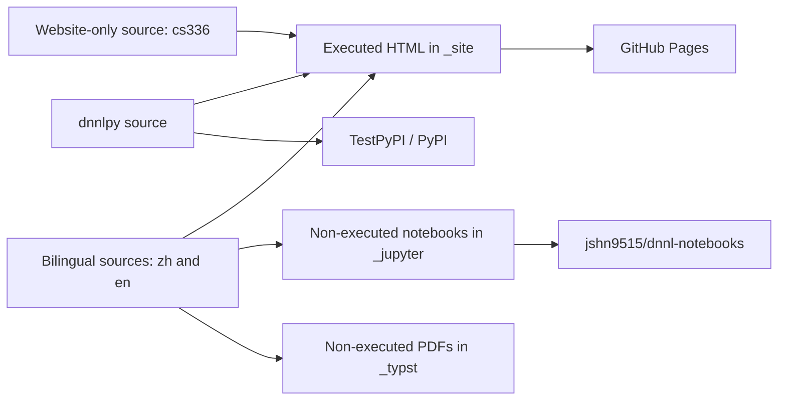

# Project Architecture

This repository contains three related deliverables built from one source tree:

1. A bilingual Quarto website;
2. Generated Jupyter notebooks and Typst PDFs;
3. The companion `dnnlpy` Python package used by the notes.

## Repository Layout

| Path                        | Purpose                                                                               |
| --------------------------- | ------------------------------------------------------------------------------------- |
| `zh/`, `en/`                | Chinese and English Quarto chapters, chapter assets, and generated language indexes.  |
| `cs336/`                    | CS336 notes and assignment material included in the website.                          |
| `dnnlpy/src/dnnlpy/`        | Installable package source, organized into `models`, `nn`, `optim`, and `tokenizers`. |
| `dnnlpy/tests/`             | Package tests.                                                                        |
| `assets/`                   | Shared website assets.                                                                |
| `utils/`                    | Dataset, cleanup, table-of-contents, notebook, Mermaid, and PDF build helpers.        |
| `.github/workflows/`        | Website, notebook, PDF, package CI, and package release workflows.                    |
| `_quarto.yml`               | Settings shared by all Quarto profiles.                                               |
| `_quarto-html.yml`          | Executed website profile and navigation structure.                                    |
| `_quarto-jupyter.yml`       | Non-executing notebook conversion profile.                                            |
| `_quarto-typst-{zh,en}.yml` | Non-executing, language-specific Typst book profiles.                                 |
| `pyproject.toml`            | Python 3.14 environment for the notes and the uv workspace root.                      |
| `dnnlpy/pyproject.toml`     | Independently buildable `dnnlpy` package supporting Python 3.12-3.14.                 |

The generated directories `_site/`, `_jupyter/`, `_typst/`, and `_freeze/` are ignored build state rather than authored source.

## Build and Delivery Flow



The HTML build is the integration path: it installs the root uv workspace, downloads required datasets, and executes applicable code. Notebook and PDF builds are distribution conversions and deliberately set `execute.enabled: false`.

## Local Development Workflow

The root project requires Python 3.14 and manages the repository as a uv workspace containing `dnnlpy`.

```bash
uv sync --all-packages
quarto render --profile html
```

The HTML profile writes to `_site/`, uses `freeze: auto` and Quarto's Jupyter execution cache, then runs `utils/clean_checkpoints.py` and `utils/generate_toc.py`. The latter regenerates `zh/README.md` and `en/README.md` from the website sidebar configuration.

For package-only work, install and test the package independently so its wider Python support is preserved:

```bash
uv venv --python 3.14 .venv
uv pip install --python .venv -e "dnnlpy[test]"
```

Pre-commit runs Gitleaks, `ruff check --fix`, and `ruff format`. Ruff also formats Python code embedded in supported notebook and Markdown files.

## Website Workflows

### Pull requests: `quarto-ci.yml`

Pull requests affecting content, website configuration, dependencies, bibliography, styles, or website helpers run the full HTML render check. The job:

1. Checks formatting in `zh/` and `en/` with Ruff;
2. Restores the latest `_freeze` Actions cache without saving it;
3. Installs Python 3.14 and all uv workspace packages;
4. Downloads the datasets required by executable notes;
5. Runs `quarto render --profile html` with the workspace virtual environment.

This is broad notebook integration coverage. It is not reduced to a guessed subset when shared dependencies can affect many chapters.

### Main, Releases, and Manual Runs: `render-website.yml`

The publishing workflow uses the same Python setup, dataset download, and executed HTML render. It uses a read/write GitHub Actions cache for `_freeze`, uploads the resulting cache as the `quarto-cache` artifact, uploads `_site/` as the Pages artifact, and deploys it to GitHub Pages.

Push runs are path-filtered to website inputs. Published releases and `workflow_dispatch` can also run the workflow.

The current push and pull-request filters cover `zh/**` and `en/**`, but not `cs336/**`. Changes limited to `cs336/` therefore require a manual website run unless the workflow filters are changed.

## Notebook Workflow: `render-notebooks.yml`

Chinese and English notebooks are rendered in separate jobs with the Jupyter profile:

```bash
quarto render zh/ --profile jupyter
quarto render en/ --profile jupyter
```

The profile writes `.ipynb` files under `_jupyter/` without executing code. Post-render helpers remove attachments and add image attributes. Each language tree is packaged as `dnnl-zh.tar.gz` or `dnnl-en.tar.gz`, attested, and uploaded as an unwrapped Actions artifact.

Successful jobs send `sync-dnnl-zh` or `sync-dnnl-en` repository-dispatch events to `jshn9515/dnnl-notebooks`. On a published release, the archives are also attached to that release.

## PDF Workflow: `render-pdfs.yml`

Chinese and English Typst books are rendered in separate jobs. The jobs install their required fonts and run:

```bash
quarto render --profile typst-zh
quarto render --profile typst-en
```

Both profiles disable code execution and use language-specific headers under `utils/`. Their post-render hook, `utils/rename_pdfs.py`, moves the results to stable paths:

- `_typst/deep-learning-notes-zh.pdf`
- `_typst/deep-learning-notes-en.pdf`

The PDFs are attested and uploaded as unwrapped Actions artifacts. Published-release runs also attach them to the release.

## `dnnlpy` CI: `dnnlpy-ci.yml`

Package changes run lint, format, test, and build jobs across Python 3.12, 3.13, and 3.14. Each matrix entry creates an isolated environment and installs `dnnlpy[test]` directly rather than using the Python-3.14-only root environment:

```bash
uv python install <version>
uv venv --python <version> .venv
uv pip install --python .venv --torch-backend cpu -e "dnnlpy[test]"
.venv/bin/python -m pytest dnnlpy/tests
uv build dnnlpy --out-dir dist
```

Non-PR runs attest and upload the built distributions. On a published release, the Python 3.14 matrix job also attaches its wheel and source distribution to the GitHub Release.

## Package Publishing

`release-testpypi.yml` and `release-pypi.yml` run on published releases or manual dispatch. Each workflow independently:

1. Runs Ruff and the `dnnlpy` test suite across Python 3.12-3.14;
2. Builds the package once with Python 3.14 after the matrix passes;
3. Publishes through its protected `testpypi` or `pypi` GitHub environment using trusted publishing.

TestPyPI publishes with its explicit legacy endpoint; PyPI uses the default `uv publish` target. Any approvals or wait timers are controlled by the corresponding GitHub environment settings.

## Workflow Trigger Summary

|        Workflow        |     Pull request      |      Push to `main`      |  Release  | Manual |
| :--------------------: | :-------------------: | :----------------------: | :-------: | :----: |
|    `quarto-ci.yml`     | Website-related paths |            -             |     -     |   -    |
|  `render-website.yml`  |           -           |  Website-related paths   | Published |  Yes   |
| `render-notebooks.yml` |           -           | Content/conversion paths | Published |  Yes   |
|   `render-pdfs.yml`    |           -           |    Content/PDF paths     | Published |  Yes   |
|    `dnnlpy-ci.yml`     | Package-related paths |  Package-related paths   | Published |  Yes   |
| `release-testpypi.yml` |           -           |            -             | Published |  Yes   |
|   `release-pypi.yml`   |           -           |            -             | Published |  Yes   |

All render and package CI workflows use concurrency groups with in-progress cancellation, preventing obsolete runs for the same delivery path from continuing after a newer run starts.
