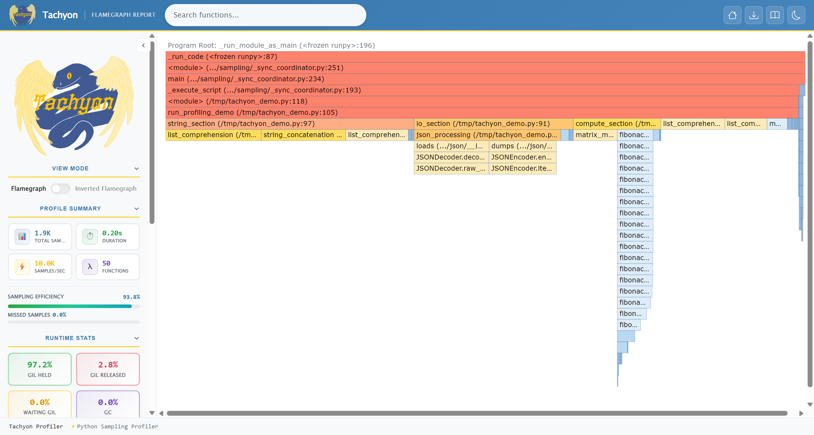
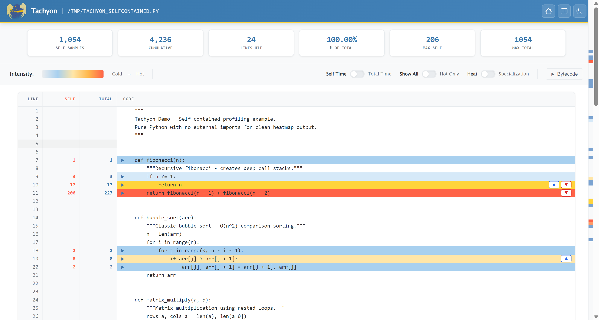

本部分对应 Stanford CS336 Assignment 1：从零实现一个小型语言模型。

CS336 Assignment 1 的目标是将前面章节介绍的 Attention、Transformer、BPE Tokenizer 和语言模型训练等内容真正组合起来，从零搭建一个完整的 GPT 风格语言模型训练流程。相比前面对各个模块的独立介绍，这一部分更加偏向工程实践。我们不仅需要实现模型本身，还需要完成 tokenizer、数据加载、训练循环、优化器以及模型评估等组件，并最终将它们连接成一套可以实际运行的训练系统。详细的作业要求可以参考课程提供的 [cs336_assignment1_basics.pdf](cs336_assignment1_basics.pdf)。

Assignment 1 涉及的主要组件已经实现于 **dnnlpy** 中，包括：

- BPE Tokenizer
- Transformer Decoder Block
- Multi-Head Causal Self-Attention
- LayerNorm / RMSNorm
- Feed-Forward Network
- GPT-style Language Model
- AdamW Optimizer
- Gradient Clipping

其中，Transformer 相关组件位于 `dnnlpy.cs336.assignment1`，并尽可能复用 `dnnlpy.nn` 和 `dnnlpy.nn.functional` 中已有的基础实现；BPE Tokenizer 相关组件位于 `dnnlpy.tokenizers`，其中还提供了多种训练优化策略。

需要说明的是，dnnlpy 中的实现与本文展示的教学实现并不完全相同。本文会尽量保留算法的核心步骤，以较直接的方式实现各个组件，重点在于理解其内部原理；dnnlpy 则在此基础上进一步进行了抽象和优化，提供更加完整的 API，同时也包含更多工程细节。因此，如果目的是理解算法和实现过程，建议优先阅读本文中的代码；如果希望直接复用这些组件，或者进一步研究更加完整的工程实现，可以参考 dnnlpy 中的版本。

本文各节编号与 CS336 Assignment 1 PDF 中的问题编号保持一致，方便与原作业对应阅读。

通过这一部分，可以进一步理解现代 LLM 的基本训练过程：

- BPE Tokenizer 如何把原始文本转换为模型输入；
- Transformer Decoder 如何完成 next-token prediction；
- Loss 如何通过反向传播驱动模型参数更新；
- 优化器、gradient clipping 等组件如何参与训练；
- 数据、模型、优化器和训练循环如何组织成完整的训练流程；
- 如何训练并评估一个小型 GPT 风格语言模型。

这是 CS336 五份作业中的第一份。后续作业会在此基础上继续讨论 LLM 训练工程、数据处理、scaling law、推理优化以及 post-training 等主题。

::: {.callout-warning}
1. CS336 的整体难度较高，本部分更适合已经熟练掌握 Python，并具备一定深度学习基础的读者。建议在阅读之前先掌握 PyTorch 基础、Transformer 架构、BPE Tokenizer 以及语言模型训练的基本原理。相关内容可以参考前面的章节，也可以直接阅读 CS336 的课程资料。
2. 本部分代码建议使用 Python 3.14 或更高版本运行。实现中会使用较多现代 Python 语法和标准库特性，因此较新的 Python 版本可以简化部分代码实现。对于后续涉及性能优化的内容，Python 3.15 还提供了新的 profiling 模块，可以用于更加方便地进行性能分析。
:::

```{python}
import itertools as it
from collections import Counter, defaultdict
from collections.abc import Iterable, Sequence
from typing import Self, override

import dnnlpy
import dnnlpy.cs336.assignment1 as cs336
import dnnlpy.models.gpt as gpt
import dnnlpy.nn as dnn
import dnnlpy.nn.functional as dF
import dnnlpy.optim as dopt
import dnnlpy.tokenizers as dltk
import IPython.display as ipy
import pandas as pd
import regex as re
import torch
import torch.nn as nn

type Pair = tuple[str, str]
type WordSymbols = tuple[str, ...]

GPT2PATTERN = re.compile(
    r"'(?:[sdmt]|ll|ve|re)"
    r'| ?\p{L}+'
    r'| ?\p{N}+'
    r'| ?[^\s\p{L}\p{N}]+'
    r'|\s+(?!\S)'
    r'|\s+'
)

print('PyTorch version:', torch.__version__)
```

## 2.1 Unicode

### Problem (unicode1)

1. `chr(0)` 返回的是空字符（null character），对应的 Unicode 编码点为 `U+0000`.
2. 它的 `repr` 表示形式是可见的转义序列 `\x00`；但是直接使用 `print()` 输出时，会发送一个不可见的控制字符，因此通常不会在终端中显示任何内容。
3. 该字符可以存在于 Python 字符串内部，并且会被计入字符串长度。虽然它在显示时通常不可见，但它仍然是字符串中的一个有效字符。

```{python}
null = chr(0)
print('repr(null):', repr(null))
print('len(null):', len(null))
print('ord(null):', ord(null))
```

### Problem (unicode2)

1. UTF-8 通常是更优的选择，因为它是基于字节的编码方式，对于以 ASCII 字符为主的文本更加紧凑，在 Web 环境中占据主导地位，并且不会像 UTF-16/UTF-32 在英文文本中那样频繁产生大量的零字节。
2. 如果逐个字节独立解码，会导致多字节字符解码失败。例如：`'é'.encode() = b'\xc3\xa9'`。但是，单独的 `b'\xc3'` 是一个不完整的 UTF-8 序列，无法被正确解码。
3. `b'\xc3\x28'` 是一个无效的 UTF-8 编码序列：`0xc3` 表示一个双字节 UTF-8 字符的起始字节，但是后面的 `0x28` 并不是合法的 UTF-8 续接字节（continuation byte）。因此，该字节序列无法被解析为有效的 UTF-8 字符。

```{python}
encoded = 'é'.encode('utf-8')

try:
    [bytes([byte]).decode('utf-8') for byte in encoded]
except UnicodeDecodeError as err:
    print('UnicodeDecodeError:', err)

try:
    b'\xc3\x28'.decode('utf-8')
except UnicodeDecodeError as err:
    print('UnicodeDecodeError:', err)
```

## 2.4 BPE Tokenizer Training

> **dnnlpy 状态：已在 dnnlpy.tokenizers.BPETrainer 中实现。**

在整个 LLM 训练流程中，BPE Tokenizer 位于原始文本和语言模型之间。模型本身并不能直接处理字符串，而是接收一串离散的 token ID。因此，在开始训练 Transformer 之前，我们需要先从训练语料中学习一套 tokenizer，将文本转换为 token，再映射成模型使用的整数 ID。

BPE 的作用，就是从语料中自动学习这套词表和 merge rules。训练完成后，同一套 tokenizer 会同时用于训练数据预处理、模型输入构造以及后续推理阶段的文本编码和解码。换句话说，tokenizer 决定了模型最终看到的基本序列单位，也直接影响序列长度、词表大小以及后续 embedding 层的规模。

因此，`train_bpe` 是整个语言模型训练流程中非常靠前的一步：

{width=85%}

本题的目标就是从训练语料中学习 BPE vocabulary 和 merge rules，为后面的语言模型训练准备 tokenizer。

### 预备：BPE 算法回顾

在第 19 章，我们已经介绍过 BPE（Byte Pair Encoding）的基本原理。这里简单回顾一下后面实现会用到的训练流程。

BPE 首先将语料划分成若干 pre-token，并统计每个 pre-token 的出现频率。随后，在每个 pre-token 内部统计相邻 token pair 的加权频率：

$$
c(p)=\sum_w f(w)n_w(p)
$$

其中，$f(w)$ 表示 pre-token $w$ 在语料中的出现次数，$n_w(p)$ 表示 pair $p$ 在 $w$ 中出现的次数。

BPE 在每一轮训练选择频率最高的 pair，将它合并成一个新的 token，加入 vocabulary，并保存对应的 merge rule，然后更新受到这次 merge 影响的 token 序列和 pair frequency。不断重复这一过程，直到达到目标 `vocab_size`，或者已经没有满足 `min_frequency` 的 pair。

例如，假设 pre-token `banana` 在语料中出现了 2 次，初始 token 序列为：

```text
(b, a, n, a, n, a), frequency = 2
```

可以看到，`(a, n)` 在一个 `banana` 中出现两次，因此它对 `(a, n)` 全局频率的贡献为：

$$
2 \times 2 = 4
$$

如果当前选择合并 `(a, n)`，那么合并之后：

```text
(b, a, n, a, n, a)
```

会变成：

```text
(b, an, an, a)
```

接下来重新统计受到影响的 pair，再继续选择下一组需要合并的 pair。

后面的几个不同版本的 BPE 实现都会遵循这一套基本流程。它们之间的区别主要在于如何统计 pair frequency、如何更新受到 merge 影响的 pair，以及如何减少重复扫描。

不过，在开始实现 BPE 之前，需要先说明两个本文和 CS336 Assignment 1 不完全相同的地方。

#### **1. Byte 的表示方式**

CS336 直接使用 raw bytes 表示 BPE token。文本经过 pre-tokenization 之后会被编码成 UTF-8 bytes，后续的 pair 统计和 merge 也直接作用在 bytes 上：

{width=65%}

本文则采用与 GPT-2 / HF Tokenizers 库一致的表示方式。在得到 UTF-8 bytes 之后，会额外进行一次 **byte-to-Unicode mapping**，将 256 个 byte 一一映射成对应的 Unicode 代理字符：

{width=90%}

例如，对于一个 byte `<space>`，在 Hugging Face / GPT-2 风格的 byte-level tokenizer 中，并不直接以 `<space>` 参与 BPE，而是先被映射为 Unicode 字符 `Ġ`。这样，所有 byte 都可以用普通 Unicode 字符表示，后续的 pair 统计和 merge 就可以直接使用字符串完成，而不需要额外处理 bytes。因此，在 GPT-2 一类 tokenizer 的词表里经常可以看到：

```text
Ġthe, Ġhello, Ġworld
```

这里的 `Ġ` 并不是原始文本中的字符，而只是空格 byte 的代理表示。

这个映射是一一对应且可逆的，因此它不会改变 byte-level BPE 的核心算法。两种实现本质上处理的是相同的 byte 信息，只是代码中的 token 表示不同：

- CS336 使用 raw bytes；
- 本文使用 byte-to-Unicode 映射后的 str。

这样做的好处是，后面的 vocabulary、pair 和 merge rule 都可以直接使用 Python 字符串表示，而不用来回 encode 和 decode bytes。对于大多数 Python 代码来说，直接操作字符串比操作 bytes 更加方便，也更方便打印和调试。

#### **2. Tie-break 规则**

另一个区别是 pair frequency 相同时的 tie-break 规则。

CS336 Assignment 1 要求：如果多个 pair 的 frequency 相同，**优先选择字典序更大的 pair**。例如：

```text
(a, b), (c, d), frequency = 5
```

当两者 frequency 相同时，会优先选择 `(c, d)` 进行 merge。

而本文的 BPE 实现更接近 Hugging Face 的行为：当 frequency 相同时，会比较 pair 中两个 token 对应的 token ID，并优先选择字典序更小的 token ID pair。

例如，假设 vocabulary 是：

```text
{'a': 3, 'b': 7, 'c': 4, 'd': 1}
```

当前有两个 pair，频率都是 10：

```text
(a, b), (c, d), frequency = 10
```

那么会优先选择 `(3, 7)` 进行合并，因为 `(3, 7)` 在排序中小于 `(4, 1)`。需要注意，这里比较的是 token ID，而不是 token 字符串本身。

因此，后面虽然会沿着 CS336 的思路一步一步实现并优化 BPE trainer，但本文并不是对 Assignment 1 的严格实现。BPE 的训练逻辑保持一致，但 byte 的内部表示和 tie-break 规则采用了更接近 GPT-2 / Hugging Face 的设计。

下一节我们先实现这套 byte-level 表示所需要的 `ByteLevelPreTokenizer` 和 `ByteLevelDecoder`。

### 预备：Pre-Tokenizer 和 Decoder

前面我们已经确定了本文采用的 byte-level 表示方式。接下来，在真正实现 BPE trainer 之前，还需要先准备两个组件：`PreTokenizer` 和 `Decoder`。

Pre-tokenizer 的作用是**在 BPE 之前先给文本划定边界**。如果直接把整段文本作为一个连续序列交给 BPE，那么 merge 可以发生在任意相邻位置，包括不同单词、标点甚至不同文本结构之间（例如文字和代码）。Pre-tokenizer 会先按照一定规则把文本划分成若干 pre-token，后续的 BPE 只在每个 pre-token 内部进行，不会跨越这些边界。

最简单的做法是按照空格和标点符号进行切分，但这种规则比较粗糙，也很难统一处理缩写、数字、连续标点以及不同语言的文本。这里我们采用 GPT-2 使用的正则表达式进行 pre-tokenization。原始文本首先会被划分成若干 pre-token，然后每个 pre-token 再转换成前面介绍的 byte-level Unicode 表示，交给后续的 BPE 处理。

因此，这里的 `ByteLevelPreTokenizer` 主要完成两件事情：

1. 使用 GPT-2 的正则表达式划分 pre-token；
2. 将每个 pre-token 转换成 byte-level Unicode 表示。

实现如下：

```{python}
class ByteLevelPreTokenizer(dltk.PreTokenizer):
    """A simple byte-level pre-tokenizer for BPE training."""

    @override
    def pre_tokenize(self, text: str) -> Iterable[str]:
        """Pre-tokenize the input text into byte-level Unicode tokens.

        Args:
            text (str): The input text to be pre-tokenized.

        Yields:
            toekn (str): Byte-level Unicode tokens extracted from the input text.

        Examples:
            >>> pre_tokenizer = ByteLevelPreTokenizer()
            >>> list(pre_tokenizer.pre_tokenize('Hello, 世界!'))
            ['Hello', ',', 'Ġä¸ĸçķĮ', '!']
        """
        for token in GPT2PATTERN.findall(text):
            yield dltk.bytes_to_unicode(token)

    @staticmethod
    def alphabet() -> list[str]:
        """Return the list of all possible byte-level Unicode characters.

        Returns:
            alphabet (list[str]): A list of all 256 byte-level Unicode characters.

        Examples:
            >>> alphabet = ByteLevelPreTokenizer.alphabet()
            >>> len(alphabet)
            256
            >>> alphabet[:5]
            ['!', '"', '#', '$', '%']
        """
        return list(dltk.BYTES_TO_UNICODE.values())
```

`pre_tokenize()` 首先通过 `GPT2PATTERN` 找到所有 pre-token，然后调用：

```python
dltk.bytes_to_unicode(token)
```

将每个 pre-token 转换成 byte-level Unicode 表示。这样，从这一层开始，后面的 BPE trainer 就只需要处理普通的 Python `str`，不需要再关心 UTF-8 编码和 byte-to-Unicode 映射的细节。

`alphabet()` 则返回所有 256 个 byte 对应的 Unicode 代理字符：

```python
@staticmethod
def alphabet() -> list[str]:
    return list(dltk.BYTES_TO_UNICODE.values())
```

这些字符会作为 BPE 的初始 alphabet。在训练 tokenizer 时，可以通过：

```python
initial_alphabet = dltk.ByteLevelPreTokenizer.alphabet()
```

将它们加入初始 vocabulary。

与 pre-tokenizer 相对应，我们还需要一个 `Decoder`。

BPE 最终得到的 token 使用的是 byte-level Unicode 表示，因此不能直接把这些 token 当作最终文本返回。Decoder 需要把这个过程反过来：先把 token 拼接起来，再将 Unicode 代理字符恢复成原始 bytes，最后通过 UTF-8 解码得到普通字符串。

实现如下：

```{python}
class ByteLevelDecoder(dltk.Decoder):
    """A simple byte-level decoder for BPE training."""

    @override
    def decode(self, tokens: list[str]) -> str:
        """Decode a list of byte-level Unicode tokens back into a string.

        Args:
            tokens (list[str]): A list of byte-level Unicode tokens to be decoded.

        Returns:
            text (str): The decoded string obtained from the input tokens.

        Examples:
            >>> decoder = ByteLevelDecoder()
            >>> tokens = ['Hello', ',', 'Ġä¸ĸçķĮ', '!']
            >>> decoder.decode(tokens)
            'Hello, 世界!'
        """
        text = ''.join(tokens)
        text = dltk.unicode_to_bytes(text)
        return text.decode('utf-8', errors='replace')
```

这里首先通过：

```python
''.join(tokens)
```

将多个 token 拼接回完整的 byte-level Unicode 字符串，然后：

```python
dltk.unicode_to_bytes(text)
```

执行前面 byte-to-Unicode 映射的逆过程，恢复原始 bytes。最后使用 UTF-8 解码，就可以得到普通文本。

下面用一个简单的例子验证 pre-tokenizer 和 decoder：

```{python}
pre_tokenizer = ByteLevelPreTokenizer()
decoder = ByteLevelDecoder()

pre_tokens = list(pre_tokenizer.pre_tokenize('Hello, 世界!'))
print('Pre-tokens:', pre_tokens)
print('Decoded:', decoder.decode(pre_tokens))
```

这里还没有执行任何 BPE merge，只是在验证 byte-level 表示能否正确完成 round trip：

{width=85%}

如果实现正确，最终解码结果应该重新得到原始的：

```text
Hello, 世界!
```

有了这两个组件之后，后面的 BPE trainer 就可以专注于 pair frequency 和 merge 本身，而不需要再处理文本划分、UTF-8 编码以及最终的文本恢复。

### 预备：如何阅读 profile 报告

::: {.callout-note}
从 Python 3.15 起，引入了一个新的 `profiling` 模块，提供了更现代的性能分析工具 Tachyon [[PEP 799](https://peps.python.org/pep-0799/)]。

旧版本的 `cProfile` 把每次函数调用和调用时间都记录下来，这样虽然能确定性地统计每个函数的调用次数和耗时，但在高频调用的函数中会产生较大的性能开销。相比之下，Tachyon 采用采样式分析，通过定期采样程序的调用栈来估计各个函数的耗时分布，从而大幅降低了运行开销。此外，它还支持采样式分析、火焰图生成以及多进程跟踪等功能。

本节所有的 profile 分析示例都使用了 `profiling` 模块。如果你使用的是 Python 3.14 或更早版本，可以使用 `cProfile` 来生成性能报告。但 `cProfile` 在多线程环境下的统计有很大误差，并且可能改变锁的竞争模式，从而影响程序的性能表现。因此，建议尽量使用 Python 3.15 或更高版本，并使用 `profiling` 模块进行性能分析。
:::

拿到 profile 报告之后，不要只看排在最前面的函数。更重要的是先找到真正占用时间的部分，再判断这些时间究竟花在函数本身，还是花在它调用的其他函数中。Tachyon 支持生成火焰图（flamegraph）和热力图（heatmap），可以帮助我们直观地看到程序的性能瓶颈。火焰图中，每个矩形表示一个函数调用，矩形越宽，表示程序越多时间处于这个调用栈中，矩形层级则表示函数之间的调用关系。逐行 heatmap 则可以进一步定位一个函数内部究竟是哪几行代码最耗时。

一个典型的火焰图如下：



一个典型的热力图如下：



通常我们可以重点关注下面几个指标：

- **nsamples**：采样次数，表示在 profiling 过程中，程序有多少次被采样到与这个函数相关。通常会区分 direct nsamples 和 cumulative nsamples：前者表示采样时程序正在直接执行这个函数本身，后者表示采样时这个函数出现在当前调用栈中，也就是包括它自身以及它调用下去的函数。如果一个函数的 cumulative nsamples 很高，说明程序在运行过程中有很大一部分时间都经过这条调用路径。
- **tottime**：函数自身执行所消耗的时间，不包含它调用的其他函数。如果一个函数的 `tottime` 很高，说明主要时间直接花在这个函数内部，例如循环、查找、对象创建或数值计算等操作。
- **cumtime**：函数自身以及它调用的其他函数一共消耗的累计时间。如果一个函数的 `cumtime` 很高，但 `tottime` 很低，说明它本身可能只是一个上层入口，真正耗时的操作主要发生在它调用的其他函数中。
- **direct/cumulative ratio**：direct samples 与 cumulative samples 的比值，也可以近似理解为 `tottime / cumtime`。如果这个比值接近 1.0，说明累计耗时几乎都发生在函数自身，瓶颈主要就在这个函数内部；如果这个比值接近 0.0，说明函数自身并不耗时，主要时间花在它调用的下层函数中。
- **call magnification**：表示一个上层调用在向下执行时，会放大出多少下层调用或栈活动。这个值越大，说明一次函数调用会进一步触发大量重复工作，通常意味着内部存在循环、递归或批量调用。例如一个函数每执行一次都会在循环中调用另一个函数 100 次，那么对应的 call magnification 就会比较大。它主要反映的是调用结构的放大程度，而不是函数本身消耗了多少时间。

因此，看 profile 结果时可以先按照 `tottime` 或 `cumtime` 排序找到热点，然后再顺着调用关系继续向下看。

在 Python 3.15 及以上版本，我们可以生成火焰图：

```bash
python -m profiling.sampling run --flamegraph -o profile.html train_bpe.py
```

如果加入 `--opcodes`：

```bash
python -m profiling.sampling run --opcodes --flamegraph -o profile.html train_bpe.py
```

还可以进一步观察 Python 字节码的执行情况。

这里会看到一些平时在 `dis.dis()` 结果中不一定直接出现的指令，例如 `LOAD_ATTR_INSTANCE_VALUE`。这些是 CPython 在运行过程中生成的 specialized instruction。这是在 Python 3.11 [[PEP 659](https://peps.python.org/pep-0659/)] 中引入的一种自适应解释器机制。简单来说，就是解释器会根据程序实际运行时遇到的数据类型和访问模式，对一些经常执行的字节码进行专门优化。

例如，运行一个运算 `a + b`，解释器最初会使用通用的 `BINARY_OP` 指令来处理各种类型的加法操作（因为 `a` 和 `b` 可能是 `int`，`float`，`str`，甚至是 `list`）。但如果在运行过程中发现 `a` 和 `b` 几乎总是整数类型，解释器可能会将 `BINARY_OP` 替换为一个专门处理整数加法的指令（例如 `BINARY_OP_ADD_INT`），从而提高执行效率。因此，在 profile 中看到这些 specialized opcode，并不是源代码发生了变化，而是 CPython 根据程序运行时的情况自动选择了更快的执行路径。

当然，对于我们的 BPE 实现来说，一开始并不需要深入研究这些字节码细节。通常先通过 self time、total time 和火焰图找到算法层面的热点，就已经能够发现大部分性能问题。只有当 Python 层面的数据结构和算法已经优化得比较充分之后，opcode 级别的分析才会更有意义。

在 Python 3.14 及以下版本，我们可以使用 `cProfile` 生成一个最基本的性能报告。相比于 Tachyon，`cProfile` 的报告旧比较简陋，只提供了最基础的函数调用次数和耗时统计。下面是一个简单的示例：

```bash
python -m cProfile -s cumulative train_bpe.py
```

这里使用 `cumulative` 排序，可以优先看到累计耗时最高的函数。

需要注意的是，profile 中的时间不一定等于程序实际运行的 wall-clock time。尤其是在多线程或多进程程序中，不同线程或 worker 消耗的 CPU 时间可能会被分别统计，因此累计时间甚至可能超过程序实际运行时间。阅读这类报告时，需要结合 profiler 的统计方式一起判断。

理解完怎么看 profile 之后，我们就可以开始分析 BPE Tokenizer 的训练过程了。

### BPE Version 1：原始 BPE 实现

首先，我们实现一个最原始的 BPE，作为后续优化版本的 baseline。代码继承自 `TraditionalTokenizer` 基类，它负责 vocab、unknown token、special token 以及 token 和 ID 之间的查询，因此我们只需要关注 BPE 本身的训练和编码逻辑。

这个版本采用最直接的实现方式：每完成一次 merge，都重新扫描所有 pre-token 并重新统计所有 pair，不使用 heap、倒排索引、增量更新、并行处理或缓存。虽然效率不高，但算法流程最清晰，也方便后面逐步分析每一种优化到底解决了什么问题。`TraditionalTokenizer` 的具体实现可以在 `dnnlpy` 中找到。

```{python}
#| code-fold: true
#| code-summary: "BPE Tokenizer v1"


class BPETokenizerV1(dltk.TraditionalTokenizer):
    """A naive byte-pair encoding tokenizer for teaching the BPE algorithm."""

    def __init__(
        self,
        vocab: dict[str, int] | None = None,
        merges: list[Pair] | None = None,
        unk_token: str = '<unk>',
        special_tokens: list[str] | None = None,
    ):
        """Initialize the BPE tokenizer with vocabulary and merge rules.

        Args:
            vocab (dict[str, int], optional): A dictionary mapping tokens to their
                corresponding IDs.
            merges (list[Pair], optional): A list of token pairs to be merged.
            unk_token (str, default: '\\<unk>'): The token to use for unknown tokens.
            special_tokens (list[str], optional): A list of special tokens to be added to
                the vocabulary.
        """
        super().__init__(vocab, unk_token)
        self.merges = merges or []
        self.merge_ranks = {pair: rank for rank, pair in enumerate(self.merges)}

        self.pre_tokenizer = ByteLevelPreTokenizer()
        self.decoder = ByteLevelDecoder()

        if special_tokens is not None:
            self.add_special_tokens(special_tokens)

    @override
    def train(
        self,
        text: str | list[str],
        vocab_size: int = 100,
        min_frequency: int = 0,
        initial_alphabet: list[str] | None = None,
        unk_token: str = '<unk>',
        special_tokens: list[str] | None = None,
    ) -> Self:
        """Train BPE by recounting every pair after every merge.

        Args:
            text (str | list[str]): The input text or a list of documents to train on.
            vocab_size (int, default: 100): The maximum size of the vocabulary.
            min_frequency (int, default: 0): The minimum frequency for a pair to be merged.
            initial_alphabet (list[str], optional): A list of initial alphabet characters
                to include in the vocabulary.
            unk_token (str, default: '\\<unk>'): The token to use for unknown tokens.
            special_tokens (list[str], optional): A list of special tokens to be added to
                the vocabulary.

        Returns:
            self (BPETokenizerV1): The trained tokenizer instance.

        Raises:
            AssertionError: If `vocab_size` is less than 1.
            AssertionError: If `min_frequency` is negative.

        Examples:
            >>> tokenizer = BPETokenizerV1()
            >>> tokenizer.train(['Hello world!'], vocab_size=10)
            >>> print(tokenizer)
            BPETokenizerV1(
                vocab_size=10,
                unk_token='<unk>',
                special_tokens=['<unk>'],
            )
        """
        if vocab_size < 1:
            raise AssertionError('`vocab_size` must be at least 1.')
        if min_frequency < 0:
            raise AssertionError('`min_frequency` must be non-negative.')

        if isinstance(text, str):
            text = [text]

        special_tokens = special_tokens or []
        special_tokens = list(dict.fromkeys([unk_token, *special_tokens]))
        word_counts = Counter()

        for story in text:
            for piece, is_special in self._split_special_tokens(story, special_tokens):
                if is_special:
                    continue

                for token in self.pre_tokenizer.pre_tokenize(piece):
                    word_counts[token] += 1

        sorted_word_counts = sorted(word_counts.items())
        word_symbols = [tuple(word) for word, _ in sorted_word_counts]
        word_freqs = [frequency for _, frequency in sorted_word_counts]

        alphabet = {char for word in word_counts for char in word}
        alphabet.update(self._prepare_initial_alphabet(initial_alphabet))

        vocab_tokens = list(special_tokens)
        for token in sorted(alphabet):
            if token not in vocab_tokens:
                vocab_tokens.append(token)

        merges = []
        while len(vocab_tokens) < vocab_size:
            pair_counts = self._count_pairs(word_symbols, word_freqs)
            best_pair = self._select_best_pair(pair_counts, min_frequency)
            if best_pair is None:
                break

            new_token = ''.join(best_pair)
            if new_token not in vocab_tokens:
                vocab_tokens.append(new_token)

            merges.append(best_pair)
            word_symbols = [
                self._merge_pair(symbols, best_pair) for symbols in word_symbols
            ]

        self.vocab = {token: idx for idx, token in enumerate(vocab_tokens)}
        self.merges = merges
        self.merge_ranks = {pair: rank for rank, pair in enumerate(self.merges)}
        self.unk_token = unk_token
        self.special_tokens = special_tokens

        return self

    @override
    def encode(self, text: str) -> list[int]:
        """Encode text into BPE token IDs without computing offsets.

        Args:
            text (str): The input text to be encoded.

        Returns:
            ids (list[int]): A list of token IDs corresponding to the input text.

        Raises:
            ValueError: If any of the tokens generated during encoding are not found in
                the vocabulary.

        Examples:
            >>> tokenizer = BPETokenizerV1()
            >>> tokenizer.train(['Hello world!'], vocab_size=10)
            >>> ids = tokenizer.encode('Hello world!')
            >>> print(ids)
            [0, 1, 2, 3]
        """
        ids = []

        for piece, is_special in self._split_special_tokens(text, self.special_tokens):
            if is_special:
                ids.append(self.token_to_id(piece))
                continue

            for token in self.pre_tokenizer.pre_tokenize(piece):
                symbols = tuple(token)

                while len(symbols) > 1:
                    pairs = [
                        pair
                        for pair in it.pairwise(symbols)
                        if pair in self.merge_ranks
                    ]
                    if not pairs:
                        break

                    best_pair = min(pairs, key=self.merge_ranks.__getitem__)
                    symbols = self._merge_pair(symbols, best_pair)

                ids.extend(self.token_to_id(symbol) for symbol in symbols)

        return ids

    @override
    def decode(self, ids: list[int], skip_special_tokens: bool = True) -> str:
        """Decode BPE token IDs back into text.

        Args:
            ids (list[int]): A list of token IDs to decode.
            skip_special_tokens (bool, default: True): Whether to skip special tokens
                during decoding. If True, special tokens will be ignored in the output.

        Returns:
            text (str): The decoded text string.

        Raises:
            ValueError: If any of the provided token IDs are invalid or not found in the
                vocabulary.

        Examples:
            >>> tokenizer = BPETokenizerV1()
            >>> tokenizer.train(['Hello world!'], vocab_size=10)
            >>> ids = tokenizer.encode('Hello world!')
            >>> print(ids)
            [0, 1, 2, 3]
            >>> decoded_text = tokenizer.decode(ids)
            >>> print(decoded_text)
            'Hello world!'
        """
        if skip_special_tokens:
            special_ids = self.special_token_ids
        else:
            special_ids = set()

        tokens = [self.id_to_token(idx) for idx in ids if idx not in special_ids]
        return self.decoder.decode(tokens)

    def _prepare_initial_alphabet(
        self,
        initial_alphabet: list[str] | None,
    ) -> list[str]:
        """Keep the first character of every unique alphabet entry.

        Args:
            initial_alphabet (list[str] | None): A list of initial alphabet characters
                to include in the vocabulary.

        Returns:
            alphabet (list[str]): A list of unique first characters from the initial
                alphabet entries.

        Examples:
            >>> initial_alphabet = ['a', 'b', 'c', 'a', 'd']
            >>> alphabet = self._prepare_initial_alphabet(initial_alphabet)
            >>> print(alphabet)
            ['a', 'b', 'c', 'd']
        """
        if initial_alphabet is None:
            return []

        alphabet = []
        for token in initial_alphabet:
            if token and token[0] not in alphabet:
                alphabet.append(token[0])

        return alphabet

    def _split_special_tokens(
        self,
        text: str,
        special_tokens: list[str],
    ) -> list[tuple[str, bool]]:
        """Split text into ordinary pieces and atomic special tokens.

        Args:
            text (str): The input text to be split.
            special_tokens (list[str]): A list of special tokens to be treated as atomic.

        Returns:
            pieces: (list[tuple[str, bool]]): A list of tuples where each tuple contains
                a piece of text and a boolean indicating whether it is a special token.

        Examples:
            >>> text = 'Hello <unk> world!'
            >>> special_tokens = ['<unk>']
            >>> pieces = self._split_special_tokens(text, special_tokens)
            >>> print(pieces)
            [('Hello ', False), ('<unk>', True), (' world!', False)]
        """
        pieces = []
        cursor = 0

        while cursor < len(text):
            matches = (
                (index, -len(token), token)
                for token in special_tokens
                if token and (index := text.find(token, cursor)) >= 0
            )
            match = min(matches, default=None)

            if match is None:
                pieces.append((text[cursor:], False))
                break

            start, _, token = match
            if start > cursor:
                pieces.append((text[cursor:start], False))

            pieces.append((token, True))
            cursor = start + len(token)

        return pieces

    def _count_pairs(
        self,
        word_symbols: list[WordSymbols],
        word_freqs: list[int],
    ) -> Counter[Pair]:
        """Count all adjacent pairs by scanning every word.

        Args:
            word_symbols (list[WordSymbols]): A list of words represented as tuples of
                symbols.
            word_freqs (list[int]): A list of frequencies corresponding to each word.

        Returns:
            counter (Counter[Pair]): A counter mapping each pair of symbols to its frequency.

        Examples:
            >>> word_symbols = [
            ...     ('l', 'o', 'w'),
            ...     ('l', 'o', 'w'),
            ...     ('l', 'o', 'w', 'e', 'r'),
            ... ]
            >>> word_freqs = [5, 3, 2]
            >>> pair_counts = self._count_pairs(word_symbols, word_freqs)
            >>> print(pair_counts)
            Counter({
                ('l', 'o'): 10,
                ('o', 'w'): 10,
                ('w', 'e'): 2,
                ('e', 'r'): 2
            })
        """
        pair_counts = Counter()

        for symbols, freq in zip(word_symbols, word_freqs, strict=True):
            for pair in it.pairwise(symbols):
                pair_counts[pair] += freq

        return pair_counts

    def _select_best_pair(
        self,
        pair_counts: Counter[Pair],
        min_frequency: int,
    ) -> Pair | None:
        """Select the most frequent pair with a direct `max()` scan.

        Args:
            pair_counts (Counter[Pair]): A counter mapping each pair of symbols to
                its frequency.
            min_frequency (int): The minimum frequency for a pair to be considered.

        Returns:
            best_pair (Pair | None): The most frequent pair of symbols, or None if
                no pair meets the minimum frequency requirement.

        Examples:
            >>> pair_counts = Counter({
                ('l', 'o'): 10,
                ('o', 'w'): 10,
                ('w', 'e'): 2,
                ('e', 'r'): 2
            })
            >>> min_frequency = 3
            >>> best_pair = self._select_best_pair(pair_counts, min_frequency)
            >>> print(best_pair)
            ('l', 'o')
        """
        if not pair_counts:
            return None

        freq, pair = max((freq, pair) for pair, freq in pair_counts.items())
        if freq < min_frequency:
            return None

        return pair

    def _merge_pair(self, symbols: WordSymbols, pair: Pair) -> WordSymbols:
        """Merge every non-overlapping occurrence of one pair in a word.

        Args:
            symbols (WordSymbols): A tuple of symbols representing a word.
            pair (Pair): A tuple of two symbols to be merged.

        Returns:
            merged (WordSymbols): A new tuple of symbols with the specified pair merged.

        Examples:
            >>> symbols = ('l', 'o', 'w', 'e', 'r')
            >>> pair = ('l', 'o')
            >>> merged = self._merge_pair(symbols, pair)
            >>> print(merged)
            ('lo', 'w', 'e', 'r')
        """
        index = 0
        merged = []

        while index < len(symbols):
            if index + 1 < len(symbols) and symbols[index : index + 2] == pair:
                merged.append(''.join(pair))
                index += 2
            else:
                merged.append(symbols[index])
                index += 1

        return tuple(merged)
```

用一个小语料检查训练、编码和解码的完整流程：

```{python}
tokenizer_v1 = BPETokenizerV1()
tokenizer_v1.train(
    ['low lower lowest', 'newer wider'],
    vocab_size=300,
    initial_alphabet=ByteLevelPreTokenizer.alphabet(),
    special_tokens=['<|endoftext|>'],
)

ids = tokenizer_v1.encode('lowest')
print('Vocab size:', tokenizer_v1.vocab_size)
print('First five merges:', tokenizer_v1.merges[:5])
print('Token IDs:', ids)
print('Decoded:', tokenizer_v1.decode(ids))
```

然后，我们可以使用 `profiling` 模块对训练过程进行性能分析：

```bash
python -m profiling.sampling run bpe_v1.py
```

得到结果如下：

```{python}
df = pd.read_csv('tokenizers/bpe_v1.csv')
df.index = list(range(1, len(df) + 1))
ipy.display(df.head(10))
```

从 profiling 结果可以看到，训练时间主要集中在 `_count_pairs()` 和 `_merge_pair()` 两个函数上。其中，`_count_pairs()` 内部几行代码分别占据了约 27.8%、16.8% 和 4.0% 的采样时间，而 `_merge_pair()` 中几个主要操作也分别占据了约 9.7%、6.8% 和 6.7%。相比之下，负责选择最高频 pair 的 `_select_best_pair()` 所占时间明显更少。

这和当前的实现方式是一致的。每一轮 merge 开始时，`_count_pairs()` 都需要遍历所有 pre-token，并扫描其中所有相邻的 symbol：

```python
for symbols, freq in zip(word_symbols, word_freqs, strict=True):
    for pair in it.pairwise(symbols):
        pair_counts[pair] += freq
```

因此，不管上一轮 merge 实际修改了多少 pre-token，这一轮都会重新统计整个语料中的所有 pair。

找到最高频的 `best_pair` 之后，程序又会把所有 pre-token 依次传入 `_merge_pair()`：

```python
word_symbols = [self._merge_pair(symbols, best_pair) for symbols in word_symbols]
```

而 `_merge_pair()` 会从头到尾扫描一个 pre-token 的 symbol 序列，检查目标 pair 是否出现。即使某个 pre-token 根本不包含当前的 `best_pair`，它仍然需要被完整扫描一次。

因此，一轮 merge 实际上包含了两次大范围扫描：

{height=480px}

真正的问题并不是 BPE 必须做这些工作，而是当前实现**没有保存上一轮已经得到的信息**。

例如，假设这一轮选择：

```text
('l', 'o') -> 'lo'
```

实际上只有包含 `('l', 'o')` 的少数 pre-token 会发生变化。但是当前实现并不知道 `('l', 'o')` 出现在哪些 pre-token 中，因此 `_merge_pair()` 只能扫描全部 pre-token。

同样，完成这次 merge 后，也并不是所有 pair 的频率都会发生变化。只有被修改位置附近的 pair 会受到影响。但是当前实现会直接丢弃上一轮的 `pair_counts`，然后调用 `_count_pairs()` 从头重新统计全部 pair。

因此，这一版最主要的问题可以概括为两个方面：

1. 每轮都重新统计所有 pair：已经计算过的大部分 pair frequency 会被重复计算。
2. 每轮都扫描所有 pre-token：即使一个 pre-token 不包含当前需要 merge 的 pair，也必须经过 `_merge_pair()` 检查。

下一版可以针对这两个问题进行优化。

首先，我们可以保存每个 pair 当前的出现频率，而不是每轮重新调用 `_count_pairs()`。当某个 pair 被 merge 后，只更新受到这次 merge 影响的局部 pair。

其次，可以额外维护一个 pair 到 pre-token 的**倒排索引**，记录每个 pair 出现在哪些 pre-token 中。例如：

```text
('l', 'o') -> {word3, word17, word52}
```

这样，当 `('l', 'o')` 被选为 `best_pair` 时，就不需要再次扫描全部 pre-token，而是可以直接找到包含它的那些 pre-token，只对这些位置执行 merge。

这样做的核心思想就是把 V1 的**全量重算**改成**增量更新**。后续的优化版本可以围绕这个思路逐步加入 pair frequency 缓存、倒排索引以及更高效的最高频 pair 查询结构。

### Problem (train_bpe_tinystories)

当前实验脚本从 Hugging Face `roneneldan/TinyStories` 读取 2,119,719 条训练样本，设置目标词表大小为 10,000，并记录训练时间和峰值内存使用。

在优化后的 BPE 实现上进行训练，结果如下：

```{python}
#| eval: false
from train_bpe_tinystories import train_bpe_tinystories

tokenizer = train_bpe_tinystories()
longest_token = max(tokenizer.get_vocab(), key=len)
print(f'Tokenizer vocab size: {tokenizer.vocab_size}')
print(f'Longest token: {longest_token!r} (length: {len(longest_token)})')
```

根据作业要求，TinyStories 数据集训练时间应低于 30 分钟，峰值内存应低于 30 GB。当前实现的训练时间约为 16 秒，峰值内存约为 2.6 GB，满足要求。

训练完成后，tokenizer 被保存为 `bpe_tinystories.json`，包含 10,000 个 token 和对应的 merge rules。按照内部 byte-to-Unicode 字符串长度计算，最长 token 是 `Ġaccomplishment`，长度为 15。

### Problem (train_bpe_expts_owt)

## 2.6 BPE Tokenizer

### Problem (tokenizer)

> **dnnlpy 状态：已在 dnnlpy.tokenizers.Tokenizer 中实现。**

`dnnlpy` 实现支持 iterator 训练、单条和批量编码、解码、special-token 注册，以及单文件 JSON 加载和保存。相比直接返回 token id 列表，`encode()` 返回一个 `Encoding` 对象，其中包含 `ids`、`tokens` 和 `offsets`，方便同时获取 token 信息和原始文本位置。

与 CS336 提供的 tokenizer 接口相比，当前实现存在一些差异。当前版本没有实现 `from_files(...)` 和 `encode_iterable(...)`，而是通过单个 JSON 文件保存完整 tokenizer 状态，并在加载时将 BPE vocabulary、merge rules 和 special tokens 恢复到现有 tokenizer 对象中。

## 2.7 Tokenizer Experiments

### Problem (tokenizer_experiments)

## 3.3 Basic Building Blocks

### Problem (linear)

> **dnnlpy 状态：已在 dnnlpy.nn.Linear 中实现。**

CS336 的实现不要求 bias，并在构造函数中接受 `device` 和 `dtype`。`dnn.Linear` 的 bias 可选但默认开启，构造函数不接收 `device` 和 `dtype`，并使用 `kaiming_uniform` 初始化而不是作业指定的 `trunc_normal` 初始化。用于作业实现时应传入 `bias=False`，再调用 `.to(...)`。

```{python}
linear = dnn.Linear(3, 2, bias=False)

x = torch.tensor([[1.0, 2.0, 3.0]])
y = linear(x)

print('weight.shape:', linear.weight.shape)
print('output.shape:', y.shape)
```

### Problem (embedding)

> **dnnlpy 状态：已在 dnnlpy.nn.Embedding 中实现。**

与 CS336 要求的不同，`dnn.Embedding` 构造函数不接受 `device` 或 `dtype`，需要在实例化后移动或转换模块。`dnnlpy` 实现还提供 `padding_idx`、`max_norm`、按词频缩放梯度、预训练权重和冻结等 PyTorch 兼容参数。初始化具有作业要求的标准正态均值和方差，但没有进行截断。

```{python}
embedding = dnn.Embedding(num_embeddings=8, embedding_dim=4)

token_ids = torch.tensor([[1, 3, 1]])
embedded = embedding(token_ids)

print('weight.shape:', embedding.weight.shape)
print('embedded.shape:', embedded.shape)
```

## 3.4 Transformer Block Components

### Problem (rmsnorm)

> **dnnlpy 状态：已在 dnnlpy.nn.RMSNorm 中实现。**

和 CS336 一样，实现会把 `float16` 和 `bfloat16` 输入提升到 `float32` 计算归一化。`eps=None` 时从输入 dtype 的 machine epsilon 得到默认值，而不是固定 `1e-5`。它还支持多维 normalized shape 和可选 affine scaling，构造函数没有 `device` 或 `dtype` 参数。

```{python}
rms_norm = dnn.RMSNorm(4, eps=1e-5)

x = torch.randn(2, 3, 4, dtype=torch.float16)
normalized = rms_norm(x)

print('normalized.shape:', normalized.shape)
print('normalized.dtype:', normalized.dtype)
```

### Problem (positionwise_feedforward)

> **dnnlpy 状态：已在 dnnlpy.cs336.assignment1.SwiGLU 中实现。**

这里实现的是作业要求的完整 position-wise feed-forward network，而不是只有 gated activation。它包含三个 projection：$W_1$ 和 $W_3$ 把 model dimension 投影到 hidden dimension，逐元素计算 $\operatorname{SiLU}(W_1x) \odot W_3x$，再由 $W_2$ 投影回 model dimension。实现还提供可选 bias 和 output dropout；作业配置使用 `bias=False`、`dropout=0.0`。

```{python}
ffn = cs336.SwiGLU(embed_dim=8, hidden_dim=24, bias=False)
x = torch.randn(2, 4, 8)
y = ffn(x)

print('y.shape:', y.shape)
```

### Problem (rope)

> **dnnlpy 状态：已在 dnnlpy.cs336.assignment1.RotaryPositionalEmbedding 中实现。**

该模块按 head dimension 预计算每个位置的 sine/cosine buffer，并对最后一维相邻的偶数、奇数 feature 成对旋转。`token_pos` 可以省略，也可以显式传入，因此能够正确处理指定位置；buffer 不作为可训练参数，也不会写入 checkpoint。输入的 head dimension 必须为偶数，position 不能超过 `max_seq_len`。

```{python}
rope = cs336.RotaryPositionalEmbedding(
    embed_dim=4,
    theta=10000.0,
    max_seq_len=16,
)
query = torch.randn(2, 3, 5, 4)
rotated = rope(query, token_pos=torch.arange(5))

print('rotated_q.shape:', rotated.shape)
```

### Problem (softmax)

> **dnnlpy 状态：已在 dnnlpy.nn.functional.softmax 中实现。**

实现会先减去指定维度上的最大值再 exponentiate，符合数值稳定版本的要求。

```{python}
scores = torch.tensor([[1000.0, 1001.0, 1002.0]])
probs = dF.softmax(scores, dim=-1)

print('probs:', probs)
print('probs.sum(dim=-1):', probs.sum(dim=-1))
```

### Problem (scaled_dot_product_attention)

> **dnnlpy 状态：已在 dnnlpy.nn.functional.scaled_dot_product_attention 中实现。**

CS336 的 boolean mask 中 `True` 表示该位置允许参与 attention；`dnnlpy` 遵循 `nn.Transformer` 的约定，用 `True` 表示该位置被屏蔽。因此传入 `dnnlpy` 前需要取反。函数返回 `(output, weights)`，并额外支持 causal mask、dropout 和显式 scale。

```{python}
q = torch.randn(1, 2, 3, 4)
k = torch.randn(1, 2, 3, 4)
v = torch.randn(1, 2, 3, 5)

mask = torch.ones(3, 3, dtype=torch.bool).tril()
mask = ~mask  # CS336's True -> dnnlpy's False

output, weights = dF.scaled_dot_product_attention(q, k, v, attn_mask=mask)

print('output.shape:', output.shape)
print('weights.shape:', weights.shape)
```

### Problem (multihead_self_attention)

> **dnnlpy 状态：已在 dnnlpy.cs336.assignment1.MultiheadSelfAttention 中实现。**

Assignment 1 专用实现分别计算 Q、K、V projection，把最后一维拆成多个 attention heads，在 Q 和 K 上应用 RoPE，然后执行 causal scaled dot-product attention，最后合并 heads 并进行 output projection。默认路径复用 `dnnlpy.nn.functional.scaled_dot_product_attention`；`fast=True` 时使用 PyTorch fused SDPA。该接口只返回 attention output，不暴露 attention weights。

```{python}
self_attn = cs336.MultiheadSelfAttention(
    embed_dim=8,
    num_heads=2,
    bias=False,
    rope=cs336.RotaryPositionalEmbedding(4, max_seq_len=16),
)

x = torch.randn(2, 4, 8)
y = self_attn(x)

print('y.shape:', y.shape)
```

### Problem (transformer_block)

> **dnnlpy 状态：已在 dnnlpy.cs336.assignment1.TransformerBlock 中实现。**

block 采用 pre-norm 结构。第一个 residual branch 为 causal self-attention，第二个 residual branch 为完整 SwiGLU feed-forward network：

$$
\begin{aligned}
h &= x + \operatorname{Attention}(\operatorname{RMSNorm}(x)) \\
y &= h + \operatorname{SwiGLU}(\operatorname{RMSNorm}(h))
\end{aligned}
$$

```{python}
rope = cs336.RotaryPositionalEmbedding(
    embed_dim=4,
    theta=10000.0,
    max_seq_len=16,
)
block = cs336.TransformerBlock(
    embed_dim=8,
    num_heads=2,
    hidden_dim=24,
    bias=False,
    rope=rope,
)
y = block(torch.randn(2, 4, 8))

print('y.shape:', y.shape)
```

### Problem (transformer_lm)

> **dnnlpy 状态：已在 dnnlpy.cs336.assignment1.TransformerLM 中实现。**

模型由 token embedding、若干个 pre-norm Transformer blocks、final RMSNorm 和 vocabulary projection 组成。RoPE 在每个 block 的 attention 内应用，因此不需要 learned absolute-position embedding。实现检查输入必须为 `(batch, sequence)`，并拒绝超过 `block_size` 的序列；还支持可选 weight tying、dropout 和 fused attention 路径。

```{python}
model = cs336.TransformerLM(
    vocab_size=128,
    block_size=16,
    embed_dim=32,
    num_layers=2,
    num_heads=4,
    hidden_dim=96,
    bias=False,
)
input_ids = torch.randint(0, 128, (2, 10))
logits = model(input_ids)

print('logits.shape:', logits.shape)
```

## 3.5 Transformer Resource Accounting

### Problem (transformer_accounting)

设词表大小为 $V$、context length 为 $T$、层数为 $N$、model dimension 为 $D$、attention head 数为 $H$、feed-forward dimension 为 $F$。假设 input/output embedding 不共享，且所有 linear 均无 bias，则参数量为：

$$
P = 2VD + N(4D^2 + 3DF + 2D) + D
$$

对 GPT-2 XL 形状：

$$
V = 50257, \quad T = 1024, \quad N = 48, \quad D = 1600, \quad H = 25, \quad F = 4288
$$

共有 1,640,452,800 个参数。其中，float32 大约占 6.56 GB（6.11 GiB）。

单个序列的主要前向传播的 FLOPs 为：

- Attention Q/K/V/O projections：$N \times 8T D^2$；
- Attention score 和 value products：$N \times 4T^2 D$；
- SwiGLU feed-forward projections：$N \times 6T D F$；
- Output LM head：$2T D V$。

总计约 $3.5168\times 10^{12}$ FLOPs。在 $T=1024$ 时 feed-forward 占主导；当 $T=16384$ 时，二次方 attention 约占 61.7%，总 forward cost 约为 $1.3358\times 10^{14}$ FLOPs。

::: {.list-table}
表 1：GPT-2 系列模型前向传播 FLOPs 分布

- - Model
  - Attention projections
  - Attention score/value
  - Feed-forward
  - LM head

- - Small
  - 19.9%
  - 13.3%
  - 39.8%
  - 27.1%

- - Medium
  - 24.8%
  - 12.4%
  - 50.1%
  - 12.7%

- - Large
  - 27.3%
  - 10.9%
  - 54.3%
  - 7.4%

- - XL
  - 28.6%
  - 9.2%
  - 57.5%
  - 4.7%
:::

## 4 Training

### Problem (cross_entropy)

> **dnnlpy 状态：已在 dnnlpy.nn.functional.cross_entropy_loss 中实现。**

CS336 把最后一维视作 vocabulary，并允许任意 leading dimensions。`dnnlpy` 遵循 PyTorch 约定：当 dim 大于 1 时，class dimension 是第 1 维。因此当 LM logits 的 shape 为 `(batch, sequence, vocab)` 时，需要先展平为 `(batch * sequence, vocab)`。实现还支持 class weights、ignored targets、soft targets、label smoothing 和多种 reduction。

和 PyTorch 一样，`dnnlpy` 的 `cross_entropy_loss` 会在内部调用 `log_softmax`，因此不需要在外部显式计算 softmax。`log_softmax` 里调用 `logsumexp` 函数，使用数值稳定的方式计算 log-sum-exp。

::: {.callout-note}
在 PyTorch 2.13 中，引入了一个新模块，`nn.LinearCrossEntropyLoss`。它将 `Linear` 和 `CrossEntropyLoss` 结合在一起，采用流式处理，避免显式构造 logits tensor，从而节省内存和计算开销。详细内容请参考 [PyTorch 官方文档](https://pytorch.org/docs/stable/generated/torch.nn.LinearCrossEntropyLoss.html)。
:::

```{python}
lm_logits = torch.randn(2, 3, 5)
targets = torch.randint(0, 5, (2, 3))

loss = dF.cross_entropy_loss(
    lm_logits.reshape(-1, 5),
    targets.reshape(-1),
)

print('loss:', loss.item())
```

### Problem (learning_rate_tuning)

对题目中的 quadratic SGD toy example，`lr=10` 比 `lr=1` 更快降低 loss；`lr=100` 虽然激进，但由于 schedule 按 `1 / sqrt(t + 1)` 衰减仍可能下降；`lr=1000` 的早期更新 overshoot 太大，因此发散。

```{python}
lr_list = [1e0, 1e1, 1e2, 1e3]
loss_list = defaultdict(list)

for lr in lr_list:
    weights = nn.Parameter(5 * torch.randn(10, 10))
    optimizer = dopt.SGD([weights], lr=lr)

    for step in range(10):
        loss = weights.pow(2).mean()
        loss.backward()
        loss_list[lr].append(loss.item())

        optimizer.step()
        optimizer.zero_grad()

df = pd.DataFrame(loss_list)
df = df.set_axis([f'lr={lr}' for lr in lr_list], axis='columns')
ipy.display(df)
```

### Problem (adamw)

> **dnnlpy 状态：已在 dnnlpy.optim.AdamW 中实现。**

实现并维护一阶矩和二阶矩，进行 bias correction，并把 decoupled weight decay 直接应用到 parameter。它是 `optim.Optimizer` 的 subclass，支持 parameter groups 和 state dict。

```{python}
params = nn.Parameter(torch.tensor([1.0, -1.0]))
optimizer = dopt.AdamW([params], lr=1e-3, weight_decay=0.01)

loss = params.square().sum()
loss.backward()

optimizer.step()
optimizer.zero_grad()
```

### Problem (adamw_accounting)

设 parameter elements 为 $P$、需要保存的 activation elements 为 $A$，float32 peak memory 可以近似为 $16P + 4A$ bytes：parameters 占 $4P$、gradients 占 $4P$、两个 AdamW moments 占 $8P$、activations 占 $4A$。使用：

$$
A \approx B[N(8TD + 2HT^2 + 4TF) + TD + 2TV]
$$

GPT-2 XL 中，有：

$$
P = 1,640,452,800 \qquad A \approx 4,093,347,840 \times B
$$

总显存近似为：

$$
16.373 \mathrm{GB} \times B + 26.247 \mathrm{GB}
$$

按这个粗略模型，80 GB 显存最多容纳 3 个 batch。

AdamW 自身对 $P$ 是线性复杂度，每 step 大约 $14P$ scalar FLOPs。按题目给定的 batch 1024、400K steps、backward cost 为 forward 的两倍、有效算力为 $0.5 \times 495\,\mathrm{TFLOP/s}$，训练约需 4,850 小时。相较于模型的 forward 和backward，optimizer 自身的 FLOPs 可忽略。

### Problem (learning_rate_schedule)

### Problem (gradient_clipping)

> **dnnlpy 状态：已在 dnnlpy.nn.utils.clip_grad_norm_ 中实现。**

当使用 L2 范数时，`clip_grad_norm_` 会在所有 parameter gradients 上计算 global norm，在超出阈值时原地缩放，并返回 clipping 之前的 norm。`dnnlpy` 还支持其他 norm orders、non-finite check 和 foreach 参数。

```{python}
params = torch.tensor([3.0, 4.0])
params.grad = torch.tensor([6.0, 8.0])

norm = dnn.utils.clip_grad_norm_([params], max_norm=1.0)

print('Before:', norm.item())
print('After:', params.grad.norm().item())
```

## 5 Training Loop

### Problem (data_loading)

> **dnnlpy 状态：已在 dnnlpy.cs336.assignment1.get_batch 中实现。**

`get_batch` 从一维 token stream 随机抽取连续 window，并构造偏移一位的 next-token targets，再把完整 batch 移动到指定 device。它接收 `torch.Tensor`；如果数据最初通过 `np.memmap` 加载，需要先使用 `torch.from_numpy` 建立 tensor view。`block_size` 对应题目中的 `context_length`。

```{python}
stream = torch.arange(100, dtype=torch.long)
inputs, targets = cs336.get_batch(
    stream,
    block_size=8,
    batch_size=4,
    device='cpu',
)

print('inputs.shape:', inputs.shape)
print('next_tokens.shape:', targets.shape)

flag = torch.equal(inputs[:, 1:], targets[:, :-1])
print('Is inputs[:, 1:] equal to targets[:, :-1]?', flag)
```

### Problem (checkpointing)

### Problem (training_together)

## 6 Decoding

### Problem (decoding)

## 7 Experiments
