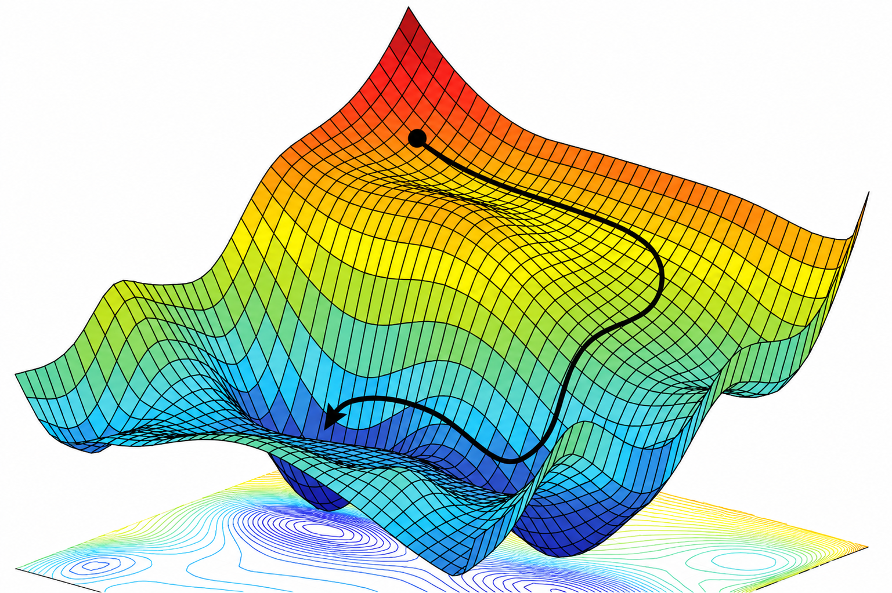

{fig-align="left"}

In the previous section, we viewed a neural network as a **learnable parameterized function**:

$$
\hat{y} = f(x; \theta)
$$

Here, $x$ is the input, $\hat{y}$ is the model output, and $\theta$ represents the parameters inside the model that need to be learned. Training is essentially the process of continuously adjusting the parameters $\theta$ so that the model output becomes closer and closer to the result we actually want.

But this immediately raises a question:

> **How does the model know whether it is doing well or poorly?**

Suppose we feed the model an image of a cat, and the model produces a prediction. Getting the output alone is not enough. We also need a way to compare the model's prediction with the ground-truth answer and tell the model:

- How wrong was this prediction?
- How well are the current parameters performing?
- After adjusting the parameters, did the model become better or worse?

This is exactly the problem that the **loss function** is designed to solve.

A loss function compares the model's prediction with the true target and eventually produces a numerical value. This value can be understood as the model's current degree of error. The goal of training a neural network is to continuously adjust the parameters so that this loss becomes as small as possible.

In this section, we will not yet discuss how the parameters should be adjusted. Instead, we first need to understand the most important objective of the entire training process:

> **What exactly are we optimizing?**

## 1.2.1 From Model Output to Training Objective

Suppose we have a simple supervised learning task. For an input $x$, we already know the corresponding ground-truth answer $y$. After receiving the input, the model produces a prediction according to the current parameters $\theta$:

$$
\hat{y} = f(x; \theta)
$$

Here, it is important to distinguish between two symbols:

- $y$: the ground-truth answer, also called the target;
- $\hat{y}$: the prediction produced by the model under the current parameters.

If the model is trained well, then $\hat{y}$ should be as close to $y$ as possible.

For example, in a house price prediction task, suppose the true price of a house is:

$$
y = 300
$$

while the model predicts:

$$
\hat{y} = 280
$$

It is easy to see that the prediction is not completely correct. But “the prediction is incorrect” is only a qualitative description. For training, we need a more explicit number that answers the question: **exactly how wrong is it?**

One of the simplest ideas is to directly compute the difference between the prediction and the true value:

$$
\hat{y} - y
$$

In this example:

$$
280 - 300 = -20
$$

The negative sign tells us that the prediction is smaller than the true value. But if our goal is only to measure “how large the error is,” we usually do not want positive and negative errors to cancel each other out.

Therefore, we can square the error:

$$
(\hat{y} - y)^2
$$

Then:

$$
(280 - 300)^2 = 400
$$

This value can be used to describe the gap between the current prediction and the ground-truth answer.

This is already one of the simplest possible loss functions. Written in a general form:

$$
L(\hat{y}, y) = (\hat{y} - y)^2
$$

where $L$ denotes the loss. The smaller the loss, the closer the model prediction is to the true answer; the larger the loss, the worse the current prediction is.

So we finally have an objective that can be optimized directly:

> **Continuously adjust the model parameters so that the loss function becomes smaller.**

## 1.2.2 Loss Function: Turning “How Well Is the Model Doing?” into a Number

Intuitively, a loss function is a **scoring rule**. The difference from an exam score is that, for a loss, smaller is usually better.

For a prediction $\hat{y}$ and a ground-truth result $y$, a loss function can be written as:

$$
L(\hat{y}, y)
$$

Because the model prediction $\hat{y}$ is itself determined by the input $x$ and parameters $\theta$:

$$
\hat{y} = f(x; \theta)
$$

the loss is ultimately also a function of the model parameters $\theta$:

$$
L(f(x; \theta), y)
$$

This point is very important.

On the surface, we are comparing the prediction with the ground-truth value. But from the perspective of training, what we truly care about is:

> **How much loss does the current parameter setting $\theta$ produce?**

The input data and ground-truth answers are already given. What we can actually change are the parameters inside the model.

Therefore, the entire neural network training problem can be written as:

$$
\min_{\theta} L(f(x; \theta), y)
$$

Here, $\min$ means that we want to find a set of parameters $\theta$ that makes the loss function as small as possible.

If we draw the loss function $L$, it might look roughly like this:

{width=70%}

What we need to do is find the point on this surface where the function value is smallest.

In this way, the idea of “learning” from the previous section now has a more concrete mathematical meaning:

> **Learning in a neural network is essentially the process of searching the parameter space for better parameters so that the loss function keeps decreasing.**

The model itself does not know what a “cat” is, nor does it know what a “correct answer” means. During training, what it really sees is only a numerical value that needs to be reduced. That value is the loss.

## 1.2.3 Different Tasks Need Different Loss Functions

At this point, you may wonder: if a loss function simply measures the difference between a prediction and the true answer, can every task just use $(\hat{y} - y)^2$? The answer is no.

Different tasks have different forms of output, and we want the model to learn different objectives. Therefore, different tasks require different loss functions. The most common cases can be roughly divided into two categories: **regression** and **classification**.

#### **Regression Problems**

The goal of a regression task is usually to predict a continuous numerical value.

For example:

- predicting house prices from housing information;
- predicting tomorrow's temperature from historical weather data;
- predicting a physical quantity from sensor measurements.

For this type of problem, a common loss function is **Mean Squared Error (MSE)**.

If a batch contains $N$ samples:

$$
(x_1, y_1), (x_2, y_2), \ldots, (x_N, y_N)
$$

and the model produces the predictions:

$$
\hat{y}_1, \hat{y}_2, \ldots, \hat{y}_N
$$

then the mean squared error is:

$$
L_{\text{MSE}} = \frac{1}{N} \sum_{i=1}^{N} (\hat{y}_i-y_i)^2
$$

Its meaning is very intuitive: compute the squared prediction error for every sample, then take the average. The more accurate the predictions are, the smaller the MSE becomes.

#### Classification Problems

Classification tasks are different.

For example, in an image classification task, the model may need to determine whether an image belongs to one of the following categories:

- cat;
- dog;
- bird;
- car.

In this case, the model output is usually not a single continuous value, but a set of scores corresponding to the different classes. What we really want the model to do is assign as much probability as possible to the correct class and as little probability as possible to the incorrect classes.

Therefore, classification problems usually do not directly use mean squared error. Instead, they use loss functions such as **cross entropy**, which are better suited to probabilistic classification. We will discuss exactly how cross entropy is computed in the later chapter on multilayer perceptrons. For now, you only need to remember one point:

> **The loss function is not fixed. It depends on the task we want the model to perform.**

Choosing a loss function is, in essence, a way of telling the model what kind of prediction should count as “good.”

## 1.2.4 The Loss of One Sample and the Objective over the Entire Dataset

So far, we have mainly discussed individual samples. For a training sample $(x_i, y_i)$, the model produces a prediction:

$$
\hat{y}_i = f(x_i; \theta)
$$

and then computes the corresponding loss:

$$
L_i = L(\hat{y}_i, y_i)
$$

But a neural network obviously cannot perform well on just a single sample.

Suppose the training set contains a total of $N$ samples:

$$
\mathcal{D} = \{(x_1,y_1),(x_2,y_2),\ldots,(x_N,y_N)\}
$$

We want to find a set of parameters that makes the model perform well **over the entire training dataset**.

The most direct approach is to average the losses over all samples:

$$
J(\theta) = \frac{1}{N} \sum_{i=1}^{N} L(f(x_i;\theta), y_i)
$$

Here, we use $J(\theta)$ to denote the overall training objective.

Then model training becomes:

$$
\min_{\theta} J(\theta)
$$

In other words:

> **Find a set of parameters that makes the model's average loss on the training data as small as possible.**

In practical deep learning training, we usually do not feed the entire dataset into the model at once. Instead, each step uses only a small subset of the data, called a **batch**.

Suppose a batch contains $B$ samples. Then the average loss of the current batch can be written as:

$$
L_{\text{batch}} = \frac{1}{B} \sum_{i=1}^{B} L_i
$$

During training, we repeatedly take new batches, compute the loss, and then adjust the model parameters based on that loss. We will see this process again later when introducing PyTorch's `Dataset`, `DataLoader`, and the complete training loop.

## 1.2.5 Training Is Essentially the Search for a Smaller Loss

Now we can finally connect the overall neural network training process.

For a batch of training data, we first feed the input into the model:

$$
\hat{y} = f(x;\theta)
$$

Then we use the loss function to compare the model prediction $\hat{y}$ with the ground-truth answer $y$:

$$
L = L(\hat{y},y)
$$

If the loss is large, the current parameters are not very good. If the loss is relatively small, then the predictions produced by the current parameters are closer to our objective. Therefore, the next thing we need to do is:

> **Adjust the parameters $\theta$ so that the loss computed next time is smaller than the current one.**

The entire process can be represented roughly as:

$$
x \rightarrow f(x;\theta) \rightarrow \hat{y} \rightarrow L(\hat{y},y)
$$

Then the parameters are updated according to information from the loss:

$$
\theta \rightarrow \theta_{\text{new}}
$$

After that, we perform the computation again using the new parameters:

$$
x \rightarrow f(x;\theta_{\text{new}})
\rightarrow \hat{y}_{\text{new}}
\rightarrow L_{\text{new}}
$$

If:

$$
L_{\text{new}} < L
$$

then this parameter adjustment has at least improved the current training objective, and we can continue repeating the process.

So neural network training is a continuously repeated loop:

{height=450px}

This is the core framework of neural network training. Whether we later study MLPs, CNNs, Transformers, or more complex LLMs, the basic structure of the training process does not fundamentally change. The model architecture may become more complex, and the loss function may differ, but the core remains:

$$
\text{Prediction} \rightarrow \text{Loss} \rightarrow \text{Update Parameters}
$$

## 1.2.6 How Exactly Should the Parameters Be Adjusted?

Now we already know the training objective:

$$
\min_{\theta} J(\theta)
$$

But there is still one crucial question left unresolved:

> **Once we know the loss is large, how exactly should the parameters be changed?**

Suppose the model contains only one parameter $w$.

Currently:

$$
w = 2
$$

and the model produces a loss of:

$$
L = 10
$$

Now we know that $L=10$ is large and we want to reduce it. But what should we do next?

We could set:

$$
w = 2.1
$$

or:

$$
w = 1.9
$$

or even directly change it to:

$$
w = 10
$$

The problem is that simply knowing the current loss does not tell us which direction the parameter should move.

If there were only one parameter, we might still be able to try different values repeatedly. But real neural networks usually contain a huge number of parameters:

$$
\theta = (w_1,w_2,\ldots,w_n)
$$

What we really need to know is:

- If we increase $w_1$, will the loss become larger or smaller?
- How much does changing $w_2$ affect the loss?
- Which parameters should be adjusted more?
- In which direction should each parameter move?

In other words, we need to know:

> **How sensitive is the loss function to each parameter?**

The tool used to describe this sensitivity is the **gradient**.

If we can compute:

$$
\frac{\partial L}{\partial w_1},
\frac{\partial L}{\partial w_2},
\ldots,
\frac{\partial L}{\partial w_n}
$$

then we can know how the loss function changes when each parameter changes slightly.

But for a complex neural network, the final loss may be produced only after dozens or even hundreds of layers of computation. How can we efficiently compute the effect of every parameter on the final loss?

This leads to several very important concepts that we will discuss in the next section: **computation graphs, forward propagation, gradients, and backpropagation.**

## 1.2.7 Summary

In this section, we added a clear training objective to the “learnable function” introduced in the previous section.

A neural network first produces a prediction using its current parameters:

$$
\hat{y} = f(x;\theta)
$$

Then a loss function compares the prediction $\hat{y}$ with the ground-truth answer $y$:

$$
L(\hat{y},y)
$$

For the entire training dataset, we want to find a set of parameters $\theta$ that makes the average loss as small as possible:

$$
\min_{\theta} J(\theta)
$$

Therefore, neural network training is not about making the model directly understand what is “correct” or “incorrect.” Instead, we first express our objective as a computable loss function, and then continuously adjust the parameters so that this loss gradually decreases.

At this point, the training problem can be summarized in three steps:

1. Make predictions using the current parameters;
2. Use a loss function to measure how poor the predictions are;
3. Adjust the parameters so that the loss decreases further.

Now only one key question remains:

> **In which direction should the parameters be adjusted?**

Knowing the value of the loss alone is not enough. We also need to know how the loss changes when each parameter changes. This information is provided by the **gradient**, and computing these gradients requires the **computation graph, forward propagation, and backpropagation** that we will introduce next.

In the next section, we will see how a neural network propagates the final loss backward step by step to every parameter.
