[](https://colab.research.google.com/github/jshn9515/dnnl-notebooks/blob/main/zh/ch1-introduction/ch1.3-computation-graph.ipynb){fig-align="left"}

In the previous two sections, we built up the basic problem of neural network training step by step.

First, a neural network can be viewed as a **learnable parameterized function**:

$$
\hat{y} = f(x;\theta)
$$

Then, we use a loss function to compare the model prediction $\hat{y}$ with the ground-truth answer $y$, turning “how poorly the model is doing” into a numerical value that can be computed:

$$
L = L(\hat{y},y)
$$

The training objective therefore becomes clear: continuously adjust the parameters $\theta$ so that the loss becomes smaller and smaller.

But one crucial step is still missing:

> **How exactly should the parameters be adjusted?**

Suppose the model has a parameter $w$. If all we know is that the current loss is $L=10$, we still do not know whether $w$ should be increased or decreased, let alone by how much. If the model contains millions, hundreds of millions, or even more parameters, trying them one by one is obviously impractical.

What we really need to know, therefore, is not simply “what is the loss?”, but:

> **If each parameter changes slightly, how will the loss change?**

This information is provided by the **gradient**. For a neural network composed of many layers, gradients must in turn be computed efficiently through the **computation graph** and **backpropagation**.

In this section, we will connect these ideas and walk through the complete process of how a neural network goes from a single prediction to the gradient associated with every parameter.

## 1.3.1 Gradient: If a Parameter Changes Slightly, How Does the Loss Change?

Let us begin with the simplest case, where there is only one parameter. Suppose the loss function depends only on the parameter $w$:

$$
L(w) = (w-3)^2
$$

If currently:

$$
w = 1
$$

then the loss is:

$$
L(1) = (1-3)^2 = 4
$$

We want to reduce this loss further. The question is: should we increase $w$ next, or decrease it?

At this point, we can compute the derivative of the loss with respect to $w$:

$$
\frac{dL}{dw} = 2(w-3)
$$

At $w=1$:

$$
\frac{dL}{dw} = -4
$$

This -4 can be understood as follows:

> **Near the current position, if $w$ is increased slightly, the loss tends to decrease; if $w$ is decreased slightly, the loss instead tends to increase.**

In other words, the derivative tells us the local trend of the loss function at the current position.

If:

$$
\frac{dL}{dw} > 0
$$

then near the current position, increasing $w$ will increase the loss. Therefore, if we want the loss to decrease, we should usually move $w$ in the smaller direction.

If:

$$
\frac{dL}{dw} < 0
$$

then increasing $w$ will decrease the loss, so we should usually move $w$ in the larger direction.

The absolute value of the derivative also reflects how locally sensitive the loss is to changes in the parameter. The larger the absolute value, the more noticeably the loss tends to change for the same small change in the parameter. The smaller the absolute value, the flatter the loss is around the current position.

A real neural network, of course, does not have only one parameter. Suppose the model parameters are:

$$
\theta = (w_1,w_2,\ldots,w_n)
$$

and the loss function is written as:

$$
L(\theta)
$$

We can then compute the partial derivative of the loss with respect to each parameter:

$$
\frac{\partial L}{\partial w_1},
\frac{\partial L}{\partial w_2},
\ldots,
\frac{\partial L}{\partial w_n}
$$

Putting these partial derivatives together gives the **gradient** of the loss function with respect to the parameters:

$$
\nabla_{\theta}L =
\left(
\frac{\partial L}{\partial w_1},
\frac{\partial L}{\partial w_2},
\ldots,
\frac{\partial L}{\partial w_n}
\right)
$$

So the gradient is not some mysterious new concept. At its core, it simply means:

> **Put the partial derivatives of the loss with respect to all parameters together.**

With the gradient, we know how sensitive the loss is to each parameter around the current parameter values, and in which direction each parameter should move to make the loss more likely to decrease.

But a new problem immediately appears. In a neural network, the loss is not computed directly from the parameters. A parameter often passes through many computations such as linear layers, activation functions, normalization, and attention before it finally affects the model output and the loss. How, then, can we work backward from the final loss to a parameter that appeared much earlier?

The answer is: first break the entire computation into smaller pieces.

## 1.3.2 Computation Graph: Breaking a Complex Function into a Sequence of Simple Operations

Suppose we have a very simple model:

$$
\hat{y} = wx+b
$$

and use squared error as the loss for a single sample:

$$
L = (\hat{y}-y)^2
$$

If we write all computations together, we get:

$$
L = (wx+b-y)^2
$$

This function is still simple enough that we could differentiate it directly. But a real neural network consists of a large number of functions nested layer by layer. If we always treat the entire model as one enormous formula, it quickly becomes difficult to analyze.

A more natural approach is to break it into several basic computation steps:

$$
a = wx, \quad \hat{y} = a + b, \quad e = \hat{y} - y, \quad L = e^2
$$

Now a complex function has been decomposed into a few simple operations: multiplication, addition, subtraction, and squaring.

We can draw the dependency relationships among these computations as a graph:



This is a **computation graph**.

The most important role of a computation graph is to explicitly unfold the computation process of a complex function so that we can clearly see:

- how each intermediate result is obtained;
- which variables a given variable depends on;
- through which paths a parameter affects the final loss.

For example, in the graph above, the parameter $w$ does not directly produce the loss $L$. It first affects $a$, then $\hat{y}$, then the error $e$, and finally $L$:

$$
w \rightarrow a \rightarrow \hat{y} \rightarrow e \rightarrow L
$$

The parameter $b$ has its own path:

$$
b \rightarrow \hat{y} \rightarrow e \rightarrow L
$$

This dependency structure is extremely important, because when we later compute gradients, we will follow exactly these paths to propagate the effect of the final loss back to the parameters step by step.

From this perspective, a neural network is simply a very large computation graph. Each layer receives the result from the previous layer, performs its own operation, and passes the output to the next layer. Although the model structure may be very complex, it can still ultimately be decomposed into a large number of simple tensor operations.

## 1.3.3 Forward Propagation: Following the Computation Graph All the Way to the Loss

Once we have a computation graph, the most natural direction is to start from the input and compute the value of each node step by step along the arrows until we obtain the final loss. This process is called **forward propagation**.

Let us continue with the previous example. Suppose:

$$
x=2,\quad w=3,\quad b=1,\quad y=5
$$

First, compute:

$$
a = wx = 3\times 2 = 6
$$

Second, obtain the model prediction:

$$
\hat{y} = a+b = 6+1 = 7
$$

Third, compute the prediction error:

$$
e = \hat{y}-y = 7-5 = 2
$$

Finally, obtain the loss:

$$
L = e^2 = 2^2 = 4
$$

The entire forward propagation process can be written as:

$$
(x,w) \rightarrow a \rightarrow \hat{y} \rightarrow e \rightarrow L
$$

In other words, forward propagation does something very straightforward:

> **Using the current parameters, transform the input step by step into a model prediction, and then transform the prediction into a loss.**

For a real neural network, forward propagation may pass through dozens or even hundreds of layers, but the basic logic does not change. Each layer simply computes its output from its inputs and parameters, then passes that output forward.

There is also one detail that will become very important later: in order to compute gradients during backpropagation, the forward pass usually needs to retain some necessary intermediate information.

For example, consider the squaring operation:

$$
L = e^2
$$

Its local derivative is:

$$
\frac{\partial L}{\partial e}=2e
$$

Therefore, during backpropagation, we need to know the value of $e$ from the forward pass. Other operations may similarly need their inputs or intermediate results in order to compute gradients. This is why, during neural network training, forward propagation is not merely about producing a prediction. It also prepares the information needed for the later backward pass.

At this point, we can already obtain the loss from the input:

$$
\text{Input} \rightarrow \text{Prediction} \rightarrow \text{Loss}
$$

Next, we need to solve the central problem of this section: how to work backward from this loss to obtain the gradient of every parameter.

## 1.3.4 Backpropagation: Using the Chain Rule to Propagate Gradients Back to Every Parameter

Forward propagation computes values from left to right along the computation graph, while **backpropagation** does exactly the opposite: starting from the final loss, it computes gradients step by step in the reverse direction of the computation graph. The core mathematical tool behind it is the **chain rule** from calculus.

Consider the same computation again:

$$
a = wx, \quad \hat{y} = a + b, \quad e = \hat{y} - y, \quad L = e^2
$$

Now suppose we want to know the effect of the parameter $w$ on the loss $L$, that is:

$$
\frac{\partial L}{\partial w}
$$

But $L$ does not depend directly on $w$. From the computation graph, we can see that $w$ passes through:

$$
w \rightarrow a \rightarrow \hat{y} \rightarrow e \rightarrow L
$$

Therefore, by the chain rule:

$$
\frac{\partial L}{\partial w} =
\frac{\partial L}{\partial e}
\frac{\partial e}{\partial \hat{y}}
\frac{\partial \hat{y}}{\partial a}
\frac{\partial a}{\partial w}
$$

These local derivatives are all simple:

$$
\frac{\partial L}{\partial e} = 2e, \quad
\frac{\partial e}{\partial \hat{y}} = 1, \quad
\frac{\partial \hat{y}}{\partial a} = 1, \quad
\frac{\partial a}{\partial w} = x
$$

Therefore:

$$
\frac{\partial L}{\partial w} = 2e\cdot 1\cdot 1\cdot x
$$

From the forward pass, we already know:

$$
e=2,\quad x=2
$$

so:

$$
\frac{\partial L}{\partial w} = 2\times 2\times 2 =8
$$

Similarly, for the parameter $b$:

$$
\frac{\partial L}{\partial b} =
\frac{\partial L}{\partial e}
\frac{\partial e}{\partial \hat{y}}
\frac{\partial \hat{y}}{\partial b}
$$

Because:

$$
\frac{\partial \hat{y}}{\partial b}=1
$$

we get:

$$
\frac{\partial L}{\partial b} = 2e =4
$$

Finally, we obtain the gradients corresponding to the two current parameters:

$$
\frac{\partial L}{\partial w}=8, \qquad
\frac{\partial L}{\partial b}=4
$$

This is the central idea of backpropagation:

> **Instead of differentiating the entire complex function all at once, use the computation graph to break the gradient into local derivatives, then combine them from back to front using the chain rule.**

In practice, we often understand this process as:

```text
Upstream Gradient × Local Derivative = Gradient Passed to the Previous Node
```

For example, starting from the node $L=e^2$, the gradient of the loss with respect to itself is:

$$
\frac{\partial L}{\partial L}=1
$$

The squaring operation receives the upstream gradient 1 and multiplies it by its local derivative $2e$, giving:

$$
\frac{\partial L}{\partial e} = 1\times 2e
$$

Next, the subtraction node propagates this gradient further backward; the addition node continues propagating it; and the multiplication node uses its own local derivatives to send gradients separately to $w$ and $x$.

The overall direction is exactly the opposite of forward propagation:

{width=85%}

So we can now form one of the most important intuitions:

- **Forward propagation**: move forward through the computation graph and compute the value of each node;
- **Backpropagation**: move backward through the computation graph and compute the gradient of the loss with respect to each node.

## 1.3.5 Why Can Backpropagation Efficiently Compute Gradients for a Large Number of Parameters?

At this point, you may wonder: the chain rule can already be used for differentiation, so what is special about backpropagation?

The key is that a neural network usually has a scalar loss but a very large number of parameters:

$$
L=L(w_1,w_2,\ldots,w_n)
$$

We want to obtain all of the following at once:

$$
\frac{\partial L}{\partial w_1},
\frac{\partial L}{\partial w_2},
\ldots,
\frac{\partial L}{\partial w_n}
$$

If we expanded the entire chain rule from scratch for every parameter, we would perform a large amount of repeated computation. The cleverness of backpropagation is that:

> **Intermediate gradients that have already been computed can be reused.**

For example, in the previous example, both $w$ and $b$ ultimately affect the loss through $\hat{y}$ and $e$. We only need to compute:

$$
\frac{\partial L}{\partial e}
$$

once, and then continue to obtain:

$$
\frac{\partial L}{\partial \hat{y}}
$$

After that, this result can be propagated separately into the different branches containing $w$ and $b$, without restarting the computation from the loss $L$.

This is also why backpropagation is so well suited to neural networks. It is essentially an application of **reverse-mode automatic differentiation**, which is especially effective when there is “one scalar output and many input parameters.” Neural network training has exactly this structure.

There is another very important detail: if a variable affects the final loss through multiple paths, then the gradients coming from those paths must be **added together**. For example:

$$
L = w^2 + 3w
$$

The parameter $w$ affects $L$ through two different paths: one through $w^2$, and the other through $3w$. Therefore:

$$
\frac{dL}{dw} = \frac{d(w^2)}{dw} + \frac{d(3w)}{dw} = 2w+3
$$

In more complex neural networks, the same tensor is often sent into multiple branches. When backpropagation encounters this situation, it accumulates the gradients propagated back from the different paths.

So backpropagation is not simply “passing one gradient all the way backward.” More precisely, it traverses the computation graph from back to front, using the local derivative of each operation together with the upstream gradient already obtained to gradually compute the gradient of every node with respect to the final loss. If multiple paths exist, their contributions are added together.

## 1.3.6 After Backpropagation: Gradients Still Need to Be Used to Update the Parameters

Now we have computed:

$$
\frac{\partial L}{\partial w}=8, \qquad \frac{\partial L}{\partial b}=4
$$

Does this mean the model has already “learned”? Not yet.

This is a very easy point to confuse:

> **Backpropagation is only responsible for computing gradients. It does not automatically turn the parameters into better values.**

Actually modifying the parameters requires a parameter update rule. The simplest form of gradient descent can be written as:

$$
\theta_{\text{new}} = \theta-\eta\nabla_{\theta}L
$$

where $\eta$ is the **learning rate**, which controls the step size of each parameter update.

For a single parameter $w$:

$$
w_{\text{new}} = w-\eta\frac{\partial L}{\partial w}
$$

Why do we subtract the gradient? Because the gradient points in the direction of the fastest local increase of the function, while we want the loss to decrease, so we usually move in the negative gradient direction.

Continuing the previous example, if the learning rate is $\eta=0.1$, then:

$$
\begin{align}
w_{\text{new}} =3-0.1\times 8 &= 2.2 \\
b_{\text{new}} =1-0.1\times 4 &= 0.6
\end{align}
$$

Using the new parameters for another forward pass:

$$
\hat{y}_{\text{new}} =2.2 \times 2 + 0.6 = 5
$$

The new loss becomes:

$$
L_{\text{new}} = (5-5)^2 = 0
$$

In this deliberately constructed simple example, a single update happens to reach the minimum exactly. Real neural networks are of course not this lucky. They usually require thousands, tens of thousands, or even more iterations, and a learning rate that is too large or too small introduces additional problems. But we can now draw the basic training process of a neural network:

{height=580px}

Now we can finally connect the content of the previous two sections:

$$
\text{Forward}
\rightarrow
\text{Loss}
\rightarrow
\text{Backward}
\rightarrow
\text{Update Parameters}
$$

Each step is responsible for something different:

- forward propagation uses the current parameters to produce predictions;
- the loss function measures how poor the current predictions are;
- backpropagation computes the gradient corresponding to each parameter;
- the optimization algorithm uses those gradients to actually modify the parameters.

Later, we will study different optimization algorithms such as SGD, momentum, and Adam. But no matter how the update rule changes, the task of backpropagation remains the same: **compute the gradient of the loss with respect to the parameters.**

## 1.3.7 Automatic Differentiation: Why Can Frameworks Compute Gradients Automatically?

If every neural network required us to manually derive all of the chain rules, deep learning could hardly have developed to its current scale. Fortunately, computation graphs give us a highly systematic approach. For every basic operation in the computation graph, we only need to know its own local derivative. For example:

$$
\begin{align}
z = x + y &\quad\Rightarrow\quad
\frac{\partial z}{\partial x} = 1, \quad
\frac{\partial z}{\partial y} = 1 \\
z = xy &\quad\Rightarrow\quad
\frac{\partial z}{\partial x} = y, \quad
\frac{\partial z}{\partial y} = x \\
z = x ^ 2 &\quad\Rightarrow\quad
\frac{\partial z}{\partial x} = 2x
\end{align}
$$

As long as the framework records the dependency relationships among these operations, it can start from the final loss after the forward pass, apply the chain rule backward through the computation graph, and automatically obtain all required gradients. This is the core idea behind **automatic differentiation**.

Automatic differentiation is neither simply using finite differences to approximate derivatives, nor expanding the entire neural network into one enormous symbolic expression and then performing symbolic differentiation. It is more like this:

> **Break a complex computation into basic operations that the framework already understands, then use the local derivatives of those operations and the chain rule to automatically compose the final gradients.**

PyTorch's `autograd` does exactly this. When we write tensor operations and perform forward computation, PyTorch establishes the corresponding automatic differentiation relationships. When we call backpropagation from the loss, it can follow those dependencies to compute the gradients backward.

Of course, we have not yet discussed how PyTorch decides which tensors require gradients, where gradients are stored, why some tensors are leaf tensors, or what `detach()` and `no_grad()` do. These belong to the framework implementation layer, and we will cover them in detail in the next chapter. For now, the most important thing is to establish one unified understanding:

> **The computation graph records how values are computed, forward propagation produces the computation results, backpropagation uses the chain rule to obtain gradients, and the optimizer then uses those gradients to update the parameters.**

## 1.3.8 Summary

In this section, we finally filled in the last missing part of neural network training.

In the previous two sections, we learned that a neural network is a learnable parameterized function:

$$
\hat{y} = f(x;\theta)
$$

and that a loss function turns model performance into an objective that can be optimized:

$$
L = L(\hat{y},y)
$$

This section went one step further and answered: **how exactly should the parameters be adjusted?**

The gradient describes the local sensitivity of the loss to changes in the parameters:

$$
\nabla_{\theta}L
$$

A computation graph breaks a complex model computation into a sequence of simple operations and records the dependency relationships among them. Forward propagation moves through the computation graph in the forward direction, using the current parameters to obtain predictions and the loss. Backpropagation then moves backward through the computation graph and uses the chain rule to compute the gradient of the loss with respect to every parameter.

Once the gradients are obtained, the optimization algorithm can actually update the parameters, for example using the simplest form of gradient descent:

$$
\theta \leftarrow \theta-\eta\nabla_{\theta}L
$$

Therefore, one basic neural network training step can be summarized as:

$$
\text{Forward}
\rightarrow
\text{Loss}
\rightarrow
\text{Backward}
\rightarrow
\text{Update}
$$

This process will appear again and again. Whether we are training an MLP, CNN, Transformer, or a much larger language model, the underlying training logic does not fundamentally change.

At this point, we have answered the conceptual question of “why deep learning can be trained.” In the next chapter, we will formally move into PyTorch and see what these concepts correspond to in code: how computation graphs are built, how gradients are stored, what `backward()` actually does, and how we can control the behavior of automatic differentiation.
