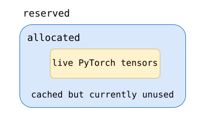

[](https://colab.research.google.com/github/jshn9515/dnnl-notebooks/blob/main/en/ch19-llm-training-engineering/ch19.1-memory-ledger.ipynb){fig-align="left"}

In Chapter 18, we built a MiniGPT from scratch and worked through the complete process of next-token prediction, batching, loss computation, backpropagation, and parameter updates.

When a model grows from a few million parameters to billions or even hundreds of billions, the basic training process does not fundamentally change. What changes is the scale of the resources behind every step.

For a model with only a few million parameters, we usually need to ask only:

> **Is the model implemented correctly? Does the loss decrease?**

In LLM training, however, the questions gradually become:

- Can the model parameters fit on the GPU?
- Can the forward pass finish?
- Will the backward pass run out of memory?
- Will `optimizer.step()` cause another OOM?
- How do we scale to multiple GPUs when the model does not fit on one?

Starting with this chapter, therefore, we will no longer view training merely as a collection of PyTorch APIs. Instead, we will revisit training from the perspective of **computation, GPU memory, and hardware resources**.

This section begins by establishing the most important ledger:

> **When training an LLM, where exactly does GPU memory go?**

```{python}
import dnnlpy
import IPython.display as ipy
import pandas as pd
import torch
import torch.nn as nn
import torch.optim as optim
from dnnlpy.models.gpt import MiniGPT

print('PyTorch version:', torch.__version__)
```

```{python}
device = dnnlpy.get_default_device()
print('Using device:', device)
```

## 19.1.1 Where Does Training Memory Go?

Suppose we download a 7B model. If its parameters use BF16, storing the weights alone requires approximately:

$$
7\times10^9\times2\ \text{bytes} \approx 13.0\ \text{GiB}
$$

This naturally leads to the following thought:

> If the model is only 13 GiB, shouldn't a 24 GiB GPU be able to train it?

In practice, no. The 13 GiB accounts for only the **parameters themselves**. During training, in addition to parameters, we encounter at least:

- **Gradients**: after backpropagation, each trainable parameter has a corresponding gradient in `param.grad`;
- **Optimizer states**: extra data stored by the optimizer to update the parameters;
- **Saved activations**: intermediate tensors produced during the forward pass and retained for gradient computation during the backward pass;
- **Temporary buffers**: workspace temporarily allocated by certain operations, including matrix multiplication, attention, convolution, sorting, and communication. These buffers are usually not retained for long and can be reused or released after the operation, but they can still produce a high peak memory usage at a particular moment.

Distributed training may also require:

- **Communication buffers**: memory prepared temporarily for communication between GPUs. For operations such as `all_reduce`, `all_gather`, and `reduce_scatter`, the NCCL communication library needs input and output buffers;
- **Gradient buckets**: DDP combines the gradients of many small parameters into larger contiguous buffers and performs one `all_reduce` per bucket instead of communicating each parameter separately;
- **Parameter buffers**: contiguous buffers into which parameters are placed for computation or communication. These are especially common in FSDP and ZeRO.

At a high level, we can divide training memory into three parts:

```text
training memory
│
├── model states
│   ├── parameters
│   ├── gradients
│   └── optimizer states
│
├── saved activations
│   └── forward intermediates required by backward
│
└── runtime memory
    ├── temporary buffers
    ├── kernel workspace
    ├── communication buffers
    └── allocator overhead / fragmentation
```

The most important point is:

> **These three categories of memory do not scale in the same way.**

Model states are determined mainly by the **parameter count**. Activations are determined mainly by $B$, $T$, $D$, and $L$, where $B$ is the micro-batch size, $T$ is the sequence length, $D$ is the hidden size, and $L$ is the number of Transformer layers. Runtime memory depends on the particular kernels, parallel strategy, PyTorch allocator, and operator implementations.

By lifetime, we can also divide training memory into two parts.

The first consists of long-lived model states:

```text
parameters
gradients
optimizer states
```

They usually persist across many training steps. Model parameters, for example, exist from the start of training until training ends. Once Adam's first and second moments have been created, they are continually updated in subsequent optimizer steps.

The second consists of tensors that exist only temporarily during a forward/backward pass:

```text
saved activations
temporary tensors
kernel workspace
```

These tensors have much shorter lifetimes.

Consequently, when analyzing LLM memory, we must stop using

$$
\text{num\_params} \times \text{bytes\_per\_param}
$$

as a representation of total training memory. At most, it tells us the size of the model weights; it does not tell us where memory goes during training.

## 19.1.2 Model States: How Much Memory Lies Behind One Parameter?

We have divided training memory into model states, saved activations, and runtime memory. We begin with model states, which are the easiest to estimate.

Suppose the model has $N$ parameters. During training, GPU memory usually contains not only the parameters themselves but also their gradients and optimizer states. We can therefore write:

$$
M_{\text{states}} ​= M_{\text{param}} ​+ M_{\text{grad}} ​+ M_{\text{optim}}
$$

Let us examine these three parts individually.

### 19.1.2.1 Parameters

If each parameter element occupies $b_p$ bytes, then:

$$
M_{\text{param}} = Nb_p
$$

The theoretical storage sizes of common dtypes are:

| data type |   size   |
| :-------: | :------: |
|   FP32    | 4 bytes  |
|   FP16    | 2 bytes  |
|   BF16    | 2 bytes  |
|   INT8    |  1 byte  |
|   INT4    | 0.5 byte |

: Table 19.1.2 Theoretical storage sizes of common dtypes

Thus, the parameters of a 7B BF16 model occupy approximately:

$$
7\times10^9\times2 = 14\times10^9\ \text{bytes}
$$

In GiB, this is:

$$
\frac{14\times10^9}{1024^3} \approx 13.0\ \text{GiB}
$$

Note that `GB` and `GiB` are not identical. Hardware specifications and model parameter counts commonly use decimal units:

$$
1\ \text{GB}=10^9\ \text{bytes}
$$

Operating systems and many memory statistics use binary units:

$$
1\ \text{GiB}=2^{30}\ \text{bytes}
$$

Therefore, `14 GB ≈ 13.0 GiB`.

### 19.1.2.2 Gradients

During training, each trainable parameter usually acquires a corresponding gradient. Therefore:

$$
M_{\text{grad}} = Nb_g
$$

If the gradients use BF16:

$$
M_{\text{grad}} = 2N
$$

If they use FP32:

$$
M_{\text{grad}} = 4N
$$

Parameters being BF16 does not automatically imply that gradients are also BF16. Their dtype depends on the mixed-precision strategy and framework implementation. In PyTorch AMP, for example, gradients are commonly retained in FP32 to avoid numerical instability.

### 19.1.2.3 AdamW Optimizer States

Unlike SGD, which can update parameters using only gradients, AdamW maintains two additional states for each parameter.

The first is the first moment:

$$
m_t = \beta_1 m_{t-1} + (1-\beta_1) g_t
$$

The second is the second moment:

$$
v_t = \beta_2 v_{t-1} + (1-\beta_2) g_t^2
$$

For every parameter, therefore, we must also store `m` and `v`.

If both use FP32:

```text
first moment:  4 bytes
second moment: 4 bytes
```

Together, they require:

$$
M_{\text{Adam states}} = 8N
$$

### 19.1.2.4 FP32 Master Weights

Some mixed-precision training schemes also retain an FP32 copy of the parameters. They first update these FP32 master weights at high precision and then convert them to low-precision weights. If this copy exists:

$$
M_{\text{master}} = 4N
$$

A more general model-state ledger can therefore be written as:

$$
M_{\text{states}} = N(b_p + b_g + b_m + b_{m_1} + b_{m_2})
$$

where:

- $b_p$: Parameter bytes;
- $b_g$: Gradient bytes;
- $b_m$: Master weight bytes;
- $b_{m_1}$: Adam first moment;
- $b_{m_2}$: Adam second moment.

### 19.1.2.5 A Memory Estimation Technique for Large Models

Consider the following simplified configuration:

```text
BF16 parameters
BF16 gradients
FP32 Adam first moment
FP32 Adam second moment
```

Each parameter then requires:

|        Item        | bytes / parameter |
| :----------------: | :---------------: |
|   BF16 parameter   |         2         |
|   BF16 gradient    |         2         |
| FP32 first moment  |         4         |
| FP32 second moment |         4         |
|       total        |      **12**       |

: Table 19.1.2.1 Per-parameter memory ledger for AdamW training

Therefore:

$$
M_{\text{states}} = 12N
$$

If FP32 master weights are also retained:

|        Item        | bytes / parameter |
| :----------------: | :---------------: |
|   BF16 parameter   |         2         |
|   BF16 gradient    |         2         |
| FP32 master weight |         4         |
| FP32 first moment  |         4         |
| FP32 second moment |         4         |
|       total        |      **16**       |

: Table 19.1.2.2 Per-parameter memory ledger for AdamW with FP32 master weights

This gives:

$$
M_{\text{states}} = 16N
$$

This is where the commonly cited figures of `12 bytes/param` and `16 bytes/param` come from.

The key is not to assume that AdamW always means 12 or 16 bytes. A more accurate approach is:

> **First list the states that training actually retains, then calculate from the dtype of each state.**

We can write a small function to do this directly:

```{python}
def model_state_breakdown(
    num_params: int,
    param_bytes: int = 2,
    grad_bytes: int = 2,
    master_weight_bytes: int = 0,
    first_moment_bytes: int = 4,
    second_moment_bytes: int = 4,
) -> pd.DataFrame:
    """Calculate model state memory breakdown for a given number of parameters
    and their respective byte sizes.
    """
    items = {
        'parameters': num_params * param_bytes,
        'gradients': num_params * grad_bytes,
        'master weights': num_params * master_weight_bytes,
        'Adam first moment': num_params * first_moment_bytes,
        'Adam second moment': num_params * second_moment_bytes,
    }

    rows = [
        {'Item': name, 'Memory (GiB)': dnnlpy.bytes_to_gib(num_bytes)}
        for name, num_bytes in items.items()
        if num_bytes > 0
    ]
    totel_mem = dnnlpy.bytes_to_gib(sum(items.values()))
    rows.append({'Item': 'total', 'Memory (GiB)': totel_mem})

    df = pd.DataFrame(rows)
    df.index = list(range(1, len(df) + 1))
    return df
```

### 19.1.2.6 A 7B Model: Why 13 GiB of Weights Does Not Fit for Training

Now let us apply the ledger to a 7B model.

Assume:

```text
parameters: BF16
gradients:  BF16
Adam m:     FP32
Adam v:     FP32
```

Then:

```{python}
df = model_state_breakdown(num_params=7e9)
ipy.display(
    df.style.set_table_styles([{'selector': 'th', 'props': [('text-align', 'center')]}])
)
```

Notice that we have calculated only the model states. We have not yet included:

```text
saved activations
attention temporary tensors
MLP intermediates
kernel workspace
communication buffers
```

If we also retain FP32 master weights:

$$
7\times10^9\times4 \approx 26.1\ \text{GiB}
$$

The model states alone become:

$$
78.2 + 26.1 \approx 104.3\ \text{GiB}
$$

We can now understand why a 7B model has only about 13 GiB of BF16 weights but may require far more than 24 GiB for training. The first figure answers how large the weights are; the second question asks which states must coexist to train the model. They are entirely different questions.

This also foreshadows why ZeRO and FSDP are so important. If every GPU must store complete copies of:

```text
parameters
gradients
optimizer states
```

memory is quickly exhausted. One of the core ideas behind ZeRO and FSDP is:

> **Do not make every GPU store all model states.**

We will discuss this problem in detail later when we cover multi-GPU training.

## 19.1.3 Activation Memory: What Must the Forward Pass Save?

Consider a simplified Transformer block:

{height="350px"}

Many intermediate tensors are produced during the forward pass. Some of them must be saved for the backward pass by autograd.

### 19.1.3.1 Query, Key, and Value

Self-Attention first computes:

$$
\begin{align}
Q &= X W_Q \\
K &= X W_K \\
V &= X W_V
\end{align}
$$

Each usually contains the same total number of elements as the hidden states, namely $BTD$. Together, the three contain approximately $3BTD$ elements.

Suppose $B=1$, $T=4096$, and $D=4096$, and we use BF16. Together, Q, K, and V occupy approximately:

$$
3\times32 = 96\ \text{MiB}
$$

This is only **one layer**. If the model has 32 layers, the order of magnitude is:

$$
96\times32 \approx 3\ \text{GiB}
$$

Of course, real autograd implementations do not necessarily save all these tensors simultaneously. The purpose here is to develop an intuition for scale.

### 19.1.3.2 Attention Matrix

Multi-head Attention usually divides the hidden dimension as:

$$
D = H d_h
$$

where $H$ is the number of heads and $d_h$ is the head dimension.

The attention score has shape $(B,H,T,T)$, so it contains $BHT^2$ elements. The $T^2$ term is particularly important. Suppose $B=1$, $H=32$, and $T=4096$. The attention matrix contains:

$$
1\times 32\times 4096\times 4096
$$

In BF16, this occupies:

$$
1\times 32\times 4096^2\times 2 \approx 1\ \text{GiB}
$$

In other words:

> **A single BF16 tensor of shape $(B,H,T,T)$ is already close to 1 GiB.**

Again, that is for **one layer**. If a naive attention implementation must save multiple intermediates of a similar size, such as scores or softmax probabilities, memory usage grows rapidly. This is why standard attention becomes especially dangerous with long contexts.

For example, increasing $T$ from 4096 to 8192 does not double the attention matrix size; it quadruples it:

$$
T^2 \rightarrow (2T)^2 = 4T^2
$$

This is one of the most important motivations behind FlashAttention, which we discussed in Chapter 10. FlashAttention does not change the mathematical $O(T^2)$ computation of $QK^\top$. Instead, it:

> **Avoids repeatedly reading and writing the complete $T\times T$ attention matrix to HBM.**

Compute complexity and memory complexity are therefore not the same thing.

### 19.1.3.3 MLP Intermediate

Another major component of a Transformer block is the MLP. A simplified FFN can be written as:

$$
D \rightarrow rD \rightarrow D
$$

where $r$ is the expansion ratio.

If $r=4$, the intermediate MLP activation has shape $(B,T,4D)$ and contains $4BTD$ elements. Again assuming $B=1$, $T=4096$, and $D=4096$, this intermediate activation occupies approximately:

$$
128\ \text{MiB}
$$

Although 128 MiB for one layer may not seem enormous, for a 32-layer model:

$$
128\times 32 = 4096\ \text{MiB} = 4\ \text{GiB}
$$

Architectures such as SwiGLU also use somewhat different intermediate tensor layouts. Thus, even without considering the $T^2$ attention matrix, the MLP and QKV alone can produce a large volume of activations.

### 19.1.3.4 Why Activation Memory Cannot Be Calculated Exactly

At this point, we might want to write a formula:

$$
M_{\text{activation}} = f(\ldots)
$$

However, unlike parameter memory, activation memory is difficult to calculate exactly from the model configuration alone. The backward pass does not need to retain every tensor that appears during the forward pass. In PyTorch, for example, autograd saves only what is actually needed for backward, and the exact tensors depend on each operator's backward implementation.

An operator's backward pass may need its `input`, its `output`, or only certain statistics. If multiple operators are fused into one kernel, the intermediates that must be saved may change again. For attention, the mathematical formula can remain identical while different kernel implementations use different amounts of activation memory. It is therefore more appropriate to write an **order-of-magnitude model**:

$$
M_{\text{activation}} \approx c_1BTDL + c_2BTrDL + c_3BHT^2L
$$

Here, $c_1,c_2,c_3$ are not fixed constants; they depend on the implementation.

What this formula really expresses is how memory scales:

```text
B ↑ → activations increase approximately linearly
T ↑ → hidden / MLP activations increase linearly
T ↑ → a naive attention matrix increases quadratically
D ↑ → hidden / QKV / MLP activations increase
L ↑ → activations from more layers must be saved
```

These scaling relationships are more useful in engineering than an apparently precise but unreliable memory figure.

## 19.1.4 Runtime Memory: Why Theory and Practice Do Not Match

So far, we have:

$$
M_{\text{model states}}, \qquad M_{\text{activations}}
$$

Does adding the two always equal actual GPU memory usage? It still does not.

Real GPU training also involves runtime memory such as:

```text
temporary tensors
kernel workspace
cuBLAS workspace
communication buffers
gradient buckets
CUDA graph pools
allocator bookkeeping
```

A matrix multiplication kernel may require additional workspace to run faster. DDP creates gradient buckets for all-reduce. FSDP may temporarily gather certain parameters. Overlapping tensor lifetimes can also prevent memory allocations from fitting together perfectly.

A more reasonable conceptual model is therefore:

$$
M_{\text{total}} \approx M_{\text{model states}} +
M_{\text{saved activations}} + M_{\text{runtime}}
$$

Even this should not be treated as a static formula that produces an exact result, because whether training can proceed is determined by:

$$
M_{\text{peak}} = \max_t M(t)
$$

that is, the **peak**.

PyTorch also presents an easily confused distinction. If we call:

```{python}
x = torch.randn(1000, 1000, 1000, device=device)

if device.type != 'cpu':
    mem = dnnlpy.memory_allocated()
else:
    mem = x.element_size() * x.nelement()

print(f'Allocated memory: {dnnlpy.bytes_to_mib(mem):6.4f} MiB.')
```

we obtain the memory currently occupied by actual tensors.

PyTorch, however, uses a CUDA caching allocator. When a tensor is released, its memory is not necessarily returned to the CUDA driver immediately. PyTorch may retain it for fast reuse by a later allocation.

Therefore, we can also inspect:

```{python}
if device.type != 'cpu':
    mem = dnnlpy.memory_reserved()
else:
    mem = 0

print(f'Reserved memory: {dnnlpy.bytes_to_mib(mem):6.4f} MiB.')
```

The distinction can be understood as:



We therefore often see:

$$
M_{\text{reserved}} > M_{\text{allocated}}
$$

This does not necessarily indicate a memory leak.

Likewise, the memory reported by `nvidia-smi` is not directly equivalent to:

```python
torch.cuda.memory_allocated()
```

They observe memory state at different layers. We will analyze this issue specifically in the later chapter on profiling.

## 19.1.5 Peak Memory: What Actually Determines OOM?

We have examined model states, saved activations, and runtime memory. One final issue remains: these allocations do not all exist simultaneously throughout the entire training step. What matters is not the sum of every tensor that ever appears, but how many tensors are alive at the same moment.

In other words, what we truly care about is:

$$
M_{\text{peak}} = \max_t M(t)
$$

where $M(t)$ is the GPU memory occupied at a particular point during training. This is **peak memory**.

The distinction is critical because OOM errors in LLM training are almost always determined by peak memory.

```{python}
dnnlpy.reset_peak_memory_stats()
mem = dnnlpy.max_memory_allocated()
print(f'Peak memory: {dnnlpy.bytes_to_mib(mem):6.4f} MiB.')
```

## 19.1.6 Following Memory Through a Training Step

For now, ignore distributed training and consider an ordinary single-GPU training step:

```python
optimizer.zero_grad()

logits = model(x)
loss = loss_fn(logits, y)

loss.backward()

optimizer.step()
```

Although this is only five lines of code, the memory state changes continuously.

#### **Before the Forward Pass**

Once training has begun, the GPU usually already holds:

```text
parameters
optimizer states
```

Gradients may also still be present if those from the previous iteration have not been released.

At this point, $M$ can be approximated as:

$$
M \approx M_{\text{param}} + M_{\text{optimizer}}
$$

#### **During the Forward Pass**

The model computes from its first layer through its last. Autograd cannot immediately discard every intermediate because some forward tensors must be retained for backward. Therefore:

```text
parameters
optimizer states
saved activations ↑
```

As computation advances, saved activations usually keep increasing. Near the end of the forward pass, information required to backpropagate through many layers may have accumulated.

#### **During the Backward Pass**

After `loss.backward()` is called, the computation graph begins propagating from the final layer toward the first. Two things happen.

On one hand, parameter gradients begin to appear:

```text
gradients ↑
```

On the other hand, once backward through a layer has completed, its saved activations may no longer be needed:

```text
saved activations ↓
```

Backward is therefore not simply a permanent accumulation of:

```text
forward memory + gradients
```

More accurately, activations are continually consumed while gradients are continually produced. Peak memory may occur near the end of the forward pass or at some point during backward; its exact position depends on the model structure and implementation.

#### **Optimizer Step**

Finally, `optimizer.step()` causes AdamW to update the parameters using:

```text
gradient
first moment
second moment
```

Some implementations may also produce temporary buffers.

There is another easily overlooked issue:

> **The states of many PyTorch optimizers are initialized lazily.**

In other words, simply creating:

```python
optimizer = optim.AdamW(model.parameters())
```

does not mean that all Adam states are allocated immediately. They are usually created when a parameter first participates in `optimizer.step()`.

This explains a commonly observed pattern:

```text
Forward succeeds
Backward succeeds
The first optimizer.step() runs out of memory
```

There is nothing surprising about this. The first two steps demonstrate only that:

```text
parameters + activations + gradients
```

fit in memory.

The first `optimizer.step()` may suddenly add:

```text
Adam first moment
Adam second moment
```

This is why the success of the forward pass alone cannot tell us whether a model can be trained.

## 19.1.7 Observing Memory in PyTorch

The theoretical ledger should ultimately agree with a real program. We can write a simple function that observes GPU memory at different stages of a training step.

```{python}
def memory_snapshot(name: str) -> None:
    allocated = dnnlpy.memory_allocated()
    reserved = dnnlpy.memory_reserved()
    peak = dnnlpy.max_memory_allocated()

    print(
        f'{name:<20}: '
        f'allocated={dnnlpy.bytes_to_mib(allocated):6.2f} MiB | '
        f'reserved={dnnlpy.bytes_to_mib(reserved):6.2f} MiB | '
        f'peak={dnnlpy.bytes_to_mib(peak):6.2f} MiB'
    )
```

During training, we can observe:

```{python}
dnnlpy.reset_peak_memory_stats()

model = MiniGPT(vocab_size=1000, block_size=32).to(device)
loss_fn = nn.CrossEntropyLoss()
optimizer = optim.AdamW(model.parameters(), lr=1e-3)

x = torch.randint(0, 1000, (4, 32), device=device)
y = torch.randint(0, 1000, (4, 32), device=device)

optimizer.zero_grad()
memory_snapshot('After `zero_grad()`')

logits = model(x)
loss = loss_fn(
    logits.reshape(-1, logits.size(-1)),  # (B*T, V)
    y.reshape(-1),  # (B*T,)
)
memory_snapshot('After `forward()`')

loss.backward()
memory_snapshot('After `backward()`')

optimizer.step()
memory_snapshot('After `step()`')
```

These results are closer to the real training process than simply calculating `param_count × bytes`.

There is one practical detail: when using AdamW, it is best to complete a warm-up step first.

The first call to:

```python
optimizer.step()
```

may create the optimizer states.

If we measure that first step directly, we are actually measuring:

```text
steady-state training memory + optimizer initialization
```

In later steps, the Adam states already exist.

More representative profiling therefore usually performs several warm-up steps, resets the statistics, and then measures a steady-state step. This idea will recur when we analyze training performance later.

## 19.1.8 Diagnosing the Memory Bottleneck from Where OOM Occurs

With the preceding ledger, we can classify common OOM errors by the stage at which they occur.

#### **OOM While Loading the Model**

If:

```python
model.to('cuda')
```

already fails, the problem begins with the model parameters. In this case:

```text
reducing batch size
gradient accumulation
activation checkpointing
```

provide essentially no help because the forward pass has not even started. We must directly reduce the model states stored on each GPU—for example, by lowering parameter precision or using distributed training methods such as Tensor Parallelism, Pipeline Parallelism, FSDP, or ZeRO to distribute parameters or other model states across multiple GPUs.

#### **Forward OOM**

If the model loads but:

```python
output = model(x)
```

runs out of memory, the likely causes include:

```text
activations
attention intermediates
temporary buffers
```

The first things to inspect are the micro-batch size, sequence length, and attention implementation.

#### **Backward OOM**

If the forward pass completes but:

```python
loss.backward()
```

runs out of memory, focus on:

```text
saved activations
gradients
backward temporary tensors
```

Activation checkpointing and a smaller micro-batch are usually more relevant here.

#### **OOM on the First `optimizer.step()`**

If:

```python
loss.backward()
```

completes successfully, but the first:

```python
optimizer.step()
```

fails, optimizer states deserve close attention. AdamW's `m` and `v`, in particular, may be allocated for the first time at this point.

#### **OOM After Increasing Context Length**

If a model trains normally with context length $T = 2048$ but suddenly runs out of memory at $T = 8192$, inspect activation memory first.

A longer context requires the model to save more intermediate activations. In naive attention especially, the attention score has shape $(B,H,T,T)$ and its memory usage is proportional to $T^2$.

In this situation, switching directly to a fused operator such as FlashAttention or cuDNN is usually more relevant than addressing parameter memory.

## 19.1.9 From the Memory Ledger to Training Optimizations

The training optimization techniques later in Chapter 17 are no longer a collection of isolated memory-saving tricks when viewed through this ledger. Each one changes a different part of the ledger.

::: {.list-table}
Table 19.1.9 How training optimizations map to the memory ledger

- - Technique
  - Primary effect
  - Core idea

- - Mixed Precision
  - states + activations + compute
  - Reduce bytes per element and increase low-precision throughput

- - Gradient Accumulation
  - activations
  - Reduce the micro-batch and accumulate gradients

- - Activation Checkpointing
  - saved activations
  - Save fewer activations and recompute them during backward

- - FlashAttention
  - attention intermediates / IO
  - Avoid materializing the complete attention matrix

- - DDP
  - throughput
  - Replicate the model and partition the data

- - ZeRO / FSDP
  - model states
  - Partition model states across GPUs

- - Quantized Optimizer
  - optimizer states
  - Store optimizer states at lower precision

- - Sequence Parallelism
  - activations
  - Partition some activations along the sequence dimension
:::

When an OOM occurs, therefore, the first question should not be which optimization option to enable. It should be:

> **Which memory category is too large?**

Mixed precision, gradient accumulation, activation checkpointing, FlashAttention, DDP, ZeRO, and FSDP can all be understood in terms of where they act on this memory ledger.

## 19.1.10 Summary

In this section, rather than optimizing the model immediately, we established the most important memory ledger for LLM training.

Training memory can first be divided into:

```text
model states + saved activations + runtime memory
```

Model states include:

$$
\text{parameters} + \text{gradients} + \text{optimizer states}
$$

For:

```text
BF16 parameters
BF16 gradients
FP32 Adam first moment
FP32 Adam second moment
```

each parameter requires approximately:

$$
2+2+4+4 = 12\ \text{bytes}
$$

If FP32 master weights are also retained, this becomes:

$$
16\ \text{bytes}
$$

Thus, although the BF16 weights of a 7B model occupy only about 13 GiB, its complete training model states may reach approximately 78.2 GiB or more.

Activation memory, by contrast, is not determined primarily by parameter count. It is closely related to $B$, $T$, $D$, and $L$.

In a Transformer, hidden states, QKV, and MLP intermediates usually grow linearly with sequence length, whereas a naive attention score of shape $(B,H,T,T)$ grows quadratically with sequence length.

Finally, remember an even more important engineering concept:

> **Training memory is not a static table; it is a collection of tensors with different lifetimes.**

The forward pass continually produces saved activations. The backward pass consumes those activations and produces gradients. The optimizer step accesses, and may even create for the first time, optimizer states.

What actually determines whether a training step can run is therefore:

$$
M_{\text{peak}} = \max_t M(t)
$$

not the size of the model's weight file.

From this section onward, the training optimizations that follow can be understood in a unified way:

> **Reduce one item in this ledger, shorten the lifetime of certain tensors, or partition them across more devices.**

In the next section, we turn to another equally important issue: memory is only one part of training cost. Even if a model fits on a GPU, that does not mean it runs quickly. To understand training speed, we must further distinguish FLOPs, memory bandwidth, and arithmetic intensity.
