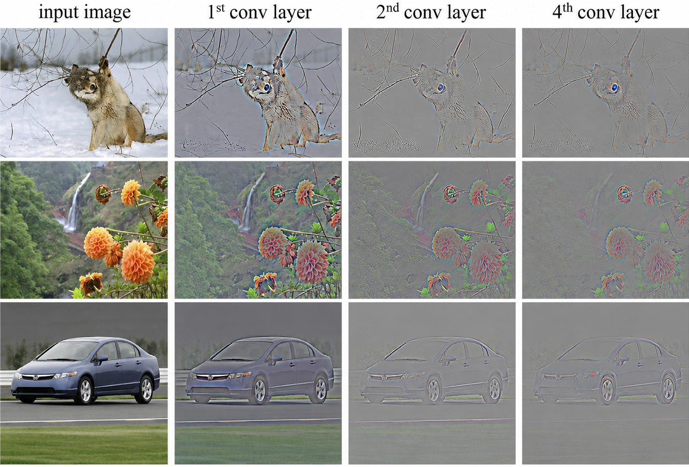

[](https://colab.research.google.com/github/jshn9515/dnnl-notebooks/blob/main/en/ch5-convolutional-neural-network/ch5.1-from-mlp-to-cnn.ipynb){fig-align="left"}

In the previous sections on multilayer perceptrons, we learned how to pass an input vector into a neural network and extract representations layer by layer through linear layers and activation functions. For tabular data or feature vectors that have already been organized, this approach is very natural: each sample can be written as a fixed-length vector, and the network only needs to learn how different input features combine.

Images may seem to be suitable for the same approach. A grayscale image is essentially a collection of pixel values, so as long as we flatten the two-dimensional pixel matrix into a long vector, we can send it directly into an MLP. In fact, on small datasets such as MNIST, an ordinary MLP can indeed classify handwritten digits successfully.

But there is a problem: **an image is not merely a very long vector.**

The arrangement of pixels in an image has a clear spatial meaning. Neighboring pixels usually belong to the same local structure, an edge may appear anywhere in an image, and more complex textures and objects are built by combining these local patterns layer by layer. If we flatten an image directly, an MLP can still see all the pixel values, but it does not explicitly take advantage of these structures.

The starting point of a **convolutional neural network (CNN)** is to write the spatial structure of images directly into the network's connectivity pattern. It is not simply giving an MLP a different name. Instead, it reconsiders a basic question: when processing an image, which inputs should a neuron see? When the same local pattern appears at different positions, do we really need to learn a separate set of parameters each time?

In this section, we will not rush into deriving the complete convolution formula. Instead, we will start from the limitations of MLPs and understand why CNNs use local connectivity and weight sharing, and why these designs are particularly suitable for images.

```{python}
import dnnlpy
import matplotlib.pyplot as plt
import torch
import torch.nn as nn
import torch.nn.functional as F

dnnlpy.set_matplotlib_format('highdpi')
print('PyTorch version:', torch.__version__)
```

## 5.1.1 An Image Is Not Merely a Vector

Suppose we have a $28 \times 28$ grayscale image. Since each position contains only one pixel value, it can be written as:

$$
X \in \mathbb{R}^{28\times 28}
$$

To pass it to an MLP, we usually first flatten the two-dimensional image into a vector of length 784:

$$
\operatorname{flatten}(X) \in \mathbb{R}^{784}
$$

From the perspective of data types, there is no problem with this. All pixel values in the two-dimensional matrix are still retained in the flattened vector; no numerical values are deleted. However, the representation changes in an important way: the original two-dimensional adjacency relationships are no longer directly reflected in the tensor shape.

For example, in the original image, the pixels near position $(i,j)$ are $(i-1,j)$, $(i+1,j)$, $(i,j-1)$, and $(i,j+1)$. These positions are close to one another in space and are usually strongly correlated. After the image is flattened, they become merely several indices in a vector. The MLP does not know which indices were originally adjacent, nor does it know that a group of pixels may jointly form an edge, corner, or texture.

We can use a simple pattern to observe the difference before and after flattening.

```{python}
image = torch.zeros(8, 8)
image[1:7, 3:5] = 1.0

flattened = image.view(1, -1)
flattened = flattened.repeat(image.numel(), 1)

fig = plt.figure(1, figsize=(6, 3))
ax1 = fig.add_subplot(1, 2, 1)
ax1.imshow(image, cmap='gray', vmin=0, vmax=1)
ax1.set_xticks([])
ax1.set_yticks([])
ax1.set_title(r'Image: $8 \times 8$')
ax2 = fig.add_subplot(1, 2, 2)
ax2.imshow(flattened, cmap='gray', vmin=0, vmax=1)
ax2.set_aspect('equal')
ax2.set_yticks([])
ax2.set_xlabel('Feature Index')
ax2.set_title('Flattened: 64')
plt.show()
```

In the image on the left, it is easy to see a vertical structure in the middle. Although the image on the right retains exactly the same values, this structure is no longer visually apparent. For an MLP, the network must learn from the training data which input indices should be combined, while the network architecture itself provides no information about the two-dimensional space. This is one of the most important differences between images and ordinary vectors: an image contains not only pixel values but also spatial relationships between pixels.

Flattening an image creates another practical problem: the number of parameters in a fully connected layer grows rapidly with the input resolution.

For a linear layer with input dimension $d_{\text{in}}$ and output dimension $d_{\text{out}}$, the shape of its weight matrix is:

$$
W\in\mathbb{R}^{d_{\text{out}}\times d_{\text{in}}}
$$

Ignoring the bias, the number of parameters is:

$$
d_{\text{in}} \times d_{\text{out}}
$$

For a $28 \times 28$ grayscale image, if the first layer contains 512 hidden units, the number of parameters is:

$$
28 \times 28 \times 512 = 401,408
$$

This size is still manageable. But if the input is changed to a $3 \times 224 \times 224$ color image, the flattened input dimension becomes:

$$
3 \times 224 \times 224 = 150,528
$$

When it is connected to the same 512 hidden units, the first layer alone has:

$$
150,528 \times 512 = 77,070,336
$$

We can verify this number directly with PyTorch.

```{python}
mlp1 = nn.Linear(28 * 28, 512, bias=False)
mlp2 = nn.Linear(3 * 224 * 224, 512, bias=False)
params1 = dnnlpy.count_params(mlp1)
params2 = dnnlpy.count_params(mlp2)

print(f'MNIST input layer: {params1:,} parameters.')
print(f'ImageNet input layer: {params2:,} parameters.')
```

The problem here is not only the number of parameters. In a fully connected layer, every output neuron must store an independent weight for every input pixel. This means that even a modest increase in input resolution causes the number of parameters to balloon, along with the computation, memory, and amount of data required for training.

More importantly, these many parameters do not take advantage of the most obvious prior in images: many useful patterns exist only in local regions, rather than requiring every neuron to observe the entire image at once from the beginning.

## 5.1.2 Patterns in Images Are Usually Local

When looking at a natural image, we usually do not begin by understanding all the pixels together. Much of the most basic visual information comes from local regions, for example:

- A change in brightness between neighboring regions forms an edge;
- two edges intersect to form a corner;
- edges repeat in a particular way to form a texture;
- multiple local textures and contours continue to combine into an object part.

In other words, visual features have an obvious hierarchical structure, but the information at the lowest level usually comes from a very small neighborhood.

Suppose we want to determine whether there is a vertical edge near a particular position in an image. This task does not require looking at pixels at the other end of the image. It only needs to compare the brightness on the left and right near the current position. Connecting a neuron to the entire image not only wastes parameters but also fails to reflect the locality of the task.

CNNs therefore use **local connectivity**. One convolution output position connects only to a local window in the input. For example, a $3\times 3$ window observes only the 9 positions around the current region, rather than the entire image.

```{python}
image_size = 8
kernel_size = 3

full_connections = image_size * image_size
local_connections = kernel_size * kernel_size

print('Connections used by one fully connected unit:', full_connections)
print('Connections used by one local 3x3 unit:', local_connections)
```

For an $8 \times 8$ input, a fully connected neuron needs to connect to 64 input positions, while a $3 \times 3$ local window needs to connect to only 9 positions. When the image becomes larger, the local window can remain the same size, so the number of inputs processed at one output position does not grow with the area of the entire image.

This design writes a very useful assumption into the network:

> **Nearby pixels are usually more directly related than pixels that are far apart.**

This assumption is called the network's **inductive bias**. It does not mean that long-distance relationships are unimportant. Rather, it means that visual modeling can start with local structures and gradually expand the range of information it can see through multiple layers.

## 5.1.3 The Same Pattern May Appear Anywhere

Local connectivity alone is still not enough.

Suppose a vertical edge may appear in both the upper-left and lower-right corners of an image. If we learn a separate set of local parameters for each position, the edge detector in the upper-left corner and the one in the lower-right corner remain unrelated. Even though they are meant to recognize the same pattern, the network must learn it repeatedly at different positions. However, many local patterns in images are position-independent. A vertical edge is still a vertical edge whether it appears on the left, right, above, or below. Therefore, a more reasonable approach is to reuse the same local detector across the entire image.

This is **weight sharing** in convolution.

A convolutional layer learns a small weight window, usually called a kernel or filter. This kernel slides across the image and performs the same local computation at every position. Thus, the same set of parameters can detect the same pattern at different spatial positions.

To observe this effect intuitively, we first construct a simple vertical edge detector by hand. Here, we temporarily use `nn.Conv2d` to perform the computation. The specific formula of the convolutional layer, tensor shapes, and implementation from scratch will be covered in later chapters.

```{python}
image = torch.zeros(1, 1, 32, 32)
image[..., 16:] = 1.0

kernel = torch.tensor(
    [
        [-1.0, 0.0, 1.0],
        [-1.0, 0.0, 1.0],
        [-1.0, 0.0, 1.0],
    ]
).view(1, 1, 3, 3)

response = F.conv2d(image, kernel)

fig = plt.figure(2, figsize=(6, 3))
ax1 = fig.add_subplot(1, 2, 1)
ax1.imshow(image[0, 0], cmap='gray')
ax1.set_xticks([])
ax1.set_yticks([])
ax1.set_title('Input Image')
ax2 = fig.add_subplot(1, 2, 2)
ax2.imshow(response[0, 0], cmap='gray')
ax2.set_xticks([])
ax2.set_yticks([])
ax2.set_title('Vertical Edge Response')
plt.show()
```

This convolutional kernel contains only 9 weights, but it can be applied to every local position in the input. If the vertical edge moves to another position in the image, the same kernel can still produce a response; there is no need to define another set of weights for the new position.

In contrast, a fully connected layer learns independent parameters for every input position by default. It may of course learn similar behavior through training, but the network architecture does not directly guarantee this pattern. More parameters and more data are usually needed to learn it.

Local connectivity and weight sharing together form the core design of CNNs:

- Process only one local region at a time;
- reuse the same local computation at every spatial position.

## 5.1.4 From Weight Sharing to Translation Equivariance

Weight sharing also brings an important property: **translation equivariance**.

Suppose a pattern in the input image moves some distance to the right. If we use the same convolutional kernel to scan the entire image, the response in the output will usually also move the same distance to the right. This can be written as:

$$
f(T(X)) = T(f(X))
$$

Here, $T$ denotes a translation operation and $f$ denotes the convolution computation.

“Equivariant” does not mean that the output remains completely unchanged. After an edge in the input moves, the corresponding edge response in the output also moves. What is preserved is the correspondence between the change in the input and the change in the output.

We can process two images that differ only in position with the same convolutional kernel.

```{python}
image_left = torch.zeros(1, 1, 32, 32)
image_left[..., 10:] = 1.0

image_right = torch.zeros(1, 1, 32, 32)
image_right[..., 20:] = 1.0

response_left = F.conv2d(image_left, kernel)
response_right = F.conv2d(image_right, kernel)

fig = plt.figure(3, figsize=(6, 6))
ax1 = fig.add_subplot(2, 2, 1)
ax1.imshow(image_left[0, 0], cmap='gray')
ax1.set_title('Input: Edge on the Left')
ax2 = fig.add_subplot(2, 2, 2)
ax2.imshow(response_left[0, 0], cmap='gray')
ax2.set_title('Response')
ax3 = fig.add_subplot(2, 2, 3)
ax3.imshow(image_right[0, 0], cmap='gray')
ax3.set_title('Input: Edge on the Right')
ax4 = fig.add_subplot(2, 2, 4)
ax4.imshow(response_right[0, 0], cmap='gray')
ax4.set_title('Shifted Response')

for ax in [ax1, ax2, ax3, ax4]:
    ax.set_xticks([])
    ax.set_yticks([])

plt.show()
```

When the edge in the input moves to the right, the response in the convolution output also moves to the right. This property is particularly suitable for visual tasks because objects or local features do not always appear in fixed positions.

It is important to note that translation equivariance and translation invariance are not the same concept:

- **Translation equivariance**: after the input is translated, the feature map translates accordingly;
- **Translation invariance**: after the input is translated, the final output remains unchanged.

Convolution itself primarily provides translation equivariance. Image classification ultimately aims for the model to be less sensitive to small changes in an object's position. This approximate translation invariance usually requires pooling, downsampling, global average pooling, data augmentation, and other mechanisms working together.

## 5.1.5 How Convolution Reduces the Number of Parameters

We can now compare the number of parameters in fully connected and convolutional layers again.

Suppose the input is an RGB image with 3 input channels. We want to obtain 64 output feature channels and use a $3 \times 3$ convolutional kernel. The shape of the convolutional layer's weights is:

$$
64 \times 3 \times 3 \times 3
$$

Therefore, ignoring the bias, the number of parameters is only:

$$
64 \times 3 \times 3 \times 3 = 1,728
$$

Whether the input image is $32 \times 32$, $224 \times 224$, or a higher resolution, the number of parameters in the convolutional layer does not change as long as the number of input channels, output channels, and the kernel size remain the same.

```{python}
linear = nn.Linear(3 * 224 * 224, 64, bias=False)
conv2d = nn.Conv2d(3, 64, kernel_size=3, bias=False)

linear_params = dnnlpy.count_params(linear)
conv2d_params = dnnlpy.count_params(conv2d)

print(f'Linear layer: {linear_params:,} parameters.')
print(f'Conv2d layer: {conv2d_params:,} parameters.')
```

The difference between the two comes from their connectivity:

- A fully connected layer stores independent parameters between every output neuron and every input pixel;
- a convolutional layer learns only a small number of local weights and shares them across the entire image.

This does not mean that convolutional layers are necessarily more powerful than linear layers. On the contrary, convolutional layers actively constrain the connectivity pattern. This restriction is precisely what makes them more suitable for images: the network does not need to learn from scratch that “local pixels are more related” and “the same pattern can appear at different positions,” because these principles have already been written into the model architecture.

## 5.1.6 How CNNs Form Hierarchical Features

A single convolutional layer can process only a local region of limited size. How, then, can a CNN recognize a complex object that spans the entire image?

The key is to stack multiple convolutional layers.

After a kernel slides across the input, it generates a two-dimensional output in which each position represents the response of that local region to a particular pattern. This output is called a **feature map**. A convolutional kernel usually generates one feature map, while multiple kernels generate multiple output channels, with each channel learning to detect different local patterns. For example, the first convolutional layer can extract simple local patterns from pixels, such as edges in different directions. The second layer no longer looks only directly at the raw pixels. Instead, it combines the edge features produced by the first layer to form corners, textures, or simple contours. As the network becomes deeper, later layers can continue combining these low-level features into object parts and higher-level semantics.

This process can be roughly understood as:

{width=80%}

This layer-by-layer combination from local to global and from simple patterns to complex patterns is CNNs' **hierarchical feature learning**. Although an individual convolution output depends only on a local window, after multiple convolutional layers are stacked, features in later layers can indirectly see an increasingly large region of the input.

The region of the original input that can influence an output neuron is called its **receptive field**. The deeper the network, the larger the receptive field usually is. Thus, the model can preserve local structure while gradually integrating information from a broader area. The precise calculation of the receptive field depends on the kernel size, stride, and downsampling method. We will encounter this concept again when discussing convolutional and pooling layers later.

## 5.1.7 CNNs Are Not Limited to Images

The most classic application of convolution is two-dimensional images, but local connectivity and weight sharing are not limited to images.

For time series or audio, we can use one-dimensional convolution along the time axis. For medical volumetric data, we can use three-dimensional convolution. The core idea remains the same: perform the same learnable computation within a local region and apply the same set of weights at different positions.

CNNs have been particularly successful for images, however, because their structure matches the characteristics of images so well:

- Images have a regular grid structure;
- neighboring pixels are usually strongly correlated;
- local patterns such as edges and textures repeat at different positions;
- complex visual concepts can be formed by combining simple local features layer by layer.

CNNs encode these principles as local connectivity, weight sharing, and translation equivariance. Compared with a fully general MLP, they therefore usually have a more suitable inductive bias for visual tasks.

## 5.1.8 Summary

In this section, we started from the problems encountered when MLPs process images and introduced the design motivation behind convolutional neural networks.

Flattening an image into a vector does not lose the pixel values, but it hides the original two-dimensional spatial structure. A fully connected layer also requires every output neuron to connect to every input pixel, causing the number of parameters to grow rapidly with image resolution. More importantly, it does not explicitly use the local correlations in images, nor does it automatically share detection parameters for the same pattern at different positions.

CNNs address these problems through two core designs: local connectivity makes each output position observe only a small window of the input, while weight sharing allows the same convolutional kernel to be reused across the entire image. Weight sharing further brings translation equivariance: when a pattern in the input translates, the corresponding feature response translates as well.

Once multiple convolutional layers are stacked, the network can first extract low-level features such as edges and colors, then gradually combine them into textures, object parts, and complete objects. CNNs therefore do not simply reduce the number of parameters; they write a spatial inductive bias suitable for images into the network architecture.

In the next section, we will formally examine the computation performed by a convolutional layer, discussing how a kernel slides across the input and how kernel size, padding, stride, input channels, and output channels each affect the shape of the output tensor.
