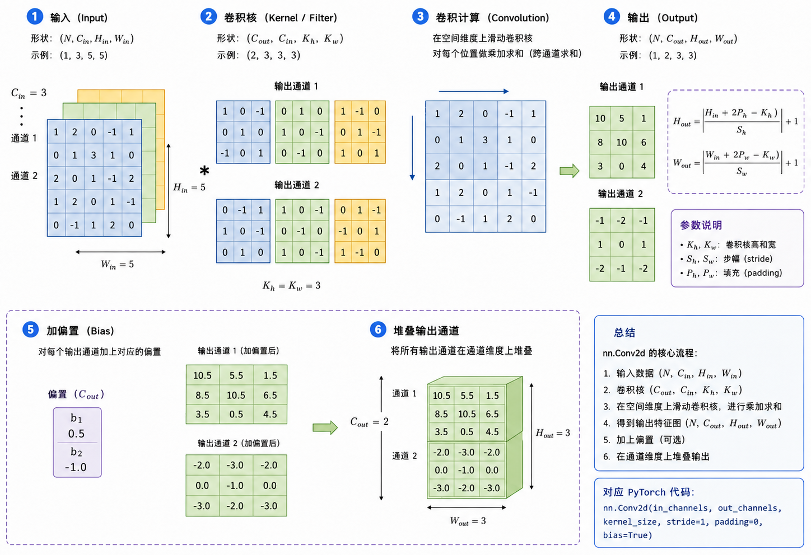
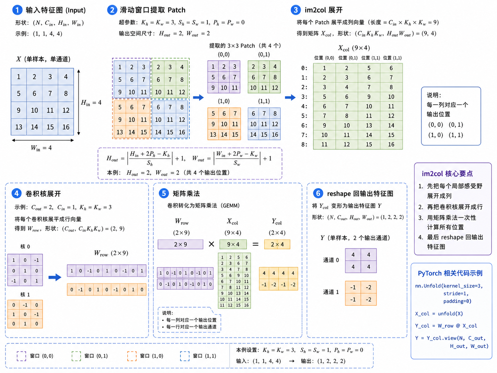

[](https://colab.research.google.com/github/jshn9515/dnnl-notebooks/blob/main/en/ch5-convolutional-neural-network/ch5.3-conv2d-from-scratch.ipynb){fig-align="left"}

In the previous section, we broke down the computation of two-dimensional convolution. For each local window in the input, the convolutional layer multiplies it element by element with the kernel and sums the results; `padding` determines how the input boundary is extended, `stride` determines how far the window moves each time, and the input and output channels determine how many groups of kernels a convolutional layer needs.

However, understanding the formula and actually writing a `Conv2d` that accepts batched, multi-channel input are two different things. A practical convolutional layer needs to handle all of the following:

- The input tensor has four dimensions, $(N, C_{\text{in}}, H, W)$;
- The weight tensor has four dimensions, $(C_{\text{out}}, C_{\text{in}}, K_h, K_w)$;
- Every output channel must aggregate all input channels;
- `padding` and `stride` jointly determine the window positions and output size;
- The convolutional layer must also register parameters, initialize weights, and participate in backpropagation like an ordinary `nn.Module`.

In this section, we will start with a direct loop-based implementation and gradually write a complete `Conv2d` module. This implementation will not aim for execution speed. Instead, we will make each loop in the code correspond as closely as possible to one dimension in the convolution formula. Once it is complete, we will compare it with `F.conv2d` to confirm that both the forward results and gradients agree.

```{python}
import math

import dnnlpy
import dnnlpy.nn.functional as dF
import torch
import torch.nn as nn
import torch.nn.functional as F
from torch import Tensor

print('PyTorch version:', torch.__version__)
```

## 5.3.1 The Input, Weights, and Output of nn.Conv2d

Let us first establish the tensor layout used throughout this section. PyTorch's two-dimensional convolution uses the **NCHW** format by default:

$$
X \in \mathbb{R}^{N\times C_{\text{in}}\times H\times W}
$$

Here, $N$ is the batch size, $C_{\text{in}}$ is the number of input channels, and $H$ and $W$ are the input height and width.

The “channel” can be understood as a different source of information at the same spatial position. For example, an RGB image has 3 input channels:

$$
C_{\text{in}} = 3
$$

They correspond to red, green, and blue. In intermediate network layers, input channels do not necessarily represent colors; they may instead represent different features such as edges, textures, and shapes.

A convolutional layer receives these $C_{\text{in}}$ input channels and generates $C_{\text{out}}$ new output channels:

$$
Y \in \mathbb{R}^{N\times C_{\text{out}}\times H_{\text{out}}\times W_{\text{out}}}
$$

Therefore:

- $C_{\text{in}}$ determines how many input channels one group of kernels needs to observe;
- $C_{\text{out}}$ determines how many different feature-extraction methods the convolutional layer should learn.

Because generating one output channel requires observing all input channels at the same time, we perform a local multiply-and-add separately for each input channel and then accumulate the results to obtain one element of that output channel.

For example:

```python
conv = nn.Conv2d(in_channels=3, out_channels=8, kernel_size=3)
```

This convolutional layer:

- Accepts an input with 3 channels;
- Learns 8 different feature-extraction methods;
- Ultimately generates 8 output channels.

We can roughly think of these 8 output channels as 8 new feature maps. Different output channels may respond to edges in different directions, changes in color, or local textures.

Suppose the input is an RGB image. An output feature generally cannot depend only on the red channel or only on the green channel; it needs to jointly observe all three RGB channels. Therefore, to generate one output channel, we need to prepare a two-dimensional convolutional kernel for each input channel.

For the $o$-th output channel, the corresponding weights are:

$$
W_o \in \mathbb{R}^{C_{\text{in}}\times K_h\times K_w}
$$

Internally, it contains $C_{\text{in}}$ two-dimensional convolutional kernels:

$$
\left[W_{o,0}, W_{o,1}, \ldots, W_{o,C_{\text{in}}-1} \right]
$$

where:

$$
W_{o,c}\in\mathbb{R}^{K_h\times K_w}
$$

The $c$-th two-dimensional kernel is responsible only for processing the $c$-th input channel.

If the input has 3 channels, generating one output channel requires three two-dimensional convolutions:

$$
\begin{align}
X_0 \ast W_{o,0} \\
X_1 \ast W_{o,1} \\
X_2 \ast W_{o,2}
\end{align}
$$

Then we add the three results together:

$$
\sum_{c=0}^{C_{\text{in}}-1} X_c\ast W_{o,c} + b_o
$$

Here, $\ast$ denotes the two-dimensional convolution operation, and $b_o$ is the bias corresponding to the $o$-th output channel.

Therefore, an output channel is not generated by one ordinary two-dimensional kernel. It is generated jointly by a set of weights containing $C_{\text{in}}$ two-dimensional kernels.

The process above can generate only one output channel. But a convolutional layer usually aims to extract many different features. For example, one set of weights may learn horizontal edges, another may learn vertical edges, and others may learn textures or changes in color. Therefore, we need to prepare $C_{\text{out}}$ such sets of weights:

$$
W_0,W_1,\ldots,W_{C_{\text{out}}-1}
$$

Each set of weights observes all $C_{\text{in}}$ input channels and generates one output channel.

Thus, the complete weight shape of the convolutional layer is:

$$
W \in \mathbb{R}^{C_{\text{out}} \times C_{\text{in}} \times K_h \times K_w}
$$

The four dimensions can be understood as follows:

- Dimension 0: the number of output channels $C_{\text{out}}$, indicating how many different feature-extraction methods the convolutional layer should learn;
- Dimension 1: the number of input channels $C_{\text{in}}$, indicating how many input channels each group of kernels needs to observe;
- Dimension 2: the kernel height $K_h$, indicating how many pixels each two-dimensional kernel covers in the vertical direction;
- Dimension 3: the kernel width $K_w$, indicating how many pixels each two-dimensional kernel covers in the horizontal direction.



Let us observe the parameter shapes of an ordinary convolutional layer in PyTorch.

```{python}
conv = nn.Conv2d(
    in_channels=3,
    out_channels=8,
    kernel_size=(3, 5),
    stride=2,
    padding=(1, 2),
)

print('Weight shape:', conv.weight.shape)
print('Bias shape:', conv.bias.shape)
```

The `weight` shape in the output is `(8, 3, 3, 5)`, whose dimensions mean, in order:

```text
(out_channels, in_channels, kernel_height, kernel_width)
```

It indicates that:

- There are 8 groups of kernels;
- Each group of kernels generates 1 output channel;
- Each group of kernels contains 3 two-dimensional kernels;
- The 3 two-dimensional kernels process the 3 input channels, respectively;
- Each two-dimensional kernel has size $3\times 5$.

Thus, the entire convolutional layer ultimately generates 8 output channels.

## 5.3.2 Handling Integer and Pair Parameters Uniformly

`nn.Conv2d` allows `kernel_size`, `stride`, and `padding` to receive either an integer or a pair `(height, width)`. For example, `kernel_size=3` means that the kernel is 3 in both the height and width directions, while `kernel_size=(3, 5)` means that the kernel is 3 in height and 5 in width; `stride=(2, 1)` means that the convolution window moves 2 positions at a time in height and 1 position at a time in width; `padding=(1, 2)` means that 1 row is added to both the top and bottom of the input, and 2 columns are added to both the left and right.

To ensure that the later code always uses a uniform representation, we first write a helper function that converts an integer into a pair.

```{python}
def as_tuple(value: int | tuple[int, int]) -> tuple[int, int]:
    """Convert an integer or a length-2 sequence to a pair."""
    if isinstance(value, int):
        return value, value

    if len(value) != 2:
        raise AssertionError('expected an integer or a sequence of length 2.')

    return tuple(map(int, value))


print('3 ->', as_tuple(3))
print('(3, 5) ->', as_tuple((3, 5)))
```

Next, we write the output-size formula derived in the previous section as a function. For each spatial dimension:

$$
L_{\text{out}} = \left\lfloor \frac{L_{\text{in}}+2P-K}{S} \right\rfloor + 1
$$

Here is the code implementation:

```{python}
def conv_output_size(
    input_size: int, kernel_size: int, padding: int, stride: int
) -> int:
    """Calculate the output size along one spatial dimension."""
    output_size = (input_size + 2 * padding - kernel_size) // stride + 1

    if output_size <= 0:
        raise RuntimeError('Calculated output size too small.')

    return output_size
```

We are not adding dilation for now, so the effective size of the kernel is simply `kernel_size` itself. Dilation changes only the spacing between sampling points inside the kernel; it does not change the core computation we need to understand in this section. We can extend it later when dilated convolution is needed.

## 5.3.3 Implementing Multi-Channel Convolution with Four Loops

We can now start implementing a complete `conv2d` function. To make the computation as intuitive as possible, we will explicitly iterate over:

1. Each sample in the batch;
2. Each output channel;
3. Every row in the output feature map;
4. Every column in the output feature map.

The summation over the input channels and the interior of the kernel can be completed at once through element-wise multiplication between the local window and the weight tensor.

```{python}
def conv2d_v1(
    x: Tensor,
    weight: Tensor,
    bias: Tensor | None = None,
    stride: int | tuple[int, int] = 1,
    padding: int | tuple[int, int] = 0,
) -> Tensor:
    """Apply a simple 2D convolution using explicit sliding windows."""
    if x.ndim != 4:
        raise AssertionError('Input must have shape (N, C_in, H, W).')
    if weight.ndim != 4:
        raise AssertionError('Weight must have shape (C_out, C_in, K_h, K_w).')
    if x.size(1) != weight.size(1):
        raise AssertionError('Input channels must match weight channels.')
    if bias is not None and weight.size(0) != bias.size(0):
        raise AssertionError('Bias must have shape (C_out,).')

    s_h, s_w = as_tuple(stride)
    p_h, p_w = as_tuple(padding)

    if s_h <= 0 or s_w <= 0:
        raise AssertionError('`stride` must be positive.')
    if p_h < 0 or p_w < 0:
        raise AssertionError('`padding` must be non-negative.')

    batch_size, in_channels, input_h, input_w = x.size()
    out_channels, _, k_h, k_w = weight.size()

    output_h = conv_output_size(input_h, k_h, p_h, s_h)
    output_w = conv_output_size(input_w, k_w, p_w, s_w)

    x_padded = F.pad(x, pad=(p_w, p_w, p_h, p_h))
    output = x.new_empty(batch_size, out_channels, output_h, output_w)

    for B in range(batch_size):
        for out_channel in range(out_channels):
            for i in range(output_h):
                row_start = i * s_h
                row_end = row_start + k_h

                for j in range(output_w):
                    col_start = j * s_w
                    col_end = col_start + k_w

                    window = x_padded[B, :, row_start:row_end, col_start:col_end]
                    value = torch.sum(window * weight[out_channel])

                    if bias is not None:
                        value = value + bias[out_channel]

                    output[B, out_channel, i, j] = value

    return output
```

Although the function contains four explicit loops, the shape of `window` at each position is:

$$
(C_{\text{in}}, K_h, K_w)
$$

and `weight[out_channel]` has exactly the same shape. Element-wise multiplication followed by summation completes the accumulation over both the input channels and the spatial dimensions of the kernel at once.

The following uses a very small input to observe the shape changes.

```{python}
x = torch.randn(2, 3, 5, 6)
weight = torch.randn(4, 3, 3, 2)
bias = torch.randn(4)

actual = conv2d_v1(x, weight, bias, stride=(2, 1), padding=(1, 0))

print('Input shape:', x.shape)
print('Weight shape:', weight.shape)
print('Output shape:', actual.shape)
```

The input has 2 samples and 3 channels, while the weights contain 4 groups of kernels, so the output has 4 channels. The spatial dimensions are jointly determined by the kernel, padding, and stride.

## 5.3.4 Comparing with PyTorch's F.conv2d

The most important step in a hand-written implementation is not making the code run, but confirming that it performs the intended mathematical operation. We can pass the same input, weights, and bias to `F.conv2d` and compare the two results.

```{python}
expected = F.conv2d(x, weight, bias, stride=(2, 1), padding=(1, 0))

max_err = (actual - expected).abs().max()
print('Maximum absolute error:', max_err.item())

flag = torch.allclose(actual, expected, atol=1e-6)
print('Is the hand-written implementation close to F.conv2d?', flag)
```

Within floating-point error, the two should be exactly the same. `F.conv2d` and our hand-written function perform the same operation; the main difference is the implementation:

- Our version uses Python loops to extract each window, making it suitable for understanding the algorithm;
- PyTorch's version calls highly optimized low-level kernels, making it suitable for actually training models.

Therefore, implementing convolution from scratch is not intended to replace `F.conv2d` in production. In real use, we should still choose the efficient implementation provided by the framework.

## 5.3.5 Does Automatic Differentiation Still Work?

Although our implementation contains slicing, element-wise multiplication, summation, and assignment, the main numerical computations are still performed by PyTorch Tensor operations. Therefore, as long as the inputs and parameters require gradients, autograd can record the computation graph and calculate the backward pass.

We can use the hand-written implementation and `F.conv2d` to calculate the same scalar loss separately, then compare the gradients of the input, weights, and bias.

```{python}
def _copy(x: Tensor, mode: bool = True) -> Tensor:
    """Copy a tensor and set its `requires_grad` attribute."""
    return x.detach().clone().requires_grad_(mode)


x_actual = torch.randn(1, 2, 4, 5, requires_grad=True)
weight_actual = torch.randn(3, 2, 3, 2, requires_grad=True)
bias_actual = torch.randn(3, requires_grad=True)

x_expected = _copy(x_actual)
weight_expected = _copy(weight_actual)
bias_expected = _copy(bias_actual)

actual = conv2d_v1(
    x_actual,
    weight_actual,
    bias_actual,
    stride=(1, 2),
    padding=(1, 0),
)
loss_actual = actual.square().mean()
loss_actual.backward()

expected = F.conv2d(
    x_expected,
    weight_expected,
    bias_expected,
    stride=(1, 2),
    padding=(1, 0),
)
loss_expected = expected.square().mean()
loss_expected.backward()

flag = torch.allclose(x_actual.grad, x_expected.grad, atol=1e-6)
print('Is input gradient close?', flag)

flag = torch.allclose(weight_actual.grad, weight_expected.grad, atol=1e-6)
print('Is weight gradients close?', flag)

flag = torch.allclose(bias_actual.grad, bias_expected.grad, atol=1e-6)
print('Is bias gradients close?', flag)
```

This shows that we do not need to manually derive and implement the convolution backward pass. As long as the forward pass consists of differentiable PyTorch operations, autograd can automatically apply the chain rule along those operations.

## 5.3.6 Wrapping the Function in a Conv2d Module

The functional implementation receives `weight` and `bias` from outside, but a real convolutional layer needs to own these trainable parameters. To do this, we can inherit from `nn.Module` and register the weights and bias using `nn.Parameter`.

```{python}
class Conv2d(nn.Module):
    """A minimal educational implementation of 2D convolution."""

    def __init__(
        self,
        in_channels: int,
        out_channels: int,
        kernel_size: int | tuple[int, int],
        stride: int | tuple[int, int] = 1,
        padding: int | tuple[int, int] = 0,
        bias: bool = True,
    ):
        super().__init__()
        if in_channels <= 0 or out_channels <= 0:
            raise AssertionError('`in_channels` and `out_channels` must be positive.')

        self.in_channels = in_channels
        self.out_channels = out_channels
        self.kernel_size = as_tuple(kernel_size)
        self.stride = as_tuple(stride)
        self.padding = as_tuple(padding)

        k_h, k_w = self.kernel_size
        self.weight = nn.Parameter(torch.empty(out_channels, in_channels, k_h, k_w))

        if bias:
            self.bias = nn.Parameter(torch.empty(out_channels))
        else:
            self.register_parameter('bias', None)

        self.reset_parameters()

    def reset_parameters(self) -> None:
        nn.init.kaiming_uniform_(self.weight, a=math.sqrt(5))

        if self.bias is not None:
            fan_in = self.in_channels * math.prod(self.kernel_size)
            bound = 1 / math.sqrt(fan_in)
            nn.init.uniform_(self.bias, -bound, bound)

    def forward(self, x: Tensor) -> Tensor:
        return conv2d_v1(
            x,
            weight=self.weight,
            bias=self.bias,
            stride=self.stride,
            padding=self.padding,
        )

    def extra_repr(self) -> str:
        return (
            f'{self.in_channels}, {self.out_channels}, '
            f'kernel_size={self.kernel_size}, stride={self.stride}, '
            f'padding={self.padding}, bias={self.bias is not None}'
        )
```

`nn.Parameter` is still essentially a Tensor, but when it is assigned as an attribute of an `nn.Module`, PyTorch automatically registers it as a model parameter. As a result, it will:

- Appear in `model.parameters()`;
- Be updated by the optimizer;
- Be included in `state_dict()`;
- Move with the module when `.to(device)` is called.

When bias is not used, instead of writing `self.bias=None` directly, we call:

```python
self.register_parameter('bias', None)
```

This clearly tells `nn.Module` that `bias` is a parameter slot defined by the module, but that it currently has no actual parameter. This also matches the implementation style of PyTorch's built-in modules.

Now instantiate the module and inspect its parameters.

```{python}
custom_conv = Conv2d(3, 8, kernel_size=3, stride=2, padding=1)

print(custom_conv)
print('Weight shape:', custom_conv.weight.shape)
print('Bias shape:', custom_conv.bias.shape)
print('Number of parameters:', dnnlpy.count_params(custom_conv))
```

The number of parameters is:

$$
C_{\text{out}}C_{\text{in}}K_hK_w + C_{\text{out}}
$$

The last term comes from the bias. If `bias=False`, the final $C_{\text{out}}$ parameters are not needed.

## 5.3.7 Why Initialize the Weights This Way?

The `reset_parameters()` above largely reproduces the default initialization used by PyTorch's `nn.Conv2d`. The convolutional layer's `fan_in` is the number of inputs connected to one output element:

$$
\text{fan\_in} = C_{\text{in}}K_hK_w
$$

This is because one output element is determined jointly by the $K_h\times K_w$ local window across all input channels.

`kaiming_uniform_` controls the range of the weights according to `fan_in`, preventing the scale of activations from growing or shrinking too quickly after repeated linear transformations through multiple layers. Here, passing $\sqrt{5}$ as the `a` parameter keeps the uniform-distribution boundaries consistent with the default uniform distribution used by PyTorch's linear and convolutional layers.

The initialization range for the bias is:

$$
\left[-\frac{1}{\sqrt{\text{fan\_in}}},
\frac{1}{\sqrt{\text{fan\_in}}}\right]
$$

`reset_parameters()` does not need an additional `@torch.no_grad()` decorator. The initialization functions in `nn.init` modify parameters in a mode that does not record gradients, so the initialization process is not added to the computation graph. However, if we directly assign to a leaf Parameter in place inside `reset_parameters()`, we should explicitly use `torch.no_grad()`.

For example, the following implementation requires a no-grad context:

```python
@torch.no_grad()
def reset_parameters(self) -> None:
    self.weight.uniform_(-0.1, 0.1)
```

This section instead uses `nn.init.kaiming_uniform_` and `nn.init.uniform_`, so no additional decorator is needed.

## 5.3.8 Comparing with PyTorch's nn.Conv2d

Finally, we set the custom module and `nn.Conv2d` to exactly the same parameters and compare their forward outputs and backward gradients.

```{python}
custom_conv = Conv2d(
    in_channels=2,
    out_channels=3,
    kernel_size=(3, 2),
    stride=(2, 1),
    padding=(1, 0),
)
reference_conv = nn.Conv2d(
    in_channels=2,
    out_channels=3,
    kernel_size=(3, 2),
    stride=(2, 1),
    padding=(1, 0),
)

with torch.no_grad():
    reference_conv.weight.copy_(custom_conv.weight)
    reference_conv.bias.copy_(custom_conv.bias)

actual = torch.randn(2, 2, 6, 5, requires_grad=True)
expected = _copy(actual)

actual = custom_conv(actual)
expected = reference_conv(expected)

flag = torch.allclose(actual, expected, atol=1e-6)
print('Is the hand-written Conv2d implementation close to nn.Conv2d?', flag)

loss_actual = actual.square().mean()
loss_expected = expected.square().mean()

loss_actual.backward()
loss_expected.backward()

flag = torch.allclose(actual, expected, atol=1e-6)
print('Is input gradient close?', flag)

flag = torch.allclose(custom_conv.weight.grad, reference_conv.weight.grad, atol=1e-6)
print('Is weight gradients close?', flag)

flag = torch.allclose(custom_conv.bias.grad, reference_conv.bias.grad, atol=1e-6)
print('Is bias gradients close?', flag)
```

This test verifies three things at once:

1. The two modules perform the same forward computation;
2. The gradients of the loss with respect to the input are the same;
3. The gradients of the loss with respect to `weight` and `bias` are the same.

Thus, in the mathematical sense, we have implemented a minimal but complete `Conv2d`.

## 5.3.9 Why Real Conv2d Is Not Implemented This Way

The structure of the hand-written version is clear, but it is very slow. The problem is not the convolution formula itself. Rather, Python loops process samples, channels, and spatial positions one by one, preventing full use of the parallel computing capabilities of the CPU and GPU.

High-performance convolution implementations usually choose different algorithms based on the input shape, hardware, and data type. One classic idea is to rearrange all local windows into a matrix first, then convert convolution into one large matrix multiplication. This method is often called `im2col`:



In PyTorch, `F.unfold` can expand all local windows in a two-dimensional input. Suppose each window contains $C_{\text{in}}K_hK_w$ elements. The expanded shape is:

$$
(N, C_{\text{in}}K_hK_w, H_{\text{out}}W_{\text{out}})
$$

The convolution weights can also be flattened into:

$$
(C_{\text{out}}, C_{\text{in}}K_hK_w)
$$

After performing matrix multiplication and restoring the spatial dimensions, we obtain the convolution output.

The following uses `F.unfold` to implement the same computation. This version no longer needs to iterate over every spatial position, so it is much faster than the previous version. However, it is still mainly intended to explain the relationship between convolution and matrix multiplication. When training an actual model, we should still use `nn.Conv2d` or `F.conv2d`.

```{python}
def conv2d_v2(
    x: Tensor,
    weight: Tensor,
    bias: Tensor | None = None,
    stride: int | tuple[int, int] = 1,
    padding: int | tuple[int, int] = 0,
) -> Tensor:
    """Apply 2D convolution by unfolding windows into columns."""
    if x.ndim != 4:
        raise AssertionError('Input must have shape (N, C_in, H, W).')
    if weight.ndim != 4:
        raise AssertionError('Weight must have shape (C_out, C_in, K_h, K_w).')
    if x.size(1) != weight.size(1):
        raise AssertionError('Input channels must match weight channels.')
    if bias is not None and weight.size(0) != bias.size(0):
        raise AssertionError('Bias must have shape (C_out,).')

    stride = as_tuple(stride)
    padding = as_tuple(padding)

    batch_size, in_channels, input_h, input_w = x.shape
    out_channels, _, k_h, k_w = weight.shape

    output_h = conv_output_size(input_h, k_h, padding[0], stride[0])
    output_w = conv_output_size(input_w, k_w, padding[1], stride[1])

    patches = dF.unfold(
        x,
        kernel_size=(k_h, k_w),
        padding=padding,
        stride=stride,
    )

    weight = weight.reshape(out_channels, -1)
    output = weight @ patches

    if bias is not None:
        output = output + bias.reshape(1, -1, 1)

    return output.reshape(batch_size, out_channels, output_h, output_w)
```

Let us test it:

```{python}
x = torch.randn(2, 3, 7, 6)
weight = torch.randn(5, 3, 3, 2)
bias = torch.randn(5)

actual = conv2d_v2(x, weight, bias, stride=(2, 1), padding=(1, 0))
expected = F.conv2d(x, weight, bias, stride=(2, 1), padding=(1, 0))

flag = torch.allclose(actual, expected, atol=1e-6)
print('Is the unfold implementation close to F.conv2d?', flag)
```

Of course, the actual implementation inside a framework is far more complex than this example. It may use specialized kernels directly or automatically choose an algorithm based on the device and input. `F.unfold` also explicitly creates an expanded intermediate tensor, which may consume a large amount of additional memory. Therefore, understanding `F.unfold` is helpful, but production code should still use `nn.Conv2d` or `F.conv2d` directly.

## 5.3.10 Summary

Starting from the convolution formula, this section implemented a two-dimensional convolution function that supports batches, multiple input channels, multiple output channels, padding, stride, and bias. We then wrapped it in an `nn.Module` that can register parameters and participate in training.

The most important tensor shapes in a convolutional layer are:

$$
\begin{align}
X&:\ (N,C_{\text{in}},H,W) \\
W&:\ (C_{\text{out}},C_{\text{in}},K_h,K_w) \\
Y&:\ (N,C_{\text{out}},H_{\text{out}},W_{\text{out}})
\end{align}
$$

For each output position, the convolutional layer extracts a local window with shape $(C_{\text{in}},K_h,K_w)$, multiplies it element by element with the complete set of weights for one output channel, and sums the results. The same weights are shared across different spatial positions, while different output channels use different groups of weights.

We also verified that the hand-written implementation and PyTorch's built-in convolution agree in both their forward results and gradients. Through `F.unfold`, we saw how convolution can be transformed into matrix multiplication. The loop-based implementation is suitable for building intuition, the unfolded implementation is suitable for understanding the computational structure, and actual model training should use the high-performance convolution kernels provided by the framework.

At this point, we understand and have implemented the core learnable operator in CNNs. However, convolutional layers often retain relatively large spatial feature maps. The next section will discuss another common class of operations: pooling and downsampling. These operations do not learn new kernels; instead, they gradually expand the input region covered by later neurons by compressing the spatial dimensions.
