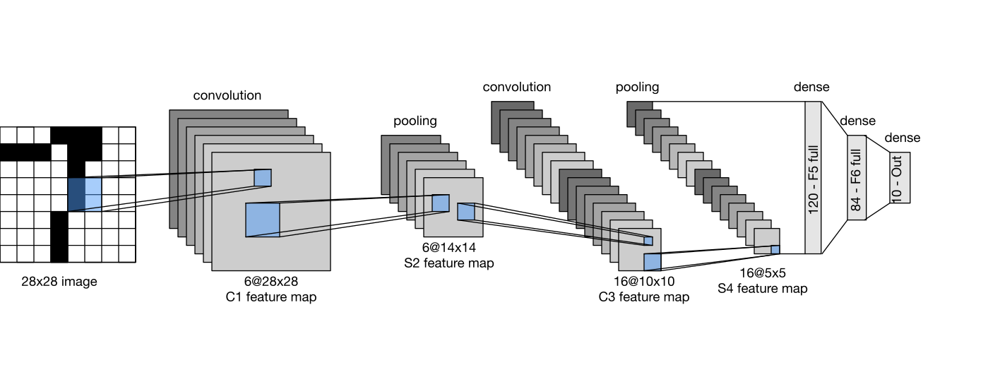

[](https://colab.research.google.com/github/jshn9515/dnnl-notebooks/blob/main/en/ch5-convolutional-neural-network/ch5.5-build-a-simple-cnn.ipynb){fig-align="left"}

The previous sections discussed convolution, pooling, and downsampling separately. A real convolutional neural network, however, is not one isolated operator. It is a complete model formed by combining multiple modules in sequence. Convolutional layers extract local features, activation functions introduce nonlinearity, pooling or strided convolution gradually reduces the spatial resolution, and the classification head finally converts the features into class logits.

In this section, we will connect these components into a complete system for the first time and build and train a simple CNN. Our goal is not to pursue the highest possible image-classification accuracy, but to see clearly how tensor shapes and semantic representations change layer by layer as an image enters the model and produces a classification result.

The entire model can be summarized as:



During the implementation, we will also briefly discuss a question that we have not explored before: when calling `nn.Conv2d`, why is PyTorch much faster than the educational implementation written with Python loops? On an NVIDIA GPU, PyTorch usually calls high-performance backends including cuDNN, and chooses an appropriate convolution algorithm based on the input shape, data type, and hardware conditions. Understanding this division of labor helps distinguish the “mathematical definition of convolution” from its “engineering implementation.”

```{python}
from collections.abc import Callable

import dnnlpy
import dnnlpy.nn as dnn
import dnnlpy.optim as dopt
import matplotlib.pyplot as plt
import torch
import torch.nn as nn
import torch.nn.functional as F
import torch.utils.data as utils
import torchinfo
import torchmetrics.classification as metrics
import torchvision.datasets as datasets
import torchvision.transforms.v2 as v2
from torch import Tensor

dnnlpy.set_matplotlib_format('svg')
print('PyTorch version:', torch.__version__)
```

## 5.5.1 From a Convolutional Layer to a Convolutional Block

A single convolutional layer performs only a linear transformation. For input $X$ and kernel $W$, the output of the convolutional layer can be written as:

$$
Z = X * W + b
$$

No matter how special convolution is spatially, without an activation function, stacking multiple convolutional layers still produces only a linear mapping. Therefore, CNNs usually add a nonlinear activation function such as ReLU after convolution:

$$
H = \operatorname{ReLU}(XW + b)
$$

A basic convolutional block can be written as:

{height=280px}

Here, convolution extracts local patterns, ReLU allows the model to represent nonlinear relationships, and pooling reduces the spatial resolution of the feature map.

```{python}
block = nn.Sequential(
    dnn.Conv2d(3, 16, kernel_size=3, padding=1),
    dnn.ReLU(),
    dnn.MaxPool2d(kernel_size=2),
)

x = torch.randn(16, 3, 28, 28)
y = block(x)

print('Input shape:', x.shape)
print('Output shape:', y.shape)
```

This convolution uses `kernel_size=3` and `padding=1`, so the height and width remain unchanged before and after convolution:

$$
28 \times 28 \rightarrow 28 \times 28
$$

Then, `MaxPool2d(kernel_size=2)` halves both spatial dimensions:

$$
28 \times 28 \rightarrow 14 \times 14
$$

At the same time, the convolutional layer increases the number of input channels from 3 to 16, so the complete shape change is:

$$
(N,3,28,28) \rightarrow (N,16,28,28) \rightarrow (N,16,14,14)
$$

## 5.5.2 Channels and Spatial Dimensions in CNNs

As CNNs become deeper, they usually gradually reduce the spatial dimensions while increasing the number of channels. For example:

$$
(3,28,28) \rightarrow (16,14,14) \rightarrow (32,7,7)
$$

This change does not mean that later features contain less information than earlier features. Height and width represent the positions at which features appear, while channels represent the types of features the network can detect. Shallow feature maps may describe edge directions and simple textures, while deeper feature maps can represent more complex local combinations.

This structure can be understood as follows:

- Shallow layers preserve more precise spatial positions;
- Deeper layers use more channels to describe richer semantics;
- Downsampling reduces computation and allows deeper units to see larger input regions.

The following combines two convolutional blocks to observe how the tensor shapes change.

```{python}
features = nn.Sequential(
    dnn.Conv2d(3, 16, kernel_size=3, padding=1),
    dnn.ReLU(),
    dnn.MaxPool2d(kernel_size=2, stride=2),
    dnn.Conv2d(16, 32, kernel_size=3, padding=1),
    dnn.ReLU(),
    dnn.MaxPool2d(kernel_size=2, stride=2),
)

x = torch.randn(16, 3, 28, 28)
y = features(x)

print('Input shape:', x.shape)
print('Feature shape:', y.shape)
```

The final output shape is `(16, 32, 7, 7)`. Each image has been transformed from a single-channel pixel grid into 32 smaller feature maps.

## 5.5.3 The Feature Extractor and Classification Head

An image-classification CNN can usually be divided into two parts:

1. **Feature extractor**: consists of convolution, activation functions, and downsampling operations;
2. **Classification head**: converts the final features into class logits.

Traditional CNNs often flatten the final feature map directly:

$$
(N,C,H,W) \rightarrow (N,CHW)
$$

and then connect it to one or more fully connected layers. For a feature map with shape `(N, 32, 7, 7)`, each sample has after flattening:

$$
32 \times 7 \times 7 = 1568
$$

features.

```{python}
x = torch.randn(4, 32, 7, 7)
y = x.flatten()

print('Before flatten:', x.shape)
print('After flatten:', y.shape)
```

This works, but the number of parameters in the classification head depends on the spatial size of the input image. For example, mapping 1568 features to 10 classes requires:

$$
1568 \times 10 + 10 = 15,690
$$

parameters.

Another simpler approach is to use global average pooling to compress the entire feature map in each channel into one scalar:

$$
(N,C,H,W) \rightarrow (N,C,1,1) \rightarrow (N,C)
$$

```{python}
x = torch.randn(4, 32, 7, 7)
pooled = F.adaptive_avg_pool2d(x, (1, 1))
feature_vector = pooled.flatten()

print('Feature maps:', x.shape)
print('After global average pooling:', pooled.shape)
print('Feature vectors:', feature_vector.shape)
```

The linear classifier now only needs to map 32 channel features to 10 classes, reducing the number of parameters to:

$$
32 \times 10 + 10 = 330
$$

Global average pooling not only reduces the number of parameters, but also makes the classification head independent of a fixed spatial resolution. We will see this design again when introducing NiN, GoogLeNet, and ResNet later.

## 5.5.4 Defining a Complete SimpleCNN

We can now wrap the feature extractor and classification head into a complete model. To keep the structure clear, we define them separately as `self.features` and `self.classifier`.

```{python}
class SimpleCNN(nn.Module):
    """A small CNN for grayscale image classification."""

    def __init__(self, in_channels: int = 1, num_classes: int = 3) -> None:
        super().__init__()
        self.num_classes = num_classes
        self.features = nn.Sequential(
            dnn.Conv2d(in_channels, 16, kernel_size=3, padding=1),
            dnn.ReLU(),
            dnn.MaxPool2d(kernel_size=2),
            dnn.Conv2d(16, 32, kernel_size=3, padding=1),
            dnn.ReLU(),
            dnn.MaxPool2d(kernel_size=2),
        )
        self.flatten = dnn.Flatten()
        self.pool = dnn.AdaptiveAvgPool2d(1)
        self.classifier = dnn.Linear(32, num_classes)

    def forward(self, x: Tensor) -> Tensor:
        x = self.features(x)
        x = self.pool(x)
        x = self.flatten(x)
        x = self.classifier(x)
        return x
```

```{python}
model = SimpleCNN(in_channels=3, num_classes=3)

x = torch.randn(16, 3, 28, 28)
logits = model(x)

print(model)
print('Input shape:', x.shape)
print('Logits shape:', logits.shape)
```

For a task with batch size 16 and 3 classes, the output shape is `(16, 3)`. Each row contains the logits for one sample and the three classes. The model does not need to add softmax manually, because when training a classifier, `nn.CrossEntropyLoss` receives the unnormalized logits directly.

## 5.5.5 Checking Tensor Shapes Layer by Layer

Once the network becomes slightly deeper, it is difficult to determine the output shape of every layer just by looking at `forward()`. The most direct debugging method is to execute the modules one by one and print the results.

```{python}
summary = torchinfo.summary(model, input_size=(16, 3, 28, 28))
print(summary)
```

The first convolutional layer has weight shape `(16, 3, 3, 3)`. Its parameter count, excluding the bias, is:

$$
16\times 3\times 3\times 3 = 432
$$

The second convolutional layer has weight shape `(32, 16, 3, 3)`. Its parameter count, excluding the bias, is:

$$
32\times 16\times 3\times 3 = 4608
$$

The number of convolutional parameters depends only on the input channels, output channels, and kernel size, not on the height and width of the input image. This is the result of weight sharing: the same kernel is reused at every spatial position instead of learning a separate set of parameters for each pixel position.

Checking shapes is an important habit when building CNNs. Common mistakes include:

- Forgetting the channel dimension in NCHW;
- Making the previous layer's `out_channels` inconsistent with the next layer's `in_channels`;
- Reducing the spatial dimensions repeatedly until they are smaller than the kernel or pooling window;
- Making the number of flattened features inconsistent with the linear layer's `in_features`.

## 5.5.6 Training a Complete CNN

Next, we will use the MNIST dataset to train a simple CNN.

First download the MNIST dataset, split it into training and validation sets, and create the `DataLoader`s.

```{python}
root = dnnlpy.get_data_root()
transform = v2.Compose([v2.ToImage(), v2.ToDtype(torch.float32, scale=True)])
train_ds = datasets.MNIST(root, train=True, download=True, transform=transform)
train_ds, val_ds = utils.random_split(train_ds, lengths=[50000, 10000])
test_ds = datasets.MNIST(root, train=False, download=True, transform=transform)

train_dl = utils.DataLoader(train_ds, batch_size=64, shuffle=True)
val_dl = utils.DataLoader(val_ds, batch_size=128, shuffle=False)
test_dl = utils.DataLoader(test_ds, batch_size=128, shuffle=False)

images, labels = next(iter(train_dl))
print('Image batch:', images.shape)
print('Label batch:', labels.shape)
```

Device selection is the same as for ordinary PyTorch models. The model parameters and input data must be on the same device.

```{python}
device = dnnlpy.get_default_device()
print('Using device:', device)
```

The training process for a CNN is not fundamentally different from the MLP training process we learned earlier. Each batch still performs:

```text
forward
  ↓
loss
  ↓
zero_grad
  ↓
backward
  ↓
optimizer.step
```

The difference is that the model internally uses convolutional layers to process four-dimensional image tensors.

```{python}
model = SimpleCNN(in_channels=1, num_classes=10).to(device)
optimizer = dopt.AdamW(model.parameters(), lr=0.001)
loss_fn = dnn.CrossEntropyLoss()

trainer = dnnlpy.Trainer(max_epochs=10)
trainer.fit(
    model=model,
    train_dataloader=train_dl,
    val_dataloader=val_dl,
    loss_fn=loss_fn,
    optimizer=optimizer,
    train_metrics={'acc': metrics.MulticlassAccuracy(model.num_classes)},
    val_metrics={'acc': metrics.MulticlassAccuracy(model.num_classes)},
)
```

After training, we can inspect the training and validation loss curves. The training curves help us determine whether the model actually learned the task rather than looking only at the accuracy from the final epoch.

```{python}
epochs = [row['epoch'] for row in trainer.history]
loss = [row['loss'] for row in trainer.history]
val_loss = [row['val_loss'] for row in trainer.history]

fig = plt.figure(1, figsize=(6, 4))
ax = fig.add_subplot(1, 1, 1)
ax.plot(epochs, loss, marker='o')
ax.plot(epochs, val_loss, marker='o')
ax.set_xlabel('Epoch')
ax.set_ylabel('Cross-entropy loss')
ax.legend(['train', 'validation'])
plt.show()
```

Next, randomly inspect a batch of validation images and the model's predictions.

```{python}
model.eval()
images, labels = next(iter(test_dl))

with torch.inference_mode():
    logits = model(images.to(device))
    preds = logits.argmax(dim=1).cpu()

fig = plt.figure(2, figsize=(8, 6))
axes = fig.subplots(3, 4)
z = zip(axes.flat, images[:12], labels[:12], preds[:12], strict=True)
for ax, image, label, pred in z:
    true_label = label.item()
    pred_label = pred.item()
    ax.imshow(image.squeeze(0), cmap='gray', vmin=0, vmax=1)
    ax.axis('off')
    ax.set_title(f'true: {true_label}, pred: {pred_label}')
plt.show()
```

## 5.5.7 The CNN Still Learns Learnable Parameters

Convolutional kernels are not predetermined edge detectors. Like the weights of a linear layer, they are learned automatically by the loss function and backpropagation.

```{python}
conv = model.features[0]
assert isinstance(conv, dnn.Conv2d)
kernels = conv.weight.detach().cpu()

fig = plt.figure(3, figsize=(8, 2))
axes = fig.subplots(2, 8)
for ax, kernel in zip(axes.flat, kernels, strict=True):
    ax.imshow(kernel[0], cmap='gray')
    ax.set_xticks([])
    ax.set_yticks([])
plt.show()
```

These weights do not necessarily look as orderly as a hand-designed Sobel kernel, because the model only needs to find features that are useful for the current classification task. On larger natural-image datasets, shallow convolutional kernels usually learn edges in different directions, color contrasts, and simple textures, while deeper features are more difficult to explain directly with a single convolutional kernel.

## 5.5.8 Why Is PyTorch's Convolution Faster Than a Loop Implementation?

In Section 5.3, we implemented convolution with Python loops. It accurately expressed the mathematical process of convolution, but it is not suitable for real training. The interface of `nn.Conv2d` looks simple, but behind it PyTorch's operator-dispatch system calls a low-level implementation optimized for the current device.

On NVIDIA GPUs, convolution can usually use **cuDNN**. cuDNN is a deep neural network computing library provided by NVIDIA. It includes high-performance implementations of common operators such as convolution, pooling, normalization, and activation functions. For example:

- Direct convolution;
- Converting convolution into matrix multiplication;
- Winograd-style algorithms;
- Kernels designed for specific data types and hardware.

Which method is faster depends on the input image shape, kernel size, stride, data type, and GPU model. Usually, we only need to call `nn.Conv2d`; PyTorch and the low-level backend handle the specific algorithm.

We can check whether CUDA and cuDNN are available in the current environment:

```{python}
print('CUDA available:', torch.cuda.is_available())
print('cuDNN available:', torch.backends.cudnn.is_available())
print('cuDNN version:', torch.backends.cudnn.version())
```

PyTorch also provides two cuDNN settings that are often mentioned:

```python
torch.backends.cudnn.benchmark
torch.backends.cudnn.deterministic
```

`benchmark=True` allows cuDNN to try different algorithms when it encounters a new input configuration and cache the faster choice. It is more suitable for training tasks with a fixed input shape over time. If the image size changes continually from batch to batch, repeatedly searching for an algorithm may instead add overhead.

`deterministic=True` asks PyTorch to prefer deterministic implementations, which helps with experimental reproducibility but may limit the available algorithms and reduce speed. It is also not sufficient for complete reproducibility, because random numbers, data loading, and other operators may introduce nondeterminism as well.

::: {.callout-caution}
Do not modify these settings uniformly in every project just for optimization. The default configuration is usually sufficient. Adjust them only when stable reproducibility is explicitly needed, or when profiling has confirmed that convolution algorithm selection affects performance.
:::

These engineering details do not change the mathematical definition of convolution: regardless of which kernel the backend selects, `nn.Conv2d` still implements the same tensor transformation externally. The educational implementation helps us understand the operator, while the high-performance backend makes the same operator run efficiently on real hardware.

## 5.5.9 Chapter Summary

This section connected the basic CNN operators learned earlier into a complete image-classification model.

- Convolutional layers extract features from local regions;
- Activation functions add nonlinearity to multiple convolutional layers;
- Pooling gradually reduces the spatial resolution;
- The number of channels usually increases as the network becomes deeper;
- Global average pooling summarizes each channel into one feature;
- The linear classifier maps the final features to class logits;
- The CNN training loop is the same as the MLP training loop, with the main difference being the tensor structure processed inside the model;
- `nn.Conv2d` uses device-specific high-performance backends, which usually include cuDNN on NVIDIA GPUs;
- High-performance implementations change how the operation is executed, not the mathematical operation that the convolutional layer exposes.

We can now build and train a simple CNN from basic operators. The next section will use LeNet as an example to examine how early convolutional neural networks formed a complete and clear architectural template.
