在上一节中，我们已经知道了前向传播如何得到预测、损失函数如何衡量误差，以及反向传播如何计算参数的梯度。但梯度本身并不会改变模型。

假设某个参数是 $\theta$，反向传播得到：

$$
\frac{\partial L}{\partial \theta}
$$

这个数告诉我们的只是：

> **如果稍微改变参数 $\theta$，loss 会朝哪个方向变化，以及变化得有多快。**

真正让模型开始学习的，是接下来根据这个梯度修改参数。

最基本的参数更新方法就是**梯度下降（Gradient Descent）**：

$$
\theta \leftarrow \theta-\eta\frac{\partial L}{\partial \theta}
$$

其中，$\eta$ 是**学习率（learning rate）**。

这一节我们不讨论复杂的优化器，而只回答一个最基本的问题：

> **为什么沿着梯度的反方向更新参数，可以让 loss 下降？**

## 1.4.1 梯度告诉我们往哪里走

先从只有一个参数的情况开始。假设损失函数是：

$$
L(\theta) = (\theta-3)^2
$$

它的导数为：

$$
\frac{dL}{d\theta} = 2(\theta-3)
$$

如果当前参数是：

$$
\theta = 5
$$

那么：

$$
\frac{dL}{d\theta} = 4
$$

导数是正数，说明如果继续增大 $\theta$，loss 会变大。因此，我们应该向相反方向移动，也就是减小 $\theta$。

如果当前参数是：

$$
\theta = 1
$$

那么：

$$
\frac{dL}{d\theta} = -4
$$

导数是负数，说明增大 $\theta$ 反而会让 loss 下降。因此，更新时应该让 $\theta$ 变大。

这两个情况其实可以统一写成：

$$
\theta \leftarrow \theta-\eta\frac{dL}{d\theta}
$$

当梯度为正时，我们减小参数；当梯度为负时，减去一个负数，相当于增大参数。

所以，梯度下降中的负号并不是一个人为规定的技巧，而是因为：

> **梯度指向局部上升最快的方向，因此负梯度指向局部下降最快的方向。**

在一维里，这只是“向左还是向右”的问题。神经网络有大量参数时，道理并没有变化，只是方向变成了高维向量。

假设模型参数为：

$$
\theta =
\begin{bmatrix}
\theta_1 \\
\theta_2 \\
\vdots \\
\theta_d
\end{bmatrix}
$$

那么梯度就是：

$$
\nabla_\theta L =
\begin{bmatrix}
\frac{\partial L}{\partial \theta_1} \\
\frac{\partial L}{\partial \theta_2} \\
\vdots \\
\frac{\partial L}{\partial \theta_d}
\end{bmatrix}
$$

所有参数一起更新：

$$
\theta \leftarrow \theta-\eta\nabla_\theta L
$$

因此，反向传播真正交给优化过程的，不是某一个梯度，而是**整个参数空间中的一个方向**。

## 1.4.2 为什么负梯度能够降低 loss

“负梯度是下降最快的方向”可以用局部线性近似理解。假设当前参数是 $\theta$，我们对参数做一个很小的改动 $\Delta\theta$。当这个改动足够小时，损失函数可以近似写成：

$$
L(\theta+\Delta\theta) \approx L(\theta) + \nabla_\theta L^T\Delta\theta
$$

如果我们选择：

$$
\Delta\theta = -\eta\nabla_\theta L
$$

代入上式：

$$
L(\theta+\Delta\theta) \approx L(\theta) - \eta\nabla_\theta L^T\nabla_\theta L
$$

而：

$$
\nabla_\theta L^T\nabla_\theta L = \|\nabla_\theta L\|^2 \ge 0
$$

因此，只要学习率 $\eta$ 足够小，就有：

$$
L(\theta+\Delta\theta) \lesssim L(\theta)
$$

这就是梯度下降最核心的数学直觉。

注意，这里说的是**局部**。梯度只描述当前位置附近的变化趋势，它并不知道整个损失函数长什么样，也不知道全局最低点在哪里。梯度下降做的事情其实很简单：

> **站在当前位置，看一眼哪里最陡，然后向下走一小步，再重新观察。**

所以一次参数更新并不能解决整个优化问题。训练神经网络需要反复执行这个过程：

{height=580px}

每完成一次更新，模型参数发生变化。下一次 forward 使用的已经是新的参数，因此预测、loss 和梯度也都会随之变化。神经网络就是这样一步一步被训练出来的。

## 1.4.3 Learning Rate：一步到底走多远

梯度告诉我们方向，但还没有告诉我们一步应该走多远。这个距离由学习率 $\eta$ 控制：

$$
\theta \leftarrow \theta-\eta\nabla_\theta L
$$

如果学习率非常小，例如：

$$
\eta = 10^{-6}
$$

那么每次参数变化都很小。训练通常比较稳定，但可能需要很多次更新才能明显降低 loss。

如果学习率过大，一次更新可能直接跨过当前的低 loss 区域。例如对于：

$$
L(\theta) = \theta^2
$$

梯度为：

$$
\frac{dL}{d\theta} = 2\theta
$$

梯度下降更新为：

$$
\theta_{t+1} = \theta_t-2\eta\theta_t = (1-2\eta)\theta_t
$$

如果：

$$
0 < \eta < 1
$$

参数会逐渐靠近 0。但如果学习率太大，例如：

$$
\eta > 1
$$

那么：

$$
|1-2\eta| > 1
$$

参数的绝对值反而会越来越大，loss 也可能不断上升。

所以学习率控制的是一个非常直接的问题：

> **我们相信当前梯度描述的局部方向到多远？**

学习率太小，模型走得太慢；学习率太大，局部近似会失效，参数可能在低 loss 区域两侧来回震荡，甚至直接发散。这也是为什么学习率通常是训练神经网络时最重要的超参数之一。

后面的优化算法和学习率调度器会用更复杂的方法决定“往哪个方向走”和“每一步走多远”。但不管形式怎么变化，它们都建立在这里的基本思想之上。

## 1.4.4 Backward 和 Update 是两件不同的事

这里还有一个很容易混淆的问题：**反向传播并不会自动更新参数。**

反向传播做的是计算：

$$
\nabla_\theta L
$$

而参数更新做的是：

$$
\theta \leftarrow \theta-\eta\nabla_\theta L
$$

这两个步骤必须区分开。可以把它们理解成：

- Backward：计算“应该怎么改”；
- Update：真正“把参数改掉”。

例如，一个参数当前为：

$$
\theta = 2
$$

反向传播计算出：

$$
\frac{\partial L}{\partial\theta} = 0.5
$$

此时参数仍然是：

$$
\theta = 2
$$

如果学习率为：

$$
\eta = 0.1
$$

执行梯度下降更新之后才得到：

$$
\theta = 2 - 0.1 \times 0.5 = 1.95
$$

所以，一次训练真正发生变化的地方，是 update。

这也是为什么以后在 PyTorch 中会看到类似这样的训练结构：

```python
loss.backward()
optimizer.step()
```

这段代码中，`backward()` 负责计算梯度，`step()` 负责根据这些梯度更新参数。至于 `optimizer.step()` 内部究竟怎样使用梯度，就属于优化算法的问题了。最简单的情况是梯度下降，但实际训练中还会使用 SGD、Momentum、Adam、AdamW 等方法。我们会在第四章中系统讨论这些内容。

## 1.4.5 从一次更新到整个训练过程

现在，我们可以把第一章前面的内容完整地串起来。

假设模型为：

$$
\hat{y} = f(x;\theta)
$$

首先，模型根据当前参数做前向传播：

$$
x \xrightarrow{f(\cdot;\theta)} \hat{y}
$$

然后根据目标 $y$ 计算损失：

$$
L(\hat{y},y)
$$

接着通过反向传播得到参数梯度：

$$
\nabla_\theta L
$$

最后使用梯度下降更新参数：

$$
\theta \leftarrow \theta-\eta\nabla_\theta L
$$

更新之后，再使用新的参数重新计算预测：

$$
\theta^{(0)} \rightarrow \theta^{(1)} \rightarrow \theta^{(2)} \rightarrow \cdots
$$

如果训练过程正常进行，我们希望看到：

$$
L(\theta^{(0)}) > L(\theta^{(1)}) > L(\theta^{(2)}) > \cdots
$$

实际训练中的 loss 不一定每一步都严格下降，尤其是在使用 mini-batch 和更复杂的优化器之后，loss 经常会产生波动。但整体目标没有改变：

> **不断调整参数，让模型在训练目标上的损失逐渐降低。**

因此，一次最基本的神经网络训练可以概括成：

$$
\text{Forward}
\rightarrow
\text{Loss}
\rightarrow
\text{Backward}
\rightarrow
\text{Update}
$$

前向传播回答“模型现在预测什么”，损失函数回答“模型错了多少”，反向传播回答“每个参数应该往哪个方向改”，而梯度下降完成最后一步：**真正修改参数。**

## 1.4.6 本章小结

这一章从一个最基本的问题开始：**神经网络究竟是怎样学会一个任务的？**

我们首先把神经网络看成一个带参数的函数：

$$
\hat{y} = f(x;\theta)
$$

模型通过前向传播得到预测，再使用损失函数衡量预测与目标之间的差距。为了知道每个参数应该怎样调整，我们利用计算图和链式法则进行反向传播，得到：

$$
\nabla_\theta L
$$

最后，梯度下降真正修改参数：

$$
\theta \leftarrow \theta-\eta\nabla_\theta L
$$

于是，神经网络最基本的训练过程可以归结为：

$$
\text{Forward}
\rightarrow
\text{Loss}
\rightarrow
\text{Backward}
\rightarrow
\text{Update}
$$

后面无论学习 MLP、CNN、RNN、Transformer，还是更大的语言模型，这个基本框架都会反复出现。模型结构会变，损失函数会变，优化算法也会变，但训练的核心逻辑并没有发生本质变化。

不过，到这里我们回答的其实只是：神经网络在算法上怎样完成训练。还有一个更深的问题没有回答。现代神经网络可能拥有数百万甚至数十亿个参数，对应的是一个极高维、复杂而非凸的优化问题。按照低维空间里的直觉，这样的问题似乎应该非常难优化，那么为什么只依赖局部梯度的训练方法，在实践中却经常真的能够找到一个很好的解？

下一节，我们从高维空间、损失地形、鞍点和过参数化的角度，继续讨论这个问题。
