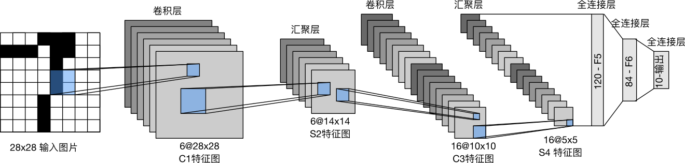

[](https://colab.research.google.com/github/jshn9515/dnnl-notebooks/blob/main/zh/ch5-convolutional-neural-network/ch5.5-build-a-simple-cnn.ipynb){fig-align="left"}

前面几节分别讨论了卷积、池化和下采样，但真实的卷积神经网络并不是某一个孤立算子，而是由多个模块按顺序组合而成的完整模型。卷积层负责提取局部特征，激活函数引入非线性，池化或 stride convolution 逐步降低空间分辨率，最后再由分类头把特征转换成类别 logits。

这一节我们将第一次把这些组件完整地连接起来，搭建并训练一个简单 CNN。我们的目标不是追求最高的图像分类准确率，而是看清一条图片从输入模型到产生分类结果时，张量形状和语义表示如何逐层变化。

整个模型可以概括为：



在实现过程中，我们还会简要讨论一个此前没有展开的问题：调用 `nn.Conv2d` 时，PyTorch 为什么远快于我们用 Python 循环写出的教学实现。在 NVIDIA GPU 上，PyTorch 通常会调用包括 cuDNN 在内的高性能后端，并根据输入形状、数据类型和硬件条件选择合适的卷积算法。理解这种分工有助于区分“卷积的数学定义”和“卷积的工程实现”。

```{python}
from collections.abc import Callable

import dnnlpy
import dnnlpy.nn as dnn
import dnnlpy.optim as dopt
import matplotlib.pyplot as plt
import torch
import torch.nn as nn
import torch.nn.functional as F
import torch.utils.data as utils
import torchinfo
import torchmetrics.classification as metrics
import torchvision.datasets as datasets
import torchvision.transforms.v2 as v2
from torch import Tensor

dnnlpy.set_matplotlib_format('svg')
print('PyTorch version:', torch.__version__)
```

## 5.5.1 从卷积层到卷积块

单个卷积层只执行线性变换。对于输入 $X$ 和卷积核 $W$，卷积层输出可以写为：

$$
Z = X * W + b
$$

无论卷积在空间上多么特殊，只要没有激活函数，多层卷积叠加后仍然只是一个线性映射。因此，CNN 通常会在卷积之后加入 ReLU 等非线性激活函数：

$$
H = \operatorname{ReLU}(XW + b)
$$

一个最基础的卷积块可以写成：

```{mermaid}
%% | fig-height: 200px

flowchart TD
    A[Conv2d] --> B[ReLU]
    B --> C[MaxPool2d]
```

其中，卷积负责提取局部模式，ReLU 让模型能够表示非线性关系，池化则降低特征图的空间分辨率。

```{python}
block = nn.Sequential(
    dnn.Conv2d(3, 16, kernel_size=3, padding=1),
    dnn.ReLU(),
    dnn.MaxPool2d(kernel_size=2),
)

x = torch.randn(16, 3, 28, 28)
y = block(x)

print('Input shape:', x.shape)
print('Output shape:', y.shape)
```

这里的卷积使用 `kernel_size=3` 和 `padding=1`，因此卷积前后的高度和宽度不变：

$$
28 \times 28 \rightarrow 28 \times 28
$$

随后，`MaxPool2d(kernel_size=2)` 将两个空间维度都缩小一半：

$$
28 \times 28 \rightarrow 14 \times 14
$$

与此同时，卷积层把输入通道数从 3 增加到 16，因此完整的形状变化是：

$$
(N,3,28,28) \rightarrow (N,16,28,28) \rightarrow (N,16,14,14)
$$

## 5.5.2 CNN 中的通道和空间尺寸

CNN 通常随着网络加深逐步减小空间尺寸，同时增加通道数。例如：

$$
(3,28,28) \rightarrow (16,14,14) \rightarrow (32,7,7)
$$

这种变化并不意味着后面的特征比前面的特征更少。高度和宽度表示特征出现的位置，而通道表示网络可以检测的特征类型。浅层特征图可能描述边缘方向和简单纹理，深层特征图则可以表示更复杂的局部组合。

可以把这种结构理解为：

- 浅层保留较精细的空间位置；
- 深层使用更多通道描述更丰富的语义；
- 下采样减少计算量，并让深层单元看到更大的输入区域。

下面组合两个卷积块，观察张量形状如何变化。

```{python}
features = nn.Sequential(
    dnn.Conv2d(3, 16, kernel_size=3, padding=1),
    dnn.ReLU(),
    dnn.MaxPool2d(kernel_size=2, stride=2),
    dnn.Conv2d(16, 32, kernel_size=3, padding=1),
    dnn.ReLU(),
    dnn.MaxPool2d(kernel_size=2, stride=2),
)

x = torch.randn(16, 3, 28, 28)
y = features(x)

print('Input shape:', x.shape)
print('Feature shape:', y.shape)
```

最终输出形状是 `(16, 32, 7, 7)`。其中，每张图片已经从一个单通道像素网格，转换成了 32 张更小的特征图。

## 5.5.3 特征提取器和分类头

一个图像分类 CNN 通常可以分成两个部分：

1. **特征提取器（feature extractor）**：由卷积、激活函数和下采样操作构成；
2. **分类头（classification head）**：把最终特征转换成类别 logits。

传统 CNN 经常直接把最后的特征图展平：

$$
(N,C,H,W) \rightarrow (N,CHW)
$$

再连接一个或多个全连接层。对于形状 `(N, 32, 7, 7)` 的特征图，展平后每个样本有：

$$
32 \times 7 \times 7 = 1568
$$

个特征。

```{python}
x = torch.randn(4, 32, 7, 7)
y = x.flatten()

print('Before flatten:', x.shape)
print('After flatten:', y.shape)
```

这种做法可以工作，但分类头参数量会依赖输入图像的空间尺寸。例如，将 1568 个特征映射到 10 个类别需要：

$$
1568 \times 10 + 10 = 15,690
$$

个参数。

另一种更简洁的做法是使用 global average pooling，把每个通道的整张特征图压缩成一个标量：

$$
(N,C,H,W) \rightarrow (N,C,1,1) \rightarrow (N,C)
$$

```{python}
x = torch.randn(4, 32, 7, 7)
pooled = F.adaptive_avg_pool2d(x, (1, 1))
feature_vector = pooled.flatten()

print('Feature maps:', x.shape)
print('After global average pooling:', pooled.shape)
print('Feature vectors:', feature_vector.shape)
```

此时线性分类器只需要把 32 个通道特征映射到 10 个类别，参数数量变为：

$$
32 \times 10 + 10 = 330
$$

Global average pooling 不仅减少了参数，也使分类头不再依赖固定的空间分辨率。后面介绍 NiN、GoogLeNet 和 ResNet 时，我们还会看到这种设计。

## 5.5.4 定义一个完整的 SimpleCNN

现在把特征提取器和分类头封装成一个完整模型。为了保持结构清晰，我们把二者分别定义为 `self.features` 和 `self.classifier`。

```{python}
class SimpleCNN(nn.Module):
    """A small CNN for grayscale image classification."""

    def __init__(self, in_channels: int = 1, num_classes: int = 3) -> None:
        super().__init__()
        self.num_classes = num_classes
        self.features = nn.Sequential(
            dnn.Conv2d(in_channels, 16, kernel_size=3, padding=1),
            dnn.ReLU(),
            dnn.MaxPool2d(kernel_size=2),
            dnn.Conv2d(16, 32, kernel_size=3, padding=1),
            dnn.ReLU(),
            dnn.MaxPool2d(kernel_size=2),
        )
        self.flatten = dnn.Flatten()
        self.pool = dnn.AdaptiveAvgPool2d(1)
        self.classifier = dnn.Linear(32, num_classes)

    def forward(self, x: Tensor) -> Tensor:
        x = self.features(x)
        x = self.pool(x)
        x = self.flatten(x)
        x = self.classifier(x)
        return x
```

```{python}
model = SimpleCNN(in_channels=3, num_classes=3)

x = torch.randn(16, 3, 28, 28)
logits = model(x)

print(model)
print('Input shape:', x.shape)
print('Logits shape:', logits.shape)
```

对于 batch size 为 16、类别数为 3 的任务，输出形状是 `(16, 3)`。这里的每一行都包含一个样本对三个类别的 logits。模型内部不需要手动加入 softmax，因为训练分类器时，`nn.CrossEntropyLoss` 会直接接收未归一化的 logits。

## 5.5.5 逐层检查张量形状

网络结构稍微变深以后，仅看 `forward()` 很难立即判断每一层的输出形状。最直接的调试方法是逐层执行模块并打印结果。

```{python}
summary = torchinfo.summary(model, input_size=(16, 3, 28, 28))
print(summary)
```

第一个卷积层的权重形状为 `(16, 3, 3, 3)`，参数数量是（去掉 bias）：

$$
16\times 3\times 3\times 3 = 432
$$

第二个卷积层的权重形状为 `(32, 16, 3, 3)`，参数数量是（去掉 bias）：

$$
32\times 16\times 3\times 3 = 4608
$$

卷积参数量只由输入通道、输出通道和卷积核大小决定，与输入图像的高度和宽度无关。这正是权重共享带来的结果：同一个卷积核会在所有空间位置重复使用，而不是为每个像素位置分别学习一组参数。

检查 shape 是搭建 CNN 时非常重要的习惯。常见错误包括：

- 忘记 NCHW 中的 channel 维度；
- 前一层的 `out_channels` 与后一层的 `in_channels` 不一致；
- 多次下采样后，空间尺寸小于卷积核或池化窗口；
- 展平后的特征数与线性层的 `in_features` 不匹配。

## 5.5.6 训练一个完整的 CNN

接下来我们使用 MNIST 数据集，训练一个简单的 CNN。

首先下载 MNIST 数据集，划分训练集和验证集，并创建 `DataLoader`。

```{python}
root = dnnlpy.get_data_root()
transform = v2.Compose([v2.ToImage(), v2.ToDtype(torch.float32, scale=True)])
train_ds = datasets.MNIST(root, train=True, download=True, transform=transform)
train_ds, val_ds = utils.random_split(train_ds, lengths=[50000, 10000])
test_ds = datasets.MNIST(root, train=False, download=True, transform=transform)

train_dl = utils.DataLoader(train_ds, batch_size=64, shuffle=True)
val_dl = utils.DataLoader(val_ds, batch_size=128, shuffle=False)
test_dl = utils.DataLoader(test_ds, batch_size=128, shuffle=False)

images, labels = next(iter(train_dl))
print('Image batch:', images.shape)
print('Label batch:', labels.shape)
```

设备选择仍然和普通 PyTorch 模型相同。模型参数和输入数据必须位于同一个设备上。

```{python}
device = dnnlpy.get_default_device()
print('Using device:', device)
```

CNN 的训练过程与前面学过的 MLP 并没有本质区别。每个 batch 仍然执行：

```text
forward
  ↓
loss
  ↓
zero_grad
  ↓
backward
  ↓
optimizer.step
```

区别只在于模型内部使用卷积层处理四维图像张量。

```{python}
model = SimpleCNN(in_channels=1, num_classes=10).to(device)
optimizer = dopt.AdamW(model.parameters(), lr=0.001)
loss_fn = dnn.CrossEntropyLoss()

trainer = dnnlpy.Trainer(max_epochs=10)
trainer.fit(
    model=model,
    train_dataloader=train_dl,
    val_dataloader=val_dl,
    loss_fn=loss_fn,
    optimizer=optimizer,
    train_metrics={'acc': metrics.MulticlassAccuracy(model.num_classes)},
    val_metrics={'acc': metrics.MulticlassAccuracy(model.num_classes)},
)
```

训练结束后，我们可以查看训练和验证的损失曲线。训练曲线可以帮助我们判断模型是否真正学到了任务，而不是只看最后一个 epoch 的准确率。

```{python}
epochs = [row['epoch'] for row in trainer.history]
loss = [row['loss'] for row in trainer.history]
val_loss = [row['val_loss'] for row in trainer.history]

fig = plt.figure(1, figsize=(6, 4))
ax = fig.add_subplot(1, 1, 1)
ax.plot(epochs, loss, marker='o')
ax.plot(epochs, val_loss, marker='o')
ax.set_xlabel('Epoch')
ax.set_ylabel('Cross-entropy loss')
ax.legend(['train', 'validation'])
plt.show()
```

接着随机查看一批验证图片和模型预测。

```{python}
model.eval()
images, labels = next(iter(test_dl))

with torch.inference_mode():
    logits = model(images.to(device))
    preds = logits.argmax(dim=1).cpu()

fig = plt.figure(2, figsize=(8, 6))
axes = fig.subplots(3, 4)
z = zip(axes.flat, images[:12], labels[:12], preds[:12], strict=True)
for ax, image, label, pred in z:
    true_label = test_ds.targets[label]
    pred_label = test_ds.targets[pred]
    ax.imshow(image.squeeze(0), cmap='gray', vmin=0, vmax=1)
    ax.axis('off')
    ax.set_title(f'true: {true_label}, pred: {pred_label}')
plt.show()
```

## 5.5.7 CNN 学到的仍然是可学习参数

卷积核不是预先规定好的边缘检测器。它们和线性层的权重一样，由损失函数和反向传播自动学习。

```{python}
conv = model.features[0]
assert isinstance(conv, dnn.Conv2d)
kernels = conv.weight.detach().cpu()

fig = plt.figure(3, figsize=(8, 2))
axes = fig.subplots(2, 8)
for ax, kernel in zip(axes.flat, kernels, strict=True):
    ax.imshow(kernel[0], cmap='gray')
    ax.set_xticks([])
    ax.set_yticks([])
plt.show()
```

这些权重不一定像人工设计的 Sobel kernel 那样整齐，因为模型只需要找到对当前分类任务有效的特征。在更大规模的自然图像数据上，浅层卷积核通常会学习到不同方向的边缘、颜色对比和简单纹理，而更深层的特征则更难直接用单个卷积核解释。

## 5.5.8 PyTorch 的卷积为什么比循环实现快

在 5.3 中，我们用 Python 循环实现了卷积。它准确表达了卷积的数学过程，却不适合真实训练。`nn.Conv2d` 的接口看起来很简单，但背后会经过 PyTorch 的算子分发系统，调用针对当前设备优化的底层实现。

在 NVIDIA GPU 上，卷积通常可以使用 **cuDNN**。cuDNN 是 NVIDIA 提供的深度神经网络计算库，其中包含卷积、池化、归一化和激活函数等常见算子的高性能实现。例如：

- 直接卷积；
- 将卷积转换成矩阵乘法；
- Winograd 类算法；
- 针对特定数据类型和硬件设计的 kernel。

哪一种方法更快，取决于输入图像形状、卷积核大小、stride、数据类型、GPU 型号。通常我们只需要调用 `nn.Conv2d`，具体算法由 PyTorch 和底层后端处理。

我们可以查看当前环境中 CUDA 和 cuDNN 是否可用：

```{python}
print('CUDA available:', torch.cuda.is_available())
print('cuDNN available:', torch.backends.cudnn.is_available())
print('cuDNN version:', torch.backends.cudnn.version())
```

PyTorch 还提供两个经常被提到的 cuDNN 配置：

```python
torch.backends.cudnn.benchmark
torch.backends.cudnn.deterministic
```

`benchmark=True` 允许 cuDNN 在遇到新的输入配置时尝试不同算法，并缓存较快的选择。它更适合输入 shape 长期固定的训练任务。如果每个 batch 的图像尺寸不断变化，频繁重新搜索算法可能反而增加开销。

`deterministic=True` 则要求优先使用确定性实现，有助于实验复现，但可能限制可选算法并降低速度。它也不是完整复现性的充分条件，因为随机数、数据加载和其他算子同样可能引入不确定性。

::: {.callout-caution}
不要为了优化而在所有项目中固定修改这些选项，默认配置通常已经足够。只有在明确需要稳定复现，或者已经通过 profiling 确认卷积算法选择影响性能时，才需要进一步调整。
:::

这一层工程细节不会改变卷积的数学定义：无论底层选择哪一种 kernel，`nn.Conv2d` 对外仍然实现相同的张量变换。教学实现帮助我们理解算子，高性能后端则负责让同一个算子在实际硬件上高效运行。

## 5.5.9 本章小结

这一节把前面学习的 CNN 基础算子连接成了一个完整图像分类模型。

- 卷积层负责在局部区域中提取特征；
- 激活函数为多层卷积加入非线性；
- 池化逐渐降低空间分辨率；
- 通道数通常随着网络加深而增加；
- global average pooling 把每个通道汇总成一个特征；
- 线性分类器将最终特征映射成类别 logits；
- CNN 的训练循环与 MLP 相同，差别主要来自模型内部处理的张量结构；
- `nn.Conv2d` 会使用设备相关的高性能后端，在 NVIDIA GPU 上通常包括 cuDNN；
- 高性能实现改变的是执行方式，而不是卷积层对外表达的数学运算。

现在我们已经能够从基础算子搭建并训练一个简单 CNN。下一节将以 LeNet 为例，观察早期卷积神经网络如何形成一套完整而清晰的架构模板。
