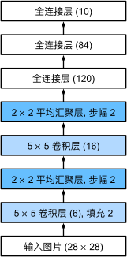

[](https://colab.research.google.com/github/jshn9515/dnnl-notebooks/blob/main/zh/ch5-convolutional-neural-network/ch5.6-lenet.ipynb){fig-align="left"}

前面几节已经分别介绍了卷积、池化、下采样和完整 CNN 的训练流程。到这里，我们已经知道一个图像分类网络可以由若干卷积块和一个分类头组成，但这些组件究竟应该怎样排列，通道数和空间尺寸又应该如何变化，还需要一个具体架构来帮助我们把它们真正串起来。

LeNet-5 是最适合作为起点的经典 CNN。它的结构并不复杂，却已经包含了后来图像分类网络长期沿用的基本模式：先通过卷积层提取局部特征，再通过池化逐步降低空间分辨率，最后用全连接层完成分类。

它的整体结构可以概括为：



今天的 CNN 已经比 LeNet 深得多，也会使用 ReLU、Batch Normalization、残差连接和更加复杂的下采样方式。但如果忽略这些后来的改进，许多现代分类网络仍然可以看作是在回答同一个问题：

> **如何把高分辨率、低语义的像素网格，逐步转换成低分辨率、高语义的特征表示？**

这一节将先还原 LeNet-5 的基本结构，再用现代 PyTorch 写法实现一个更适合当前训练习惯的版本。重点不是复刻所有历史细节，而是理解它为什么成为了后来 CNN 的结构模板。

```{python}
import math

import dnnlpy
import dnnlpy.nn as dnn
import torch
import torch.nn as nn
import torchinfo
from torch import Tensor

print('PyTorch version:', torch.__version__)
```

## 5.6.1 LeNet 解决了什么问题？

在 LeNet 出现之前，手写数字识别常常依赖人工设计的图像特征。研究者需要先决定应该提取哪些边缘、笔画或几何形状，再把这些特征交给分类器。

CNN 改变了这种流程。网络不再依赖人工规定的特征，而是直接从像素中学习一系列逐层组合的表示：

```text
pixels
  ↓
edges and simple strokes
  ↓
local stroke combinations
  ↓
digit-level representation
  ↓
class prediction
```

LeNet 的重要性不只是用了卷积，而是把多个关键思想组合成了一个可以端到端训练的系统：

- 卷积层使用局部连接和权重共享提取特征；
- 池化层逐步降低空间分辨率；
- 更深层的通道表示更复杂的模式；
- 全连接层根据最终特征完成分类；
- 所有参数都通过反向传播共同学习。

因此，LeNet 可以看作从人工设计特征走向神经网络自动学习特征的早期代表。

## 5.6.2 原始 LeNet-5 的张量形状

LeNet-5 通常接收大小为 $32\times 32$ 的单通道图像。对于 $28\times 28$ 的 MNIST 数据集，可以先在四周补零，使其变成 $32\times 32$。

经典结构的形状变化如下：

```text
Input:        (N,   1, 32, 32)
Conv 5x5:     (N,   6, 28, 28)
Pool 2x2:     (N,   6, 14, 14)
Conv 5x5:     (N,  16, 10, 10)
Pool 2x2:     (N,  16,  5,  5)
Conv 5x5:     (N, 120,  1,  1)
Flatten:      (N, 120)
Linear:       (N, 84)
Output:       (N, 10)
```

第一层卷积不使用 padding，因此空间尺寸从 $32\times 32$ 变为：

$$
32 - 5 + 1 = 28
$$

随后，$2\times 2$ 池化把高度和宽度都缩小一半：

$$
28\times 28 \rightarrow 14\times 14
$$

第二层卷积再次使用 $5\times 5$ 卷积核：

$$
14 - 5 + 1 = 10
$$

再经过一次池化后得到 $5\times 5$ 的特征图。最后一个 $5\times 5$ 卷积刚好覆盖整个空间区域，因此：

$$
5 - 5 + 1 = 1
$$

这会得到形状为 `(N, 120, 1, 1)` 的输出。将空间维度展平后，每张图片就被表示成一个 120 维向量。

::: {.callout-note}
原始 LeNet-5 的部分连接方式、激活函数和损失函数与今天常见的 PyTorch 实现并不完全相同。教学中通常保留其整体结构，但使用标准的全连接卷积、现代激活函数和交叉熵损失。
:::

## 5.6.3 用 PyTorch 实现经典 LeNet

下面先按照经典的形状变化实现 LeNet。为了更接近原始模型，我们使用 `Tanh` 和平均池化；但输出层仍然直接返回 logits，以便配合现代的 `nn.CrossEntropyLoss`。

```{python}
class LeNet5(nn.Module):
    """A practical implementation of the classic LeNet-5 architecture."""

    def __init__(self, num_classes: int = 10):
        super().__init__()
        self.features = nn.Sequential(
            dnn.Conv2d(1, 6, kernel_size=5),
            dnn.Tanh(),
            dnn.AvgPool2d(kernel_size=2),
            dnn.Conv2d(6, 16, kernel_size=5),
            dnn.Tanh(),
            dnn.AvgPool2d(kernel_size=2),
            dnn.Conv2d(16, 120, kernel_size=5),
            dnn.Tanh(),
        )
        self.classifier = nn.Sequential(
            dnn.Flatten(),
            dnn.Linear(120, 84),
            dnn.Tanh(),
            dnn.Linear(84, num_classes),
        )

    def forward(self, x: Tensor) -> Tensor:
        x = self.features(x)
        x = self.classifier(x)
        return x


model = LeNet5(num_classes=10)
x = torch.randn(8, 1, 32, 32)
logits = model(x)

print(model, end='\n\n')
print('Input shape:', x.shape)
print('Output shape:', logits.shape)
```

模型输出形状为 `(8, 10)`。这里的 10 个数不是概率，而是每个类别对应的 logits。训练时可以直接传给：

```python
loss_fn = nn.CrossEntropyLoss()
```

`CrossEntropyLoss` 内部会完成 `log_softmax` 和负对数似然计算，因此模型的最后一层不需要额外添加 `Softmax`。

## 5.6.4 LeNet 的参数都在哪里

一个卷积层的参数数量为：

$$
C_{\text{out}} \left( C_{\text{in}} K_h K_w + 1 \right)
$$

其中最后的 1 对应每个输出通道的 bias。

例如，第一层卷积的参数数量是：

$$
6 \times (1 \times 5 \times 5 + 1) = 156
$$

第二层卷积的参数数量是：

$$
16 \times (6 \times 5 \times 5 + 1) = 2416
$$

虽然卷积层会在整张图片上反复使用卷积核，但同一个卷积核在所有空间位置共享参数。因此，参数量只由输入通道、输出通道和卷积核尺寸决定，与卷积核滑动了多少次无关。

下面统计每个可学习层的参数量。

```{python}
summary = torchinfo.summary(model, input_size=(8, 1, 32, 32))
print(summary)
```

从参数统计上看，LeNet-5 中参数量最大的层是最后一个卷积层 C5，而不是显式的全连接层。C5 使用 $5\times 5$ 卷积核，将 $16\times 5\times 5$ 的特征图映射为 $120\times 1\times 1$，因此它虽然在结构上属于卷积层，但每个输出单元都与上一层的全部特征相连，在功能上与全连接层十分接近。

因此，更准确地说，LeNet-5 的大部分参数集中在网络后部的密集连接分类模块中，而不是前面的局部特征提取层。后来的 NiN、GoogLeNet 等架构引入全局平均池化，使每个通道直接聚合为空间平均值，从而减少对这类参数量较大的密集分类层的依赖。这一内容将在下一章继续讨论。

## 5.6.5 原始写法和现代写法有什么不同

如果今天重新设计一个同等规模的小型 CNN，通常不会完全照搬 LeNet 的所有细节。一个更现代的版本可能会做出以下改变：

- 用 `ReLU` 替代 `Tanh`；
- 用 max pooling 或 stride convolution 替代 average pooling；
- 使用 padding，使卷积前后的空间尺寸更容易控制；
- 使用 adaptive pooling，避免分类头依赖固定输入分辨率；
- 根据需要加入 normalization 和 dropout。

下面给出一个现代化的 LeNet 风格模型。

```{python}
class ModernLeNet5(nn.Module):
    """A modernized LeNet-style CNN with adaptive pooling."""

    def __init__(self, num_classes: int = 10) -> None:
        super().__init__()
        self.features = nn.Sequential(
            dnn.Conv2d(1, 16, kernel_size=3, padding=1),
            dnn.ReLU(),
            dnn.MaxPool2d(kernel_size=2),
            dnn.Conv2d(16, 32, kernel_size=3, padding=1),
            dnn.ReLU(),
            dnn.MaxPool2d(kernel_size=2),
        )
        self.pool = dnn.AdaptiveAvgPool2d(1)
        self.flatten = dnn.Flatten()
        self.classifier = dnn.Linear(32, num_classes)

    def forward(self, x: Tensor) -> Tensor:
        x = self.features(x)
        x = self.pool(x)
        x = self.flatten(x)
        x = self.classifier(x)
        return x


model = ModernLeNet5(num_classes=10)
summary = torchinfo.summary(model, input_size=(8, 1, 32, 32))
print(summary)
```

由于使用了 `AdaptiveAvgPool2d(1)`，这个模型可以接收不同空间尺寸的输入。相比之下，经典 LeNet 的全连接层默认输入正好经过两次卷积和池化后变成 `(120, 1, 1)`，因此对输入尺寸有更强的依赖。

当然，现代版不一定比经典版更好。LeNet 的设计非常适合 MNIST 这类小型图像分类任务，而现代化的改进更多是为了适应更大、更复杂的图像数据集。

## 5.6.6 最后一层卷积和全连接层的关系

经典 LeNet 中，最后一个卷积层把 `(N, 16, 5, 5)` 映射到 `(N, 120, 1, 1)`。由于卷积核大小也是 $5\times 5$，它在空间上覆盖了整个输入特征图。这时，卷积层与全连接层非常相似。对每个样本而言，每个输出通道都使用一组大小为：

$$
16\times 5\times 5
$$

的权重，对整个输入特征图进行加权求和。

我们可以验证，一个覆盖整个空间区域的卷积和线性层可以产生相同结果。

```{python}
x = torch.randn(3, 16, 5, 5)
conv = nn.Conv2d(16, 120, kernel_size=5)
linear = nn.Linear(16 * 5 * 5, 120)

with torch.no_grad():
    linear.weight.copy_(conv.weight.reshape(120, -1))
    linear.bias.copy_(conv.bias)

conv_output = conv(x).flatten(start_dim=1)
linear_output = linear(x.flatten(start_dim=1))

max_diff = (conv_output - linear_output).abs().max()
print('Maximum difference:', max_diff.item())
```

这说明卷积层和线性层并不是完全不同的两类运算。卷积层本质上也是线性变换，只是它通过局部连接和权重共享加入了适合图像的结构约束。当卷积核覆盖整个空间区域，而且只计算一个输出位置时，这种空间共享不再发挥作用，它就退化成了普通线性层。

## 5.6.7 LeNet 留下了什么

LeNet 的具体规模今天已经很小，但它留下的结构思想仍然非常重要。

首先，它建立了“特征提取器 + 分类头”的基本分工。前面的卷积层负责把像素转换成特征，后面的分类器负责根据这些特征输出类别。

其次，它展示了 CNN 中典型的形状变化：空间尺寸逐渐减小，通道数逐渐增加。后来的 AlexNet、VGG、ResNet 虽然规模更大，但仍然沿用了这个总体趋势。

最后，它证明了图像特征不一定需要人工设计。只要把局部连接、权重共享和反向传播结合起来，网络就可以直接从数据中学习适合任务的特征。

但是，LeNet 也留下了一些尚未解决的问题：

- 当图像更大、类别更多时，网络应该怎样扩大？
- 只增加卷积层数量，模型就一定会变好吗？
- 大型全连接层带来的参数量应该怎样减少？
- 如何让更深的网络稳定训练？
- 如何在准确率和计算成本之间取得平衡？

这些问题推动了后续 CNN 架构的发展。AlexNet 把 CNN 推向大规模图像分类，VGG 探索了使用小卷积核构建更深网络，NiN 和 GoogLeNet 引入了 $1\times 1$ 卷积与更灵活的通道变换，ResNet 通过残差连接让极深网络更容易优化，MobileNet 和 EfficientNet 则进一步关注计算效率和模型缩放。

因此，LeNet 不只是一个需要记忆的经典模型。它更像是 CNN 架构设计的起点：

> **先用卷积逐层提取空间特征，再把最终表示交给分类器。**

## 5.6.8 本章小结

这一节通过 LeNet 把前面学过的卷积、激活函数、池化和全连接层组合成了一个完整的经典 CNN。

LeNet 的核心结构是：

```text
Conv → Pool → Conv → Pool → Conv/Flatten → Linear → Output
```

在这个过程中，空间尺寸逐渐减小，通道数逐渐增加，局部像素最终被转换成适合分类的高层特征。它还展示了卷积特征提取器和全连接分类头之间的基本分工，并解释了为什么现代网络后来开始使用 global average pooling 和更灵活的分类头。

到这里，CNN 的基础组件已经基本完整。下一章将不再逐个介绍算子，而是沿着 CNN 架构的发展路线，讨论研究者如何通过更深的网络、更小的卷积核、$1\times 1$ 卷积、多尺度分支、残差连接和可分离卷积，不断改进图像特征提取器。
